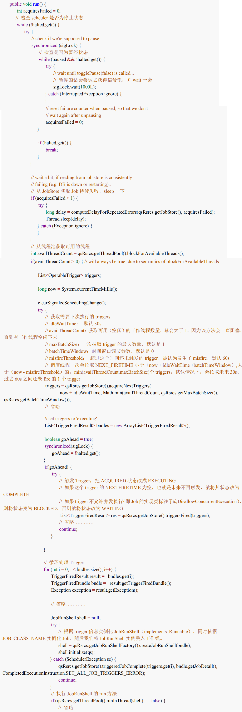
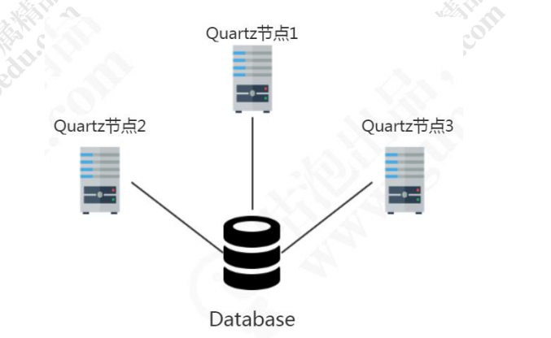
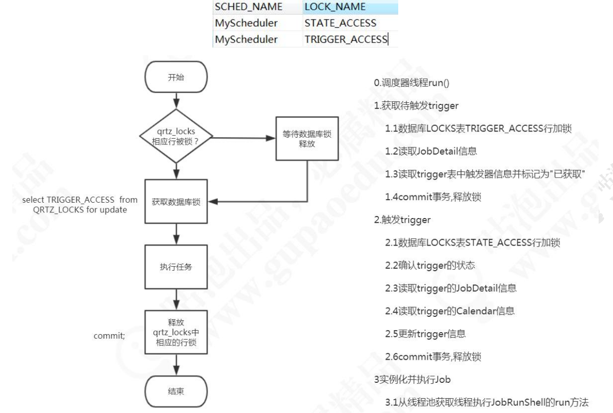

# 7 Quartz 调度原理 

问题：

1、Job 没有继承 Thread 和实现 Runnable，是怎么被调用的？通过反射还是什么？

2、任务是什么时候被调度的？是谁在监视任务还是监视 Trigger？ 

3、任务是怎么被调用的？谁执行了任务？ 

4、任务本身有状态吗？还是触发器有状态？ 

看源码的入口 

```java
Scheduler scheduler = factory.getScheduler(); 
scheduler.scheduleJob(jobDetail, trigger); 
scheduler.start();
```

## 7.1 获取调度器实例 

### 7.1.1 读取配置文件 

```java
public Scheduler getScheduler() throws SchedulerException {
        if (cfg == null) {
            // 读取 quartz.properties 配置文件
            initialize();
        }
        // 这个类是一个 HashMap，用来基于调度器的名称保证调度器的唯一性
        SchedulerRepository schedRep = SchedulerRepository.getInstance();
        Scheduler sched = schedRep.lookup(getSchedulerName());
        // 如果调度器已经存在了
        if (sched != null) {
            // 调度器关闭了，移除
            if (sched.isShutdown()) {
                schedRep.remove(getSchedulerName());
            } else {
                // 返回调度器 return sched;
            }
        }
        // 调度器不存在，初始化
        sched = instantiate();
        return sched;
    }
```

instantiate()方法中做了初始化的所有工作： 

```java
// 存储任务信息的 
JobStore JobStore js = null; 
// 创建线程池，默认是 SimpleThreadPool 
ThreadPool tp = null; 
// 创建调度器 
QuartzScheduler qs = null; 
// 连接数据库的连接管理器 
DBConnectionManager dbMgr = null; 
// 自动生成 ID
// 创建线程执行器，默认为 DefaultThreadExecutor 
ThreadExecutor threadExecutor;
```

### 7.1.2 创建线程池（包工头） 

830 行和 839 行，创建了一个线程池，默认是配置文件中指定的 SimpleThreadPool。

```java
String tpClass = cfg.getStringProperty(PROP_THREAD_POOL_CLASS, SimpleThreadPool.class.getName()); 
tp = (ThreadPool) loadHelper.loadClass(tpClass).newInstance();
```

​	SimpleThreadPool 里面维护了三个 list，分别存放所有的工作线程、空闲的工作线程和忙碌的工作线程。我们可以把 SimpleThreadPool 理解为包工头。 

```java
private List<WorkerThread> workers; 
private LinkedList<WorkerThread> availWorkers = new LinkedList<WorkerThread>(); 
private LinkedList<WorkerThread> busyWorkers = new LinkedList<WorkerThread>();
```

​	tp 的 runInThread()方法是线程池运行线程的接口方法。参数 Runnable 是执行的任务内容。 

​	取出 WorkerThread 去执行参数里面的 runnable（JobRunShell）。

```java
WorkerThread wt = (WorkerThread)availWorkers.removeFirst(); 
busyWorkers.add(wt); 
wt.run(runnable);
```

### 7.1.3 WorkerThread（工人） 

​	WorkerThread 是 SimpleThreadPool 的 内 部 类 ， 用 来 执 行 任 务 。 我 们 把WorkerThread理解为工人。在WorkerThread的 run 方法中，执行传入的参数runnable任务： 

```java
runnable.run(); 
```

### 7.1.4 创建调度线程（项目经理） 

1321 行，创建了调度器 QuartzScheduler： 

```java
qs = new QuartzScheduler(rsrcs, idleWaitTime, dbFailureRetry); 
```

​	在 QuartzScheduler 的构造函数中，创建了 QuartzSchedulerThread，我们把它理解为项目经理，它会调用包工头的工人资源，给他们安排任务。 

​	并 且 创 建 了 线 程 执 行 器 schedThreadExecutor ， 执 行 了 这 个 QuartzSchedulerThread，也就是调用了它的 run 方法。

```java
// 创建一个线程，resouces 里面有线程名称 
this.schedThread = new QuartzSchedulerThread(this, resources); 
// 线程执行器 
ThreadExecutor schedThreadExecutor = resources.getThreadExecutor(); 
//执行这个线程，也就是调用了线程的 run 方法 
schedThreadExecutor.execute(this.schedThread);
```

​	点开 QuartzSchedulerThread 类，找到 run 方法，这个是 Quartz 任务调度的核心方法： (重点，有个截图)




JobRunShell 的作用 

​	JobRunShell 用来为 Job 提供安全的运行环境的，执行 Job 中所有的作业，捕获运行中的异常，在任务执行完毕的时候更新 Trigger 状态，等等。JobRunShell 实例是用 JobRunShellFactory 为 QuartzSchedulerThread 创建的，在调度器决定一个 Job 被触发的时候，它从线程池中取出一个线程来执行任务。 

### 7.1.5 线程模型总结 

SimpleThreadPool：包工头，管理所有 WorkerThread 

WorkerThread：工人，把 Job 包装成 JobRunShell，执行 

QuartSchedulerThread：项目经理，获取即将触发的 Trigger，从包工头出拿到worker，执行 Trigger 绑定的任务 

## 7.2 绑定 JobDetail 和 Trigger

```java
// 存储 JobDetail 和 Trigger 
resources.getJobStore().storeJobAndTrigger(jobDetail, trig); 
// 通知相关的 Listener 
notifySchedulerListenersJobAdded(jobDetail); notifySchedulerThread(trigger.getNextFireTime().getTime()); notifySchedulerListenersSchduled(trigger);
```

## 7.3 启动调度器 

```java
// 通知监听器 
notifySchedulerListenersStarting(); 
if (initialStart == null) { 
	initialStart = new Date(); 
	this.resources.getJobStore().schedulerStarted(); 
	startPlugins();
} else { 
	resources.getJobStore().schedulerResumed(); 
}
// 通知 QuartzSchedulerThread 不再等待，开始干活 
schedThread.togglePause(false); 
// 通知监听器 
notifySchedulerListenersStarted();
```

## 7.4 源码总结 

​	getScheduler 方法创建线程池 ThreadPool，创建调度器 QuartzScheduler，创建调度线程 QuartzSchedulerThread，调度线程初始处于暂停状态。 

​	scheduleJob 将任务添加到 JobStore 中。 

​	scheduler.start()方法激活调度器，QuartzSchedulerThread 从 timeTrriger 取出待触 发 的 任 务 ， 并 包 装 成 TriggerFiredBundle ， 然 后 由 JobRunShellFactory 创 建TriggerFiredBundle 的 执 行 线 程 JobRunShell ，调 度 执 行 通 过 线 程 池 SimpleThreadPool 去执行 JobRunShell，而 JobRunShell 执行的就是任务类的 execute 

方法：job.execute(JobExecutionContext context)。 

## 7.5 集群原理 

基于数据库，如何实现任务的不重跑不漏跑？ 

问题 1：如果任务执行中的资源是“下一个即将触发的任务”，怎么基于数据库实现这个资源的竞争？ 

问题 2：怎么对数据的行加锁？



QuartzSchedulerThread 第 287 行，获取下一个即将触发的 Trigger 

```java
triggers = qsRsrcs.getJobStore().acquireNextTriggers(
```

调用 JobStoreSupport 的 acquireNextTriggers()方法，2793 行 

调用 JobStoreSupport.executeInNonManagedTXLock()方法，3829 行：

```
return executeInNonManagedTXLock(lockName
```

尝试获取锁，3843 行： 

```
transOwner = getLockHandler().obtainLock(conn, lockName);
```

下面有回滚和释放锁的语句，即使发生异常，锁同样能释放。 

调用 DBSemaphore 的 obtainLock()方法，103 行 

```java
public boolean obtainLock(Connection conn, String lockName) throws LockException { 
    if (!isLockOwner(lockName)) { 
        executeSQL(conn, lockName, expandedSQL, expandedInsertSQL);
```

调用 StdRowLockSemaphore 的 executeSQL()方法，78 行。 

最终用 JDBC 执行 SQL，语句内容是 expandedSQL 和 expandedInsertSQL。

```
ps = conn.prepareStatement(expandedSQL);
```

问题：expandedSQL 和 expandedInsertSQL 是一条什么 SQL 语句？似乎我们没有赋值？

在 StdRowLockSemaphore 的构造函数中，把定义的两条 SQL 传进去： 

```java
public StdRowLockSemaphore() { 
	super(DEFAULT_TABLE_PREFIX, null, SELECT_FOR_LOCK, INSERT_LOCK); 
}
```

```
public static final String SELECT_FOR_LOCK = "SELECT * FROM " + TABLE_PREFIX_SUBST + TABLE_LOCKS + " WHERE " + COL_SCHEDULER_NAME + " = " + SCHED_NAME_SUBST + " AND " + COL_LOCK_NAME + " = ? FOR UPDATE"; 
public static final String INSERT_LOCK = "INSERT INTO " + TABLE_PREFIX_SUBST + TABLE_LOCKS + "(" + COL_SCHEDULER_NAME + ", " + COL_LOCK_NAME + ") VALUES (" + SCHED_NAME_SUBST + ", ?)";
```

它调用了父类 DBSemaphore 的构造函数： 

```java
public DBSemaphore(String tablePrefix, String schedName, String defaultSQL, String defaultInsertSQL) { 
    this.tablePrefix = tablePrefix; 
    this.schedName = schedName; 
    setSQL(defaultSQL); 
    setInsertSQL(defaultInsertSQL); 
}
```

在 setSQL()和 setInsertSQL()中为 expandedSQL 和 expandedInsertSQL 赋值。

执行的 SQL 语句：

```java
select * from QRTZ_LOCKS t where t.lock_name='TRIGGER_ACCESS' for update
```

在我们执行官方的建表脚本的时候，QRTZ_LOCKS 表，它会为每个调度器创建两行数据，获取 Trigger 和触发 Trigger 是两把锁：



## 7.6 任务为什么重复执行 

在我们的演示过程中，有多个调度器，任务没有重复执行，也就是默认会加锁，什么情况下不会上锁呢？ 

JobStoreSupport 的 executeInNonManagedTXLock()方法 

如果 lockName 为空，则不上锁

```java
if (lockName != null) { 
	// If we aren't using db locks, then delay getting DB connection 
	// until after acquiring the lock since it isn't needed. 
	if (getLockHandler().requiresConnection()) { 
		conn = getNonManagedTXConnection(); 
	}
	transOwner = getLockHandler().obtainLock(conn, lockName); 
}
if (conn == null) {
	conn = getNonManagedTXConnection(); 
}
```

而上一步 JobStoreSupport 的 acquireNextTriggers()方法， 

1 ）如 果 acquireTriggersWithinLock=true 或 者 batchTriggerAcquisitionMaxCount>1 时 ， locaName 赋 值 为 LOCK_TRIGGER_ACCESS，此时获取 Trigger 会加锁。 

2）否则，如果 isAcquireTriggersWithinLock()值是 false 并且 maxCount=1 的话，lockName 赋值为 null，这种情况获取 Trigger 下不加锁。

```java
public List<OperableTrigger> acquireNextTriggers(final long noLaterThan, final int maxCount, final long timeWindow) throws JobPersistenceException { 
	String lockName; 
	if(isAcquireTriggersWithinLock() || maxCount > 1) { 
	lockName = LOCK_TRIGGER_ACCESS; 
	} else { 
	lockName = null; 
}
```

acquireTriggersWithinLock 变量默认是 false：

```java
private boolean acquireTriggersWithinLock = false; 
```

maxCount 来自 QuartzSchedulerThread： 

```java
triggers = qsRsrcs.getJobStore().acquireNextTriggers( now + idleWaitTime, Math.min(availThreadCount, qsRsrcs.getMaxBatchSize()), qsRsrcs.getBatchTimeWindow()); 
```

getMaxBatchSize()来自 QuartzSchedulerResources，代表 Scheduler 一次拉取trigger 的最大数量，默认是 1： 

```
private int maxBatchSize = 1; 
```

这个值可以通过参数修改，代表允许调度程序节点一次获取（用于触发）的触发器的最大数量，默认值是 1。 

```
org.quartz.scheduler.batchTriggerAcquisitionMaxCount=1 
```

​	根据以上两个默认值，理论上在获取 Trigger 的时候不会上锁，但是实际上为什么没有出现频繁的重复执行问题？因为每个调度器的线程持有锁的时间太短了，单机的测试无法体现，而在高并发的情况下，有可能会出现这个问题。 

QuartzSchedulerThread 的 triggersFired()方法： 

```
List<TriggerFiredResult> res = qsRsrcs.getJobStore().triggersFired(triggers); 
```

​	调用了 JobStoreSupport 的 triggersFired()方法，接着又调用了一个 triggerFired triggerFired(Connection conn, OperableTrigger trigger)方法： 

​	如果 Trigger 的状态不是 ACQUIRED，也就是说被其他的线程 fire 了，返回空。但是这种乐观锁的检查在高并发下难免会出现 ABA 的问题，比如线程 A 拿到的时候还是ACQUIRED 状态，但是刚准备执行的时候已经变成了 EXECUTING 状态，这个时候就会出现重复执行的问题。 

```java
if (!state.equals(STATE_ACQUIRED)) { 
	return null; 
}
```

总结，如果： 

​	如果设置的数量为 1（默认值），并且使用 JDBC JobStore（RAMJobStore 不支持 分 布 式 ， 只 有 一 个 调 度 器 实 例 ， 所 以 不 加 锁 ） ， 则 属 性 org.quartz.jobStore.acquireTriggersWithinLock 应设置为 true。否则不加锁可能会导 致任务重复执行。 

```properties
org.quartz.scheduler.batchTriggerAcquisitionMaxCount=1 
org.quartz.jobStore.acquireTriggersWithinLock=true 
```

