# 1 **spring系列集成webSocket**

## 1.1 集成webSocket

 SpringBoot 整合：https://www.jianshu.com/p/2c9be4641d43

Spring 整合： https://www.cnblogs.com/3dianpomian/p/5902084.html

使用项目 spring-websocket-server

### 1.1.1 集成

```
WebSocketConfig SpringBoot配置类
WebSocketServer 集成服务端集中

WebSocketController http测试类
index.html 前端客户端js代码
```

websocket建立连接时传递参数：https://www.liangzl.com/get-article-detail-149503.html

JAVA 截取URL的参数：https://www.cnblogs.com/zhifengge/p/5735978.html

**配置路径**

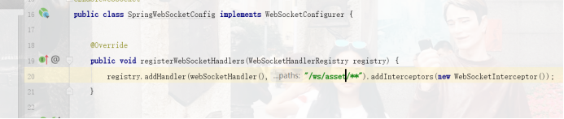

**各种方法对应**

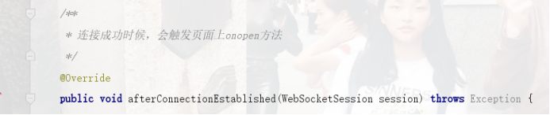

### 1.1.2 测试demo

```
分贝在浏览器打开两个窗口，访问html页面（http://localhost:8083/）
访问测试端口:
http://localhost:8083/api/ws/sendAll?message=我是测试群发消息
http://localhost:8083/api/ws/sendOne?message=我是单发消息1&id=81956079-413f-e49a-45ae-4e80e4ab5bd9
```

### 1.1.3 websocket默认长度限制

tomcat: websocket 发送内容长度设置（默认8192字节）

<https://blog.csdn.net/zhaotian19871204/article/details/84801915>


## 1.2 原生集成webSocket

使用项目 websocket-server

# 2 java client连接websocket接口

 https://blog.csdn.net/mengxb12138/article/details/81016782

使用项目websocket-javaclient: com.websocket.config.DestApp 测试

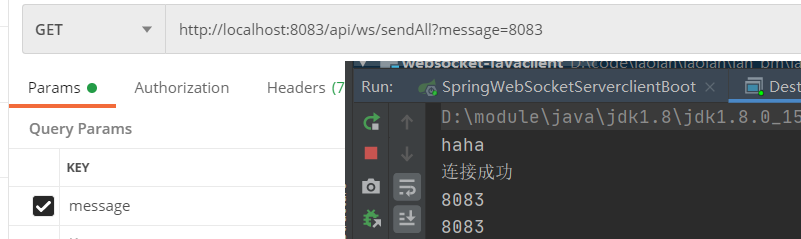

# 3 serverclinet 集成

## 3.1 原生集成

使用项目 websocket-serverclient

### 3.1.1 **代码**

#### Session

存储

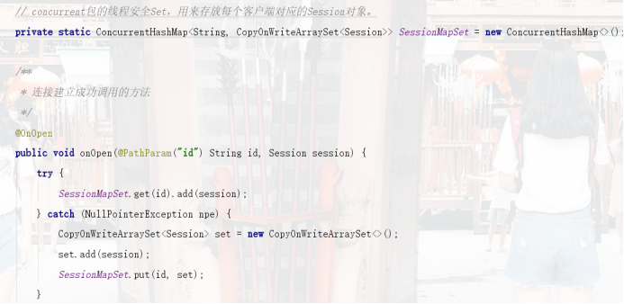

传递

由server 传递到 client

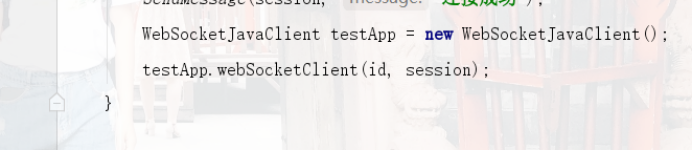 

由client传递回server

 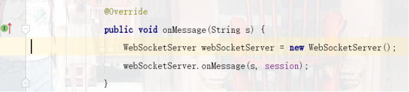

 

####  **页面访问index.html**

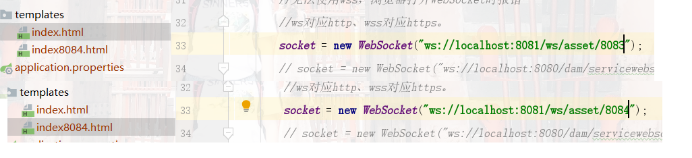

 

### 3.1.2 **测试**

####  **启动8083，8084**


 

####  **打开2个index,2个index8084**

注意sessionId

#### **访问8083** **发送sendAll**

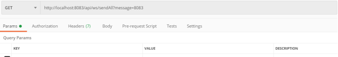

Index 收到

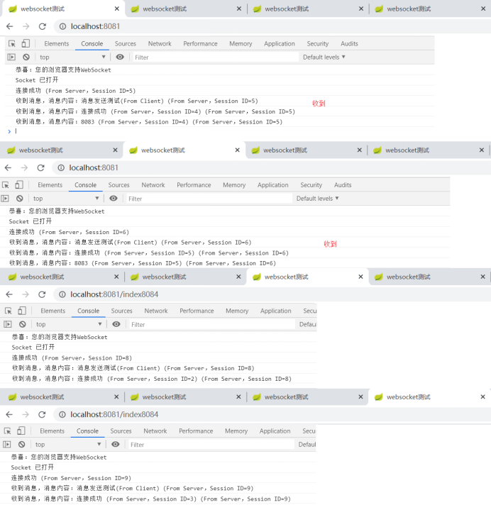 

 

#### **访问8084** **发送sendAll**

Index84 收到

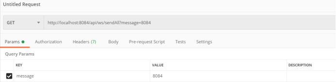

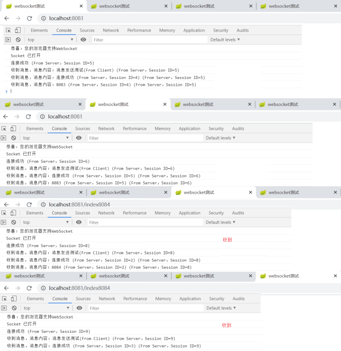  

##  3.2 spring boot 集成

使用项目 spring-websocket-serverclient

# 4 数据服务集成

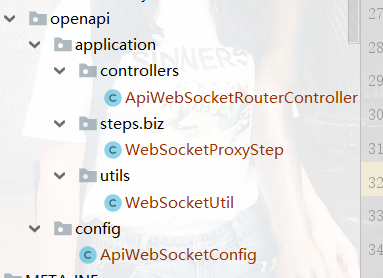


