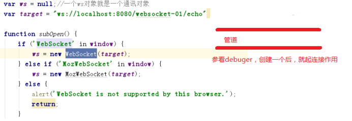
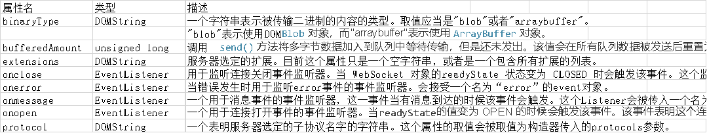

 

 

 

# 1 客户端H5

## 1.1 概述

WebSocket对象提供了用于创建和管理 [WebSocket](https://developer.mozilla.org/zh-CN/docs/Web/API/WebSockets_API) 连接，以及可以通过该连接发送和接收数据的 API。

*一个ws对象就是一个通讯对象*

ws://localhost:8080/helloworld/hello

 

```javascript
WebSocket WebSocket(in DOMString url, in optional DOMString protocols);
WebSocket WebSocket(in DOMString url,in optional DOMString[] protocols);

url: 表示要连接的URL。这个URL应该为响应WebSocket的地址。

protocols 可选
可以是一个单个的协议名字字符串或者包含多个协议名字字符串的数组。这些字符串用来表示子协议，这样做可以让一个服务器实现多种WebSocket子协议（例如你可能希望通过制定不同的协议来处理不同类型的交互）。如果没有制定这个参数，它会默认设为一个空字符串。
构造器方法可能抛出以下异常：SECURITY_ERR 试图连接的端口被屏蔽。
```

 

## 1.2 **属性**和常量



常量

这些常量是 readyState 属性的取值，可以用来描述 WebSocket 连接的状态。

| **常量**   | **值** | **描述**                         |
| ---------- | ------ | -------------------------------- |
| CONNECTING | 0      | 连接还没开启。                   |
| OPEN       | 1      | 连接已开启并准备好进行通信。     |
| CLOSING    | 2      | 连接正在关闭的过程中。           |
| CLOSED     | 3      | 连接已经关闭，或者连接无法建立。 |

 

 

## 1.3 **方法概述**

```javascript
void close(in optional unsigned long code, in optional DOMString reason);
void send(in DOMString data);
```

### 1.3.1 **close()**

关闭WebSocket连接或停止正在进行的连接请求。如果连接的状态已经是closed，这个方法不会有任何效果

void close(in optional unsigned short code, in optional DOMString reason);

**参数**

```
code 可选
一个数字值表示关闭连接的状态号，表示连接被关闭的原因。如果这个参数没有被指定，默认的取值是1000 （表示正常连接关闭）。 请看CloseEvent页面的 list of status codes来看默认的取值。

reason 可选
一个可读的字符串，表示连接被关闭的原因。这个字符串必须是不长于123字节的UTF-8 文本（不是字符）。
```

**可能抛出的异常**

```
INVALID_ACCESS_ERR: 选定了无效的code。
SYNTAX_ERR: reason 字符串太长或者含有unpaired surrogates。
注意： 在Gecko中，Gecko 8.0 (Firefox 8.0 / Thunderbird 8.0 / SeaMonkey 2.5)之间的版本的实现不支持任何参数。
```


### 1.3.2 **send()**

通过WebSocket连接向服务器发送数据。

void send(in DOMString data);

void send(in ArrayBuffer data);

void send(in Blob data); 

 **参数**

```
data
要发送到服务器的数据。
```

**可能抛出的异常**

```
INVALID_STATE_ERR
当前连接的状态不是OPEN。
SYNTAX_ERR
数据是一个包含unpaired surrogates的字符串。
注意: Gecko 6.0实现的send()方法与规范的要求有一些不同。Gecko会返回一个 boolean表示连接是否依然处于开启状态 （并且这个数据被成功放入的发送队列或者被发送）。在 Gecko 8.0中这个问题被修正了。
到了 Gecko 11.0，实现了接受 ArrayBuffer的参数的方法，但接受 Blob数据类型的方法没有被实现。
```

 

 