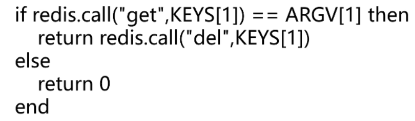
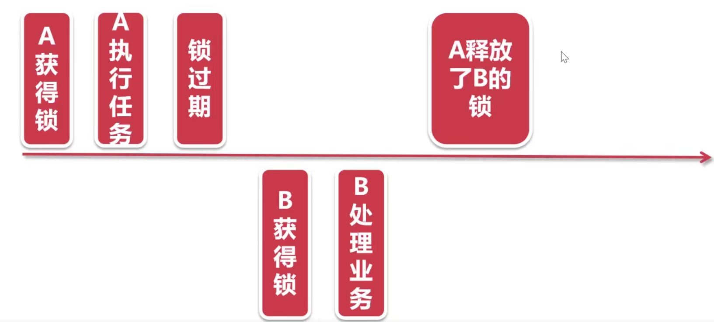

# 1 基于redis的Setnx实现分布式锁

问题：定时任务集群部署，任务重复执行

## 1.1 获取锁的Redis命令

SET resource_name my_random_value NX PX 30000

- resource_name: 资源名称，可根据不同的业务区分不同的锁
- my_random_value： 随机值，每个线程的随机值都不同，用于释放锁时的校验
- NX：key不存在时设置成功，key存在则设置不成功
- PX：自动失效时间，出现异常情况，锁可以过期失效


## 1.2 实现原理

利用NX的原子性，多个线程并发时，只有一个线程可以设置成功

设置成功即获得锁，可以执行后续的业务处理

如果出现异常，过了锁的有效期，锁自动释放


## 1.3 释放锁

释放锁采用Redis的delete命令

释放锁时校验之前设置的随机数，相同才能释放

释放锁时的LUA脚本



## 1.4 原理图解



# 2 基于redis分布式锁

## 2.1 RedisLock

distribute-lock#com.example.distributelock.lock.RedisLock

使用AutoCloseable实现自动关闭操作

```java
@Slf4j
public class RedisLock implements AutoCloseable {

    private RedisTemplate redisTemplate;
    private String key;
    private String value;
    //单位：秒
    private int expireTime;

    public RedisLock(RedisTemplate redisTemplate,String key,int expireTime){
        this.redisTemplate = redisTemplate;
        this.key = key;
        this.expireTime=expireTime;
        this.value = UUID.randomUUID().toString();
    }

    /**
     * 获取分布式锁
     * @return
     */
    public boolean getLock(){
        RedisCallback<Boolean> redisCallback = connection -> {
            //设置NX
            RedisStringCommands.SetOption setOption = RedisStringCommands.SetOption.ifAbsent();
            //设置过期时间
            Expiration expiration = Expiration.seconds(expireTime);
            //序列化key
            byte[] redisKey = redisTemplate.getKeySerializer().serialize(key);
            //序列化value
            byte[] redisValue = redisTemplate.getValueSerializer().serialize(value);
            //执行setnx操作
            Boolean result = connection.set(redisKey, redisValue, expiration, setOption);
            return result;
        };

        //获取分布式锁
        Boolean lock = (Boolean)redisTemplate.execute(redisCallback);
        return lock;
    }

    public boolean unLock() {
        String script = "if redis.call(\"get\",KEYS[1]) == ARGV[1] then\n" +
                "    return redis.call(\"del\",KEYS[1])\n" +
                "else\n" +
                "    return 0\n" +
                "end";
        RedisScript<Boolean> redisScript = RedisScript.of(script,Boolean.class);
        List<String> keys = Arrays.asList(key);

        Boolean result = (Boolean)redisTemplate.execute(redisScript, keys, value);
        log.info("释放锁的结果："+result);
        return result;
    }


    @Override
    public void close() throws Exception {
        unLock();
    }
}
```

## 2.2 demo

```java
@RequestMapping("redisLock")
public String redisLock(){
    log.info("我进入了方法！");
    try (RedisLock redisLock = new RedisLock(redisTemplate,"redisKey",30)){
        if (redisLock.getLock()) {
            log.info("我进入了锁！！");
            Thread.sleep(15000);
        }
    } catch (InterruptedException e) {
        e.printStackTrace();
    } catch (Exception e) {
        e.printStackTrace();
    }
    log.info("方法执行完成");
    return "方法执行完成";
}
```

## 2.3 基于分布式锁解决定时任务重复问题

distribute-lock#com.example.distributelock.service.SchedulerService

```java
@Service
@Slf4j
public class SchedulerService {
    @Autowired
    private RedisTemplate redisTemplate;

    @Scheduled(cron = "0/5 * * * * ?")
    public void sendSms(){
        try(RedisLock redisLock = new RedisLock(redisTemplate,"autoSms",30)) {
            if (redisLock.getLock()){
                log.info("向138xxxxxxxx发送短信！");
            }
        } catch (Exception e) {
            e.printStackTrace();
        }
    }

}

```

