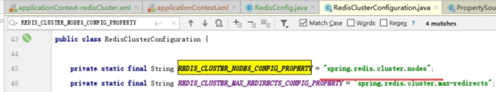

本文是从为知笔记上复制过来的，懒得调整格式了，为知笔记版本是带格式的，内容也比这里全

https://www.cnblogs.com/larryzeal/p/7188687.html

 

 

# 1 工厂Factory

## 1.1 **Pom.xml**

```xml
<spring.version>4.3.6.RELEASE</spring.version>
<jedis.version>2.9.0</jedis.version>
<spring.data.redis.version>1.8.0.RELEASE</spring.data.redis.version>

<!-- Redis客户端 -->
<dependency>
    <groupId>redis.clients</groupId>
    <artifactId>jedis</artifactId>
    <version>${jedis.version}</version>
</dependency>

<!-- Redis -->
<dependency>
    <groupId>org.springframework.data</groupId>
    <artifactId>spring-data-redis</artifactId>
    <version>${spring.data.redis.version}</version>
</dependency>
```

 

## 1.2 **单机（配置版）**

src\main\resources\spring\_applicationContext-redis.xml

### 1.2.1 **Redis连接工厂**

连接名，账号，密码

扩展：

1. *连超时设置*

1. *是否使用连接池*
2. *注入连接池配置*


```xml
<!-- Spring提供的Redis连接工厂 -->
	<bean id="jedisConnectionFactory" class="org.springframework.data.redis.connection.jedis.JedisConnectionFactory">
		<!-- Redis服务主机. -->
		<property name="hostName" value="${spring.redis.hostName}" />
		<!-- Redis服务端口号. -->
		<property name="port" value="${spring.redis.port}" />
		<!-- Redis服务连接密码. -->
		<property name="password" value="${spring.redis.password}" />
		<!-- 连超时设置. -->
		<property name="timeout" value="${spring.redis.timeout}" />
		<!-- 是否使用连接池. -->
		<property name="usePool" value="${spring.redis.usePool}" />
		<!--  注入连接池配置. -->
		<property name="poolConfig" ref="jedisPoolConfig" />
	</bean> 
```

 

### 1.2.2 扩展--**连接池的配置**

```xml
<!-- 连接池配置. -->
	<bean id="jedisPoolConfig" class="redis.clients.jedis.JedisPoolConfig">
		<!-- 连接池中最大连接数。高版本：maxTotal，低版本：maxActive -->
		<property name="maxTotal" value="8" />
		<!-- 连接池中最大空闲的连接数. -->
		<property name="maxIdle" value="8" />
		<!-- 连接池中最少空闲的连接数. -->
		<property name="minIdle" value="${spring.redis.minIdle}" />
		<!-- 当连接池资源耗尽时，调用者最大阻塞的时间，超时将跑出异常。单位，毫秒数;默认为-1.表示永不超时。高版本：maxWaitMillis，低版本：maxWait -->
		<property name="maxWaitMillis" value="${spring.redis.maxWaitMillis}" />
		<!-- 连接空闲的最小时间，达到此值后空闲连接将可能会被移除。负值(-1)表示不移除. -->
		<property name="minEvictableIdleTimeMillis" value="${spring.redis.minEvictableIdleTimeMillis}" />
		<!-- 对于“空闲链接”检测线程而言，每次检测的链接资源的个数。默认为3 -->
		<property name="numTestsPerEvictionRun" value="${spring.redis.numTestsPerEvictionRun}" />
		<!-- “空闲链接”检测线程，检测的周期，毫秒数。如果为负值，表示不运行“检测线程”。默认为-1. -->
		<property name="timeBetweenEvictionRunsMillis" value="${spring.redis.timeBetweenEvictionRunsMillis}" />
		<!-- testOnBorrow:向调用者输出“链接”资源时，是否检测是有有效，如果无效则从连接池中移除，并尝试获取继续获取。默认为false。建议保持默认值. -->
		<!-- testOnReturn:向连接池“归还”链接时，是否检测“链接”对象的有效性。默认为false。建议保持默认值. -->
		<!-- testWhileIdle:向调用者输出“链接”对象时，是否检测它的空闲超时；默认为false。如果“链接”空闲超时，将会被移除。建议保持默认值. -->
		<!-- whenExhaustedAction:当“连接池”中active数量达到阀值时，即“链接”资源耗尽时，连接池需要采取的手段, 默认为1(0:抛出异常。1:阻塞，直到有可用链接资源。2:强制创建新的链接资源) -->
	</bean> 
```

 


## 1.3 **单机（注释版）**

 laolan-javaeeEx-cache-redis-springdataredis#cn.e3mall.config.RedisConfig


## 1.4 集群（配置版）

### 1.4.1 **集群节点配置**推荐：方式三：resourcePropertySource

```properties
# 集群配置
spring.redis.cluster.nodes=
```

```xml-dtd
 <!--配置文件加载-->
    <bean id="resourcePropertySource" class="org.springframework.core.io.support.ResourcePropertySource">
        <constructor-arg name="name" value="redis.properties"/>
        <constructor-arg name="resource" value="classpath:redis.properties"/>
    </bean>

    <!-- 配置Cluster -->
    <bean id="redisClusterConfiguration"
          class="org.springframework.data.redis.connection.RedisClusterConfiguration">
        <constructor-arg name="propertySource" ref="resourcePropertySource"/>	<!-- 方式三 -->
        <property name="maxRedirects" value="6"></property>
```

原理：



 

### **1.4.2 集群节点配置方式二：RedisClusterNode**

```xml-dtd
 <!-- 配置Cluster -->
    <bean id="redisClusterConfiguration"
          class="org.springframework.data.redis.connection.RedisClusterConfiguration">
        <constructor-arg name="propertySource" ref="resourcePropertySource"/>	<!-- 方式三 -->
        <property name="maxRedirects" value="6"></property>
        <!--  方式二：节点配置 -->
        <property name="clusterNodes">
            <set>
                <bean class="org.springframework.data.redis.connection.RedisClusterNode">
                    <constructor-arg name="host" value="192.168.25.101"></constructor-arg>
                    <constructor-arg name="port" value="6380"></constructor-arg>
                </bean>
                <bean class="org.springframework.data.redis.connection.RedisClusterNode">
                    <constructor-arg name="host" value="192.168.25.101"></constructor-arg>
                    <constructor-arg name="port" value="6381"></constructor-arg>
                </bean>
				<bean class="org.springframework.data.redis.connection.RedisClusterNode">
					<constructor-arg name="host" value="192.168.25.101"></constructor-arg>
					<constructor-arg name="port" value="6382"></constructor-arg>
				</bean>
            </set>
        </property>
    </bean>
```

## 1.5**集群（注释版）** 

 

# 2 配置

## 2.1 Template

### 2.1.1 **StringRedisTemplate**

1.注入redis连接工程

2.事务

1. **key序列化器keySerializer**

4.value序列化器**valueSerializer**

```xml
	<bean id="stringRedisTemplate" class="org.springframework.data.redis.core.StringRedisTemplate">
		<property name="connectionFactory" ref="jedisConnectionFactory" />
		<!-- 开启事务 -->
		<property name="enableTransactionSupport" value="true"></property>
		<property name="keySerializer">
			<bean class="org.springframework.data.redis.serializer.StringRedisSerializer" />
		</property>
		<property name="valueSerializer">
			<bean class="org.springframework.data.redis.serializer.JdkSerializationRedisSerializer" />
			 <!--<bean class="org.springframework.data.redis.serializer.JacksonJsonRedisSerializer" />-->
		</property>
	</bean> 
```

 

### 2.1.2 R**edisTemplate**

1.注入redis连接工程

2.事务

1. **key序列化器****keySerializer**

4.value序列化器**valueSerializer**

1. hashK**ey序列化器****keySerializer**
2. HashValue序列化器**valueSerializer** 

```xml
<!-- Spring提供的访问Redis类. -->
	<bean id="redisTemplate" class="org.springframework.data.redis.core.RedisTemplate">
		<property name="connectionFactory" ref="jedisConnectionFactory" />
		<!-- 开启事务 -->
		<property name="enableTransactionSupport" value="true"></property>

		<property name="keySerializer">
			<bean class="org.springframework.data.redis.serializer.StringRedisSerializer" />
		</property>

		<property name="valueSerializer">
			<bean class="org.springframework.data.redis.serializer.JdkSerializationRedisSerializer" />
			<!-- <bean class="com.alibaba.fastjson.support.spring.GenericFastJsonRedisSerializer"/>
            <bean class="org.springframework.data.redis.serializer.StringRedisSerializer" /> -->
		</property>

		<property name="hashKeySerializer">
			<bean class="org.springframework.data.redis.serializer.StringRedisSerializer" />
		</property>

		<property name="hashValueSerializer">
        	<bean class="org.springframework.data.redis.serializer.StringRedisSerializer" />
		</property>
	</bean>
```


## 2.3 **Spring-cahe的cacheManager**

```xml-dtd
<!-- 不使用就需要注解掉，如果配置了启用注解注释，就必须要配置cacheManager 否则就会启动报错。因为配置了这个缓存拦截器就会去注入cacheManager -->
	<cache:annotation-driven cache-manager="stringRedisCacheManager" />

	<!-- 这里面可以配置上面分析的各种字段属性-->
	<bean id="stringRedisCacheManager" class="org.springframework.data.redis.cache.RedisCacheManager">
		<!--配置 redisTemplate-->
		<constructor-arg index = "0" type="org.springframework.data.redis.core.RedisOperations">
			<ref bean="stringRedisTemplate" />
		</constructor-arg>
		<!-- 过期时间 -->
		<property name="defaultExpiration" value="300000"/>
		<!--    支持事务 -->
		<property name="transactionAware" value = "true"/>
	</bean>

	<!-- 这里面可以配置上面分析的各种字段属性-->
	<bean id="redisCacheManager" class="org.springframework.data.redis.cache.RedisCacheManager">
		<!--配置 redisTemplate-->
		<constructor-arg index = "0" type="org.springframework.data.redis.core.RedisOperations">
			<ref bean="redisTemplate" />
		</constructor-arg>
		<!-- 过期时间 -->
		<property name="defaultExpiration" value="300000"/>
		<!--    支持事务 -->
		<property name="transactionAware" value = "true"/>
	</bean>
```


 

 

 

 

 

 

 

 

 

 

 

 

 

 

 

 

 

 

 

 

 

 

 