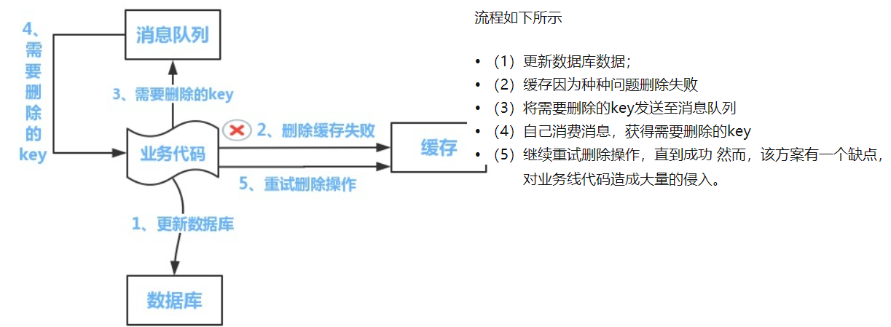
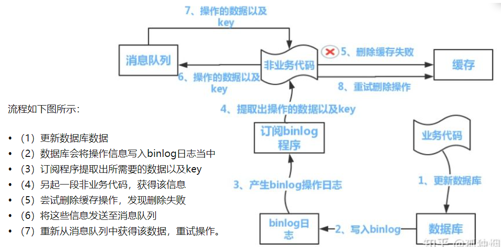

# 1 缓存同步

## 1.1 思路

### 1.1.1 第一种：查（增）修删(删)+失效时间

参看jedis 查询缓存，缓存同步

增加:不管

查询(缓存查询)：先去redis查询，得到就返回; 否，去数据库查询，并存入redis（失效时间）,再返回

修改和删除(缓存同步):  直接删除redis

 

### 1.1.2 第二种：增改（更新）删（删）

增加和修改: 更新数据库以及更新redis

查询：不管

删除: 直接删除

# 2 分布式缓存DB一致性

## **2.1 三种**更新策略

都会存在问题，第三种情况几率很小

1. 先更新数据库，再更新缓存
2. 先删除缓存，再更新数据库
3. 先更新数据库，再删除缓存
   1. **失效**：应用程序先从cache取数据，没有得到，则从数据库中取数据，成功后，放到缓存中。
   2. **命中**：应用程序从cache中取数据，取到后返回。
   3. **更新**：先把数据存到数据库中，成功后，再让缓存失效。

## 2.2 一定解决分布式缓存

[把分布式缓存一致性解决方案说的最清楚的一篇文章](https://zhuanlan.zhihu.com/p/59167071)

### 2.2.1 mq引入

  mq保证一定消费，

### 2.2.2 mq+binlog+canal订阅引入

相当于在msyql层面解决，不需要去改造每个业务代码

 

 