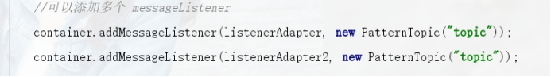
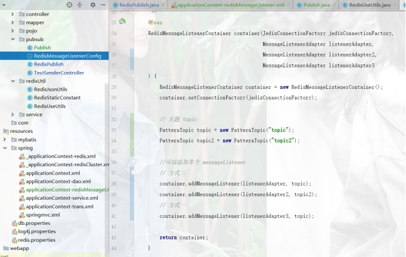
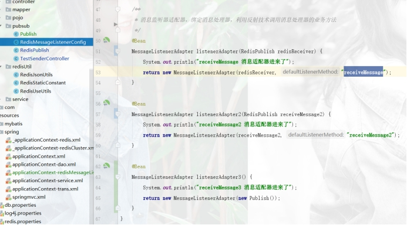
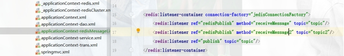
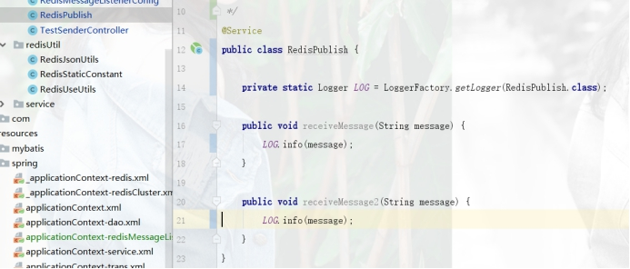
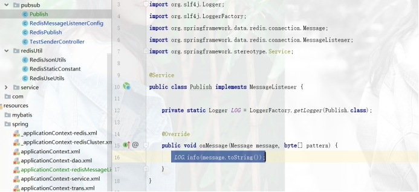
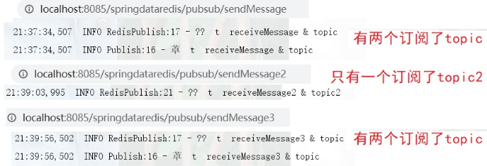
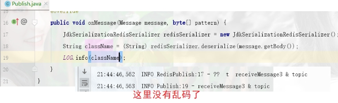

 

 

# 1. **发布订阅**

## 1.1. **概述**

### 1.1.1. **概念**

多方订阅，一方发布

 

### 1.1.2. **主题**

在订阅了这个主题的所有地方都会收到信息

 

 

各个主题，访问对应的

​	凡是订阅过该主题的都能接受到

 

 

# 2. **Spring整合**

https://segmentfault.com/a/1190000004438233

 

## 2.1. **Config(二选一)消息监听器容器和主题**

### 2.1.1. **注解版**

*redis消息监听器容器*

 

  

 

### 2.1.2. **Xml 版本**

 

 

## 2.2. **消息发布**

### 2.2.1. **方式一：指定发布的方法**

这里比较特殊，一般一个方法，一个监听器，一个主题

 

 

### 2.2.2. **方式二：实现onMessage方法**

 

 

## 2.3. **测试**

 

## 2.4. **消息结果解析乱码问题**

 

 

 