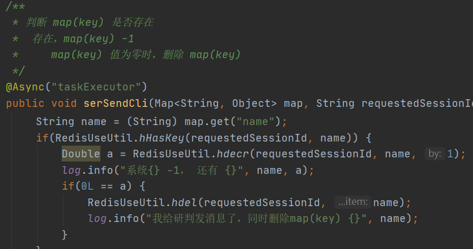
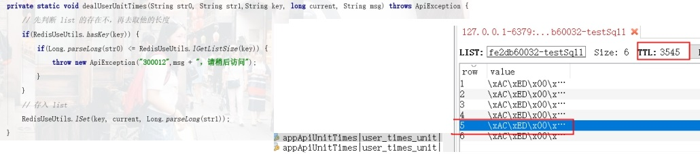

# 1. **面试题**

## 1.1. **Redis在项目中的使用场景**

| 数据类型 | 使用场景                                                     |
| -------- | ------------------------------------------------------------ |
| String   | 比如说 ，我想知道什么时候封锁一个IP地址。Incrby命令          |
| Hash     | 存储用户信息【id，name，age】Hset(key,field,value)Hset(userKey,id,101)Hset(userKey,name,admin)Hset(userKey,age,23)----修改案例----Hget(userKey,id)Hset(userKey,id,102)为什么不使用String 类型来存储Set(userKey,用信息的字符串)Get(userKey)不建议使用String 类型 |
| List     | 实现最新消息的排行，还可以利用List的push命令，将任务存在list集合中，同时使用另一个命令，将任务从集合中取出[pop]。Redis—list数据类型来模拟消息队列。【电商中的秒杀就可以采用这种方式来完成一个秒杀活动】 |
| Set      | 特殊之处：可以自动排重。比如说微博中将每个人的好友存在集合(Set)中，这样求两个人的共通好友的操作。我们只需要求交集即可。 |
| Zset     | 以某一个条件为权重，进行排序。京东：商品详情的时候，都会有一个综合排名，还可以按照价格进行排名。 |

 

# 项目

## Hash

### 数采-多线程处理数据

```
判断 map(key) 是否存在
 存在，map(key) -1
    map(key) 值为零时，删除 map(key)
```



### 服务-调用次数

调用总次数和已调用总次数

一个apiPermit 对应一个


## List

### 服务-调用频率

发生场景：

统计调用频率，设计失效时间。

 


## 发布订阅

### 服务-同步调用次数调用频率

 

 

