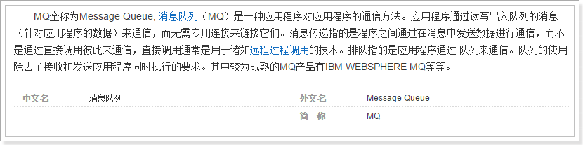
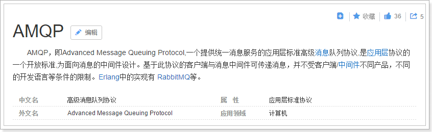
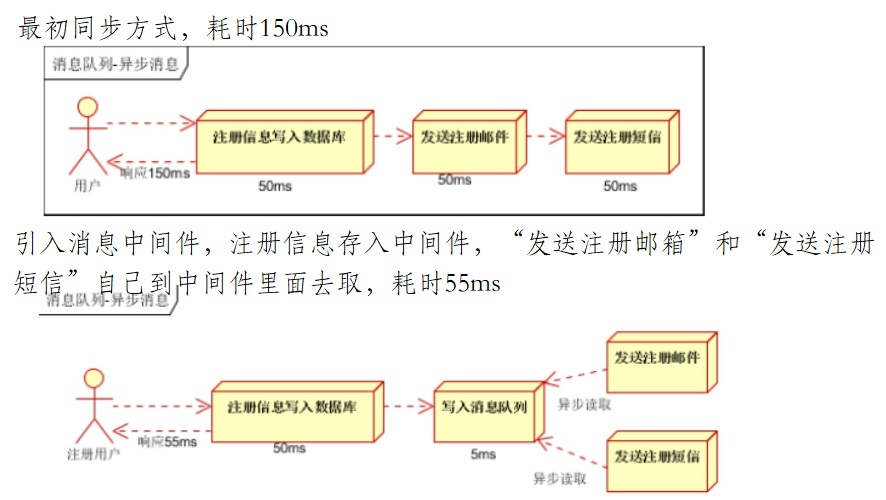
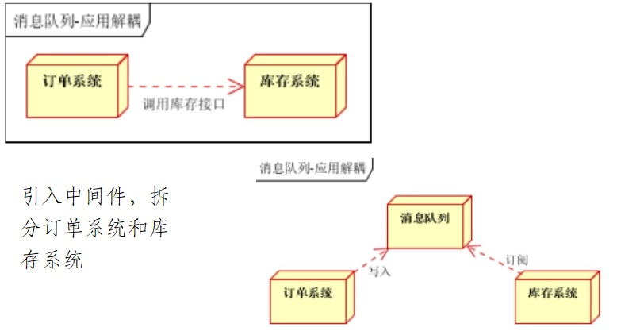
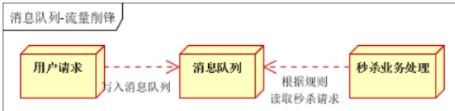

# 1.RabbitMQ

## 1.1.搜索与商品服务的问题

目前我们已经完成了商品详情和搜索系统的开发。我们思考一下，是否存在问题？

- 商品的原始数据保存在数据库中，增删改查都在数据库中完成。
- 搜索服务数据来源是索引库，如果数据库商品发生变化，索引库数据不能及时更新。
- 商品详情做了页面静态化，静态页面数据也不会随着数据库商品发生变化。

如果我们在后台修改了商品的价格，搜索页面和商品详情页显示的依然是旧的价格，这样显然不对。该如何解决？

这里有两种解决方案：

- 方案1：每当后台对商品做增删改操作，同时要修改索引库数据及静态页面
- 方案2：搜索服务和商品页面服务对外提供操作接口，后台在商品增删改后，调用接口

以上两种方式都有同一个严重问题：就是代码耦合，后台服务中需要嵌入搜索和商品页面服务，违背了微服务的`独立`原则。

所以，我们会通过另外一种方式来解决这个问题：消息队列

## 1.2.消息队列（MQ）

### 1.2.1.什么是消息队列

消息队列，即MQ，Message Queue。

消息队列是典型的：生产者、消费者模型。生产者不断向消息队列中生产消息，消费者不断的从队列中获取消息。因为消息的生产和消费都是异步的，而且只关心消息的发送和接收，没有业务逻辑的侵入，这样就实现了生产者和消费者的解耦。

结合前面所说的问题：

- 商品服务对商品增删改以后，无需去操作索引库或静态页面，只是发送一条消息，也不关心消息被谁接收。
- 搜索服务和静态页面服务接收消息，分别去处理索引库和静态页面。

如果以后有其它系统也依赖商品服务的数据，同样监听消息即可，商品服务无需任何代码修改。

### 1.2.2.AMQP和JMS

MQ是消息通信的模型，并不是具体实现。现在实现MQ的有两种主流方式：AMQP、JMS。

两者间的区别和联系：

- JMS是定义了统一的接口，来对消息操作进行统一；AMQP是通过规定协议来统一数据交互的格式
- JMS限定了必须使用Java语言；AMQP只是协议，不规定实现方式，因此是跨语言的。
- JMS规定了两种消息模型；而AMQP的消息模型更加丰富

### 1.2.3.常见MQ产品

- ActiveMQ：基于JMS
- RabbitMQ：基于AMQP协议，erlang语言开发，稳定性好
- RocketMQ：基于JMS，阿里巴巴产品，目前交由Apache基金会
- Kafka：分布式消息系统，高吞吐量

## 1.3. **应用**场景

### 1.3.1. **异步处理**

最初同步方式，耗时150ms

 

### 1.3.2. **应用解耦**

### 1.3.3. **流量削峰**

 