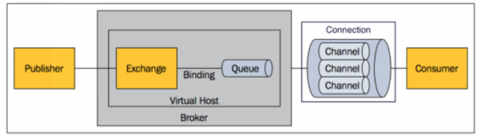

# 1. **RabbitMQ**

## 1.1. **RabbitMQ简介：**

RabbitMQ是一个由erlang开发的AMQP(Advanved Message Queue Protocol)的开源实现

 

## 1.2. 消息路由

 

-  Message：消息，消息是不具名的，它由消息头和消息体组成。消息体是不透明的，而消息头则是由一系列的可选属性组成，这些属性包括routing-key(路由键)、proiority(相对于其他消息的优先权)、delivery-mode(指出改消息可能)
- Publisher：消息的生成者，也是一个向交换器发布消息的客户端应用程序

- Broker：表示消息队列服务器实体
  - Virtual Host：虚拟主机，表示一批交换器、消息队列和相关对象。虚拟主机是共享相同的身份认证和加密环境的独立服务器域。每个vhost本质上就是一个mini版的RabbitMQ服务器，拥有自己的队列、交换器、绑定和权限机制。
  - Exchange：交换器，用来接收生成者发送消息并将这些消息路由给服务器的队列。Exchange有四种类型：direct(默认)，fanout，topic和headers，不同类型的Exchange转发消息的策略有区别
  - Binding：绑定，用于消息队列和交换器之间的关联
  - Queue：消息队列
- Connection：网络连接，比如一个TCP连接
  - Channel：信道
- Consumer：消息的消费者，表示一个从消息队列中取得消息的客户端应用程序

 

 