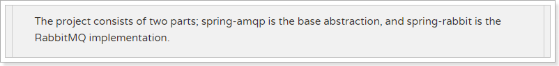

# 3.Spring AMQP

## 3.1.简介

Sprin有很多不同的项目，其中就有对AMQP的支持：


Spring AMQP的页面：http://spring.io/projects/spring-amqp


注意这里一段描述：

                                             

         Spring-amqp是对AMQP协议的抽象实现，而spring-rabbit 是对协议的具体实现，也是目前的唯一实现。底层使用的就是RabbitMQ。
    

## 3.2.依赖和配置
## 3.2.依赖和配置

添加AMQP的启动器：

```xml
<dependency>
    <groupId>org.springframework.boot</groupId>
    <artifactId>spring-boot-starter-amqp</artifactId>
</dependency>
```

在`application.yml`中添加RabbitMQ地址：

```yaml
spring:
  rabbitmq:
    host: 192.168.56.101
    username: leyou
    password: leyou
    virtual-host: /leyou
```


## 3.3.监听者

在SpringAmqp中，对消息的消费者进行了封装和抽象，一个普通的JavaBean中的普通方法，只要通过简单的注解，就可以成为一个消费者。

```java
@Component
public class Listener {

    @RabbitListener(bindings = @QueueBinding(
            value = @Queue(value = "spring.test.queue", durable = "true"),
            exchange = @Exchange(
                    value = "spring.test.exchange",
                    ignoreDeclarationExceptions = "true",
                    type = ExchangeTypes.TOPIC
            ),
            key = {"#.#"}))
    public void listen(String msg){
        System.out.println("接收到消息：" + msg);
    }
}
```

- `@Componet`：类上的注解，注册到Spring容器
- `@RabbitListener`：方法上的注解，声明这个方法是一个消费者方法，需要指定下面的属性：
  - `bindings`：指定绑定关系，可以有多个。值是`@QueueBinding`的数组。`@QueueBinding`包含下面属性：
    - `value`：这个消费者关联的队列。值是`@Queue`，代表一个队列
    - `exchange`：队列所绑定的交换机，值是`@Exchange`类型
    - `key`：队列和交换机绑定的`RoutingKey`

类似listen这样的方法在一个类中可以写多个，就代表多个消费者。


## 3.4.AmqpTemplate

Spring最擅长的事情就是封装，把他人的框架进行封装和整合。

Spring为AMQP提供了统一的消息处理模板：AmqpTemplate，非常方便的发送消息，其发送方法：


红框圈起来的是比较常用的3个方法，分别是：

- 指定交换机、RoutingKey和消息体
- 指定消息
- 指定RoutingKey和消息，会向默认的交换机发送消息


## 3.5.测试代码

```java
@RunWith(SpringRunner.class)
@SpringBootTest(classes = Application.class)
public class MqDemo {

    @Autowired
    private AmqpTemplate amqpTemplate;

    @Test
    public void testSend() throws InterruptedException {
        String msg = "hello, Spring boot amqp";
        this.amqpTemplate.convertAndSend("spring.test.exchange","a.b", msg);
        // 等待10秒后再结束
        Thread.sleep(10000);
    }
}
```

运行后查看日志：


