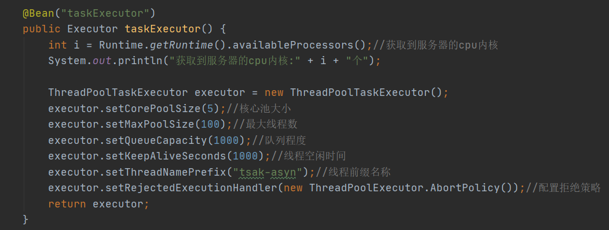
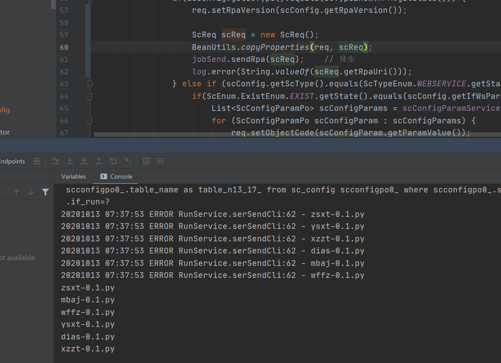

# 1. **线程池**

https://blog.csdn.net/weixin_43168010/article/details/97613895

## 1.1. **介绍**

 

## 1.2. **配置**

### 1.2.1. **Xml** **配置**

 

### 1.2.2. **注解配置**

 

 

 

## 1.3. **队列-最大线程数-核心线程数**

### 1.3.1. **线程池的工具类 : Executors分类**

Java通过Executors提供四种线程池，分别为：

newCachedThreadPool创建一个可缓存线程池，如果线程池长度超过处理需要，可灵活回收空闲线程，若无可回收，则新建线程。

newFixedThreadPool 创建一个定长线程池，可控制线程最大并发数，超出的线程会在队列中等待。

newScheduledThreadPool 创建一个无限线程池，支持定时及周期性任务执行。

newSingleThreadExecutor 创建一个单线程化的线程池，它只会用唯一的工作线程来执行任务，保证所有任务按照指定顺序(FIFO, LIFO, 优先级)执行。

 

### 1.3.2. **处理流程**


### 1.3.3. **拒绝策略**

 

 

# 2. **异步任务@Aysnc**、

<https://blog.csdn.net/weixin_43168010/article/details/103512942>

## 2.1. **概念配置**

​	在Java应用中，绝大多数情况下都是通过同步的方式来实现交互处理的；但是在处理与第三方系统交互的时候，容易造成响应迟缓的情况，之前大部分都是使用多线程来完成此类任务，其实，在Spring 3.x之后，就已经内置了@Async来完美解决这个问题。

xml配置

```xml
<!-- 开启异步 这里屏蔽，kun-openapi-runtime.xml 已经有啦，如果两个都配置，spring 工程：xml 会覆盖 注解，spring boot 启动会报错 -->
<task:annotation-driven executor="myExecutor" scheduler="myScheduler" />
	<task:executor id="myExecutor" pool-size="1" />
	<task:scheduler id="myScheduler" pool-size="1" /> 
```

注解@EnableAsync , 访问localhost:8080**/hello**, 会马上得到返回的信息

```java
@EnableAsync  //开启异步注解功能
@Aysnc
```


##  2.2 CountDownLatch等待线程

 <https://blog.csdn.net/weixin_43168010/article/details/103512942>

主线程等待子线程

```java
@Async(value = "taskExecutor")
    public void testCountDownLatch(CountDownLatch countDownLatch, int i){
        try {
            Thread.sleep(1000);
        } catch (InterruptedException e) {
            e.printStackTrace();
        }
        System.out.println(i + " 处理数据中..." + new Date() + "  " + Thread.currentThread().getName());
        countDownLatch.countDown();
    }
```

```
@GetMapping("/testCountDownLatch")
    public String testCountDownLatch(){
        System.out.println("开始执行多线程任务:::"+System.currentTimeMillis());
        CountDownLatch countDownLatch = new CountDownLatch(10);
        for (int i = 0; i < 10; i++) {
            asyncService.testCountDownLatch(countDownLatch, i);
        }
        try {
            countDownLatch.await();
        } catch (InterruptedException e) {
            e.printStackTrace();
        }

        System.out.println("子线程已近执行完了，主线程继续执行:::"+Thread.currentThread().getName());
        return "testCountDownLatch";
    }
```

## 2.3. **注意**

### 2.3.1 **结合线程池使用**

```java
@Async(value = "taskExecutor")
public void helloExecutor(int i)
```

### 2.3.2 多级**@async** **不生效**（很重要）

 由于异步方法@Async和他调用的同步方法在一个类中，不生效

com.atguigu.task.service.ManyService#testCountDownLatch 

###  2.3.3 CountDownLatch核心线程数

在多级的时候，多个http请求可能出现核心线程里面都是CountDownLatch时候，就死锁

​	比如在demo,核心线程数是6，5个CountDownLatch

​	第一次请求是5个CountDownLatch(分别继续执行他们的子线程，实际只剩下一个在处理子线程)，

​	然后又发过来一个http请求，恰好最后一个被第二次请求的CountDownLatch占用，就gg了

### 2.3.4 for 循环对象传参问题

由于对象是引用类型，在BeanUtils.copyProperties(req, scReq);



