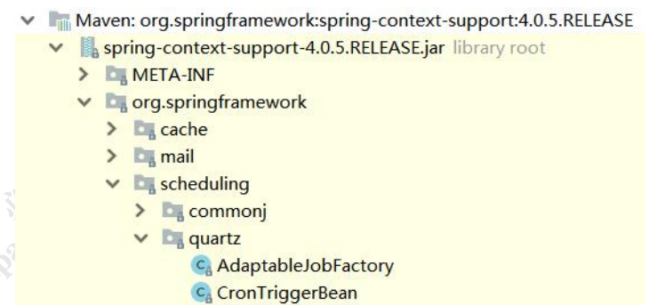

# 4 Quartz 集成到 Spring 

Spring-quartz 工程 

Spring 在 spring-context-support.jar 中直接提供了对 Quartz 的支持。



可以在配置文件中把 JobDetail、Trigger、Scheduler 定义成 Bean。 

## 4.1 定义 Job 

```xml
<bean name="myJob1" class="org.springframework.scheduling.quartz.JobDetailFactoryBean"> 		<property name="name" value="my_job_1"/>
	<property name="group" value="my_group"/> 
    <property name="jobClass" value="com.gupaoedu.quartz.MyJob1"/> 
    <property name="durability" value="true"/> 
</bean>
```

## 4.2 定义 Trigger

```xml
<bean name="simpleTrigger" class="org.springframework.scheduling.quartz.SimpleTriggerFactoryBean"> 
    <property name="name" value="my_trigger_1"/> 
    <property name="group" value="my_group"/> 
    <property name="jobDetail" ref="myJob1"/> 
    <property name="startDelay" value="1000"/> 
    <property name="repeatInterval" value="5000"/> 
    <property name="repeatCount" value="2"/> 
</bean>
```

## 4.3 定义 Scheduler

```xml
<bean name="scheduler" class="org.springframework.scheduling.quartz.SchedulerFactoryBean"> 	
    <property name="triggers"> 
        <list>
            <ref bean="simpleTrigger"/> 
            <ref bean="cronTrigger"/> 
        </list> 
    </property> 
</bean>
```


# 2 注解版本

## 2.1 注解配置	

既然可以在配置文件配置，当然也可以用@Bean 注解配置。在配置类上加上@Configuration 让 Spring 读取到。 

```java
public class QuartzConfig { 
    @Bean 
    public JobDetail printTimeJobDetail(){ 
        return JobBuilder.newJob(MyJob1.class) 
            .withIdentity("gupaoJob") 
            .usingJobData("gupao", "职位更好的你") 
            .storeDurably() 
            .build(); 
    }
    
    @Bean
    public Trigger printTimeJobTrigger() { 
        CronScheduleBuilder cronScheduleBuilder = 
            CronScheduleBuilder.cronSchedule("0/5 * * * * ?"); 
        return TriggerBuilder.newTrigger() 
            .forJob(printTimeJobDetail()) 
            .withIdentity("quartzTaskService") 
            .withSchedule(cronScheduleBuilder) 
            .build(); 
    } 
}
```

运行 springboot-quartz-ans 