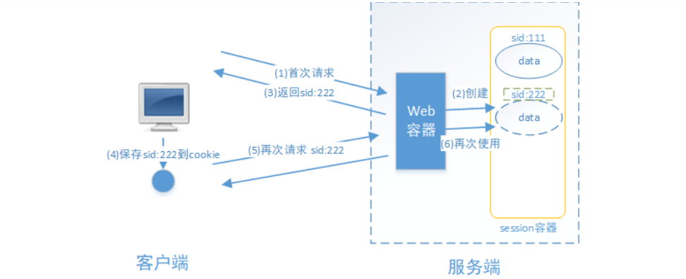
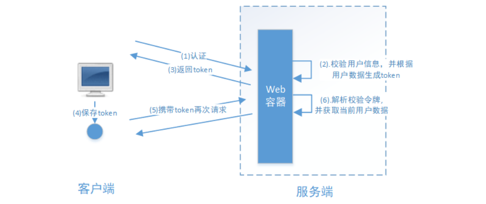
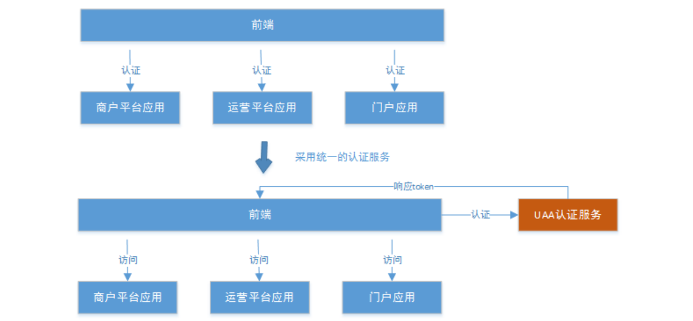
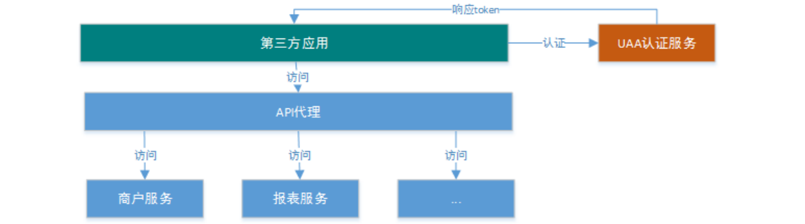
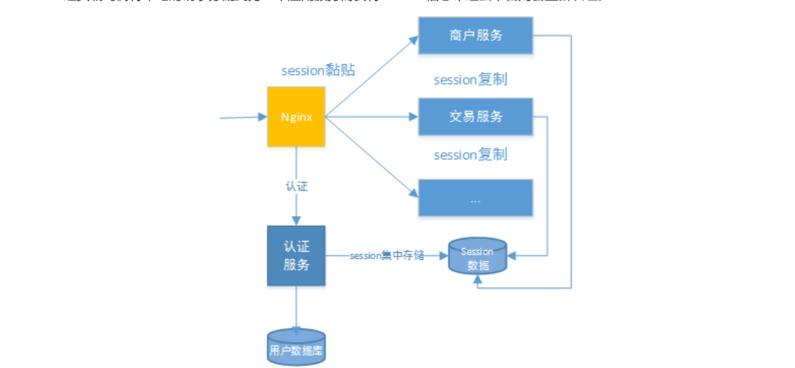
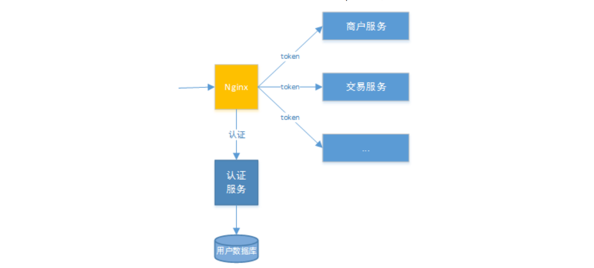
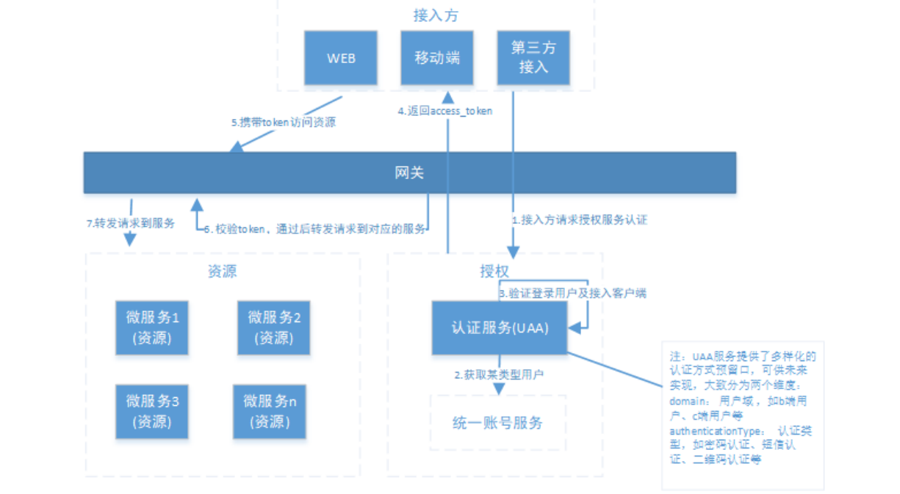

# 2 用户认证 

SaaS平台提供统一认证的服务，本章节学习SaaS平台的认证功能。 

## 2.1 基本概念 

### 2.1.1 什么是认证 

​	进入移动互联网时代，大家每天都在刷手机，常用的软件有微信、支付宝、头条等，下边拿微信来举例子说明认证 相关的基本概念，在初次使用微信前需要注册成为微信用户，然后输入账号和密码即可登录微信，输入账号和密码 登录微信的过程就是认证。 

系统为什么要认证？ 

认证是为了保护系统的隐私数据与资源，用户的身份合法方可访问该系统的资源。 

**认证** ：用户认证就是判断一个用户的身份是否合法的过程，用户去访问系统资源时系统要求验证用户的身份息，身份合法方可继续访问，不合法则拒绝访问。常见的用户身份认证方式有：用户名密码登录，二维码登录，手 机短信登录，指纹认证等方式。 

### 2.1.2 什么是会话 

​	用户认证通过后，为了避免用户的每次操作都进行认证可将用户的信息保证在会话中。会话就是系统为了保持当前用户的登录状态所提供的机制，常见的有基于session方式、基于token方式等。 

#### 基于session的认证方式如下图： 

​	它的交互流程是，用户认证成功后，在服务端生成用户相关的数据保存在session(当前会话)中，发给客户端的sesssion_id 存放到 cookie 中，这样用户客户端请求时带上 session_id 就可以验证服务器端是否存在 session 数据，以此完成用户的合法校验，当用户退出系统或session过期销毁时,客户端的session_id也就无效了。 

#### 基于token方式如下图： 

它的交互流程是，用户认证成功后，服务端生成一个token发给客户端，客户端存储token，每次请求时带上 

token，服务端收到token通过验证后即可确认用户身份。 

### 2.1.3 什么是授权 

​	还拿微信来举例子，微信登录成功后用户即可使用微信的功能，比如，发红包、发朋友圈、添加好友等，没有绑定银行卡的用户是无法发送红包的，绑定银行卡的用户才可以发红包，发红包功能、发朋友圈功能都是微信的资源即功能资源，用户拥有发红包功能的权限才可以正常使用发送红包功能，拥有发朋友圈功能的权限才可以使用发朋友圈功能，这个根据用户的权限来控制用户使用资源的过程就是授权。 

为什么要授权？

​	认证是为了保证用户身份的合法性，授权则是为了更细粒度的对隐私数据进行划分，授权是在认证通过后发生的， 控制不同的用户能够访问不同的资源。 

**授权：** 授权是用户认证通过根据用户的权限来控制用户访问资源的过程，拥有资源的访问权限则正常访问，没有 权限则拒绝访问。

## 2.2.分布式系统认证方案 

### 2.2.1 分布式认证需求 

#### 1、统一认证授权 

​	分布式系统的每个服务（系统）都会有认证、授权的需求，如果每个服务都实现一套认证授权逻辑会非常冗余，考虑分布式系统共享性的特点，需要由独立的认证服务来处理系统认证授权的请求； 

​	如下图，闪聚支付平台包括：商户平台应用、运营平台应用、门户应用，每个应用都需要身份认证，闪聚支付平台统一由UAA认证服务完成认证。 

1、前端请求UAA认证服务请求认证，认证通过获取 Token 

2、前端携带Token访问各各应用。 

#### 2、开放认证体系 

​	考虑分布式系统开放性的特点，UAA认证服务不仅服务于平台自身，并且对第三方系统也要提供认证，平台应提供扩展和开放的认证机制，以开放API的方式供第三方应用接入，一方应用（内部 系统服务）和三方应用（第三方应用）均采用统一机制接入。 

下图是第三方的应用接入闪聚支付平台结构图：

1、第三方应用请求UAA认证服务请求认证，认证通过获取Token。 

2、第三方应用携带Token访问API代理（专门针对第三方应用接入开发的微服务）。 

3、API代理访问平台微服务向第三方应用返回业务

### 2.2.2 分布式认证方案 

#### 2.2.2.1 选型分析 

##### 1、基于session的认证方式 

​	在分布式的环境下，基于session的认证会出现一个问题，每个应用服务都需要在session中存储用户身份信息，通过负载均衡将本地的请求分配到另一个应用服务需要将session信息带过去，否则会重新认证。  

这个时候，通常的做法有下面几种： 

**Session复制：**多台应用服务器之间同步session，使session保持一致，对外透明。 

**Session黏贴：**当用户访问集群中某台服务器后，强制指定后续所有请求均落到此机器上。

**Session集中存储**：将Session存入分布式缓存中，所有服务器应用实例统一从分布式缓存中存取Session。 

​	总体来讲，基于session认证的认证方式，可以更好的在服务端对会话进行控制，且安全性较高。但是session机制方式基于cookie，在复杂多样的移动客户端上不能有效的使用，并且无法跨域，另外随着系统的扩展需提高session的复制、黏贴及存储的容错性。 

##### 2、基于token的认证方式 

​	基于token的认证方式，服务端不用存储认证数据，易维护扩展性强， 客户端可以把token 存在任意地方，并且可 以实现web和app统一认证机制。其缺点也很明显，token由于自包含信息，因此一般数据量较大，而且每次请求 都需要传递，因此比较占带宽。另外，token的签名验签操作也会给cpu带来额外的处理负担。 

#### 2.2.2.2 技术方案-基于token的认证方式 

根据 选型的分析，决定采用基于token的认证方式，它的优点是： 

1、适合统一认证的机制，客户端、一方应用、三方应用都遵循一致的认证机制。 

2、token认证方式对第三方应用接入更适合，因为它更开放，使用当前有流行的开放协议Oauth2.0、JWT。 

3、一般情况服务端无需存储会话信息，减轻了服务端的压力。 

分布式系统认证技术方案见下图

流程描述： 

（1）接入方（需要使用平台资源的统称为接入方）采取OAuth2.0方式请求统一认证服务(UAA)进行认证。 

（2）认证服务(UAA)调用统一账号服务去查询该用户信息及其权限信息。（第三方应用接入不需要该步骤） 

（3）认证服务(UAA)验证登录用户及第三方应用合法性。 

（4）若接入方身份合法，认证服务生成jwt令牌返回给接入方，其中jwt中包含了权限信息。 

（5）接入方携带jwt令牌对API网关内的微服务资源进行访问。 

（6）API网关对令牌解析、并验证接入方的权限是否能够访问本次请求的微服务。 

（7）如果接入方的权限没问题，API网关将Token转发至微服务。 

（8）微服务收到请求，明文token中包含登录用户的身份和权限信息，后续微服务使用用户身份及权限信息。 

流程所涉及到统一账号服务、UAA服务、API网关这三个组件职责如下： 

**1）统一账号服务** 

提供商户和平台运营人员的登录账号、密码、角色、权限、资源等系统级信息的管理，不包含用户业务信息。 

**2）统一认证服务(UAA)** 

它承载了OAuth2.0接入方认证、登入用户的认证、授权以及生成令牌的职责，完成实际的用户认证、授权功能。 

**3）API网关**

​	作为系统的唯一入口，API网关为接入方提供定制的API集合，它可能还具有其它职责，如身份验证、监控、负载均衡、缓存等。API网关方式的核心要点是，所有的接入方和消费端都通过统一的网关接入微服务，在网关层处理所有的非业务功能。 

