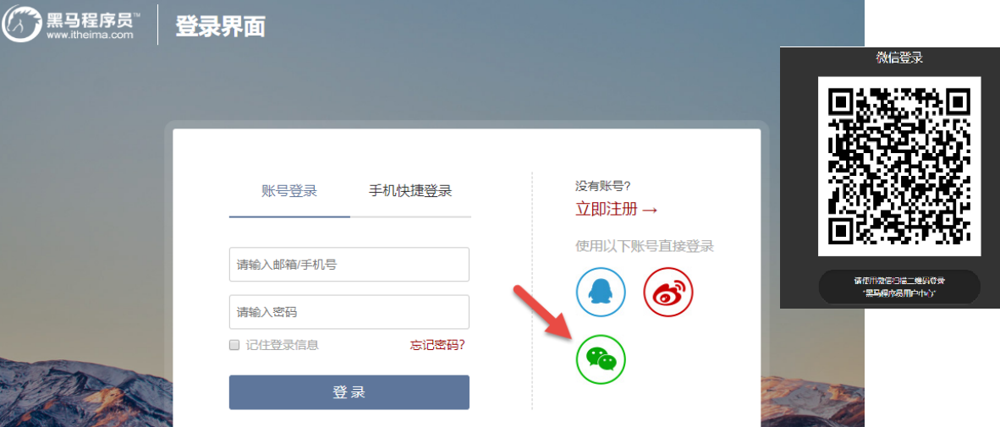
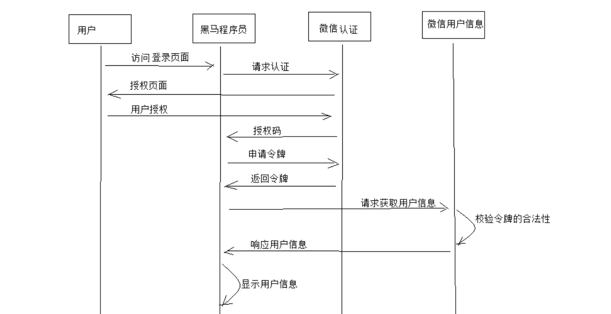
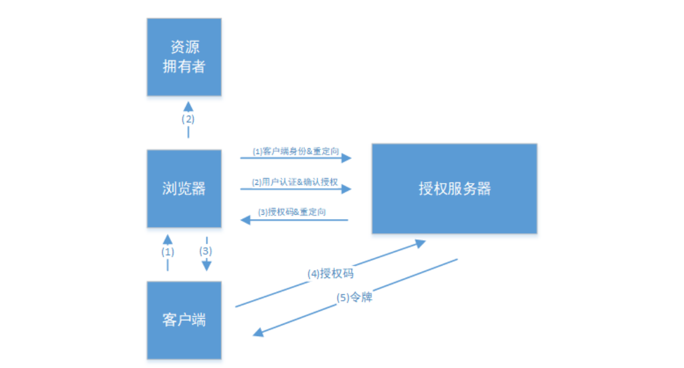
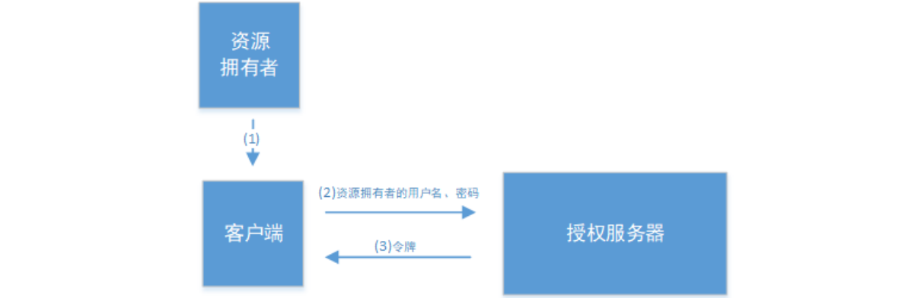
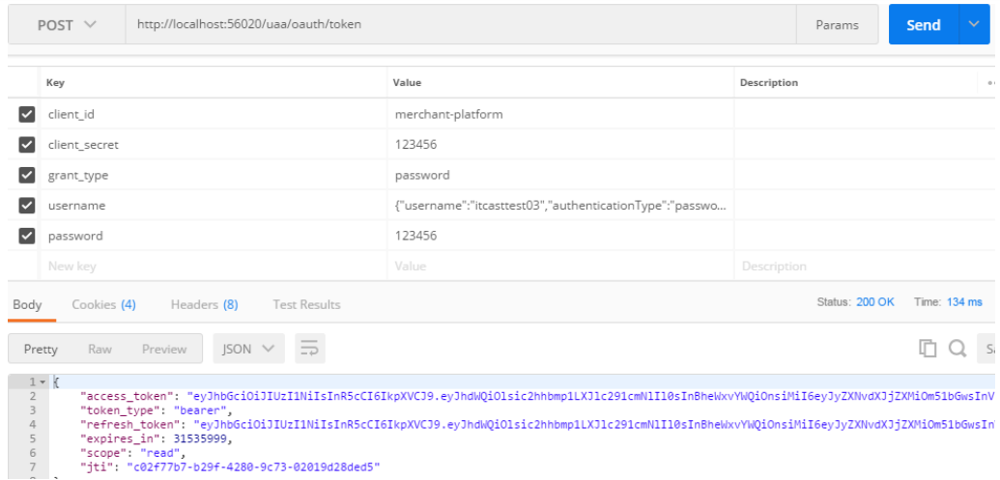
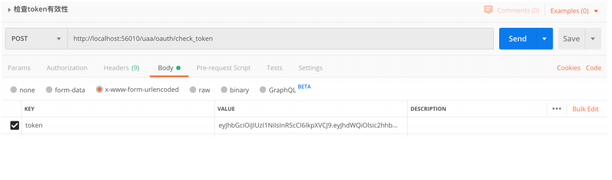

# 2.3 OAuth2.0 

## 2.3.1 OAuth2.0介绍 

### OAuth2.0介绍 

​	OAuth（开放授权）是一个开放标准，允许用户授权第三方应用访问他们存储在另外的服务提供者上的信息，而不需要将用户名和密码提供给第三方应用或分享他们数据的所有内容。OAuth2.0是OAuth协议的延续版本，但不向后兼容OAuth 1.0即完全废止了OAuth1.0。很多大公司如Google，Yahoo，Microsoft等都提供了OAUTH认证服务，这些都足以说明OAUTH标准逐渐成为开放资源授权的标准。 

Oauth协议目前发展到2.0版本，1.0版本过于复杂，2.0版本已得到广泛应用。 

参考：https://baike.baidu.com/item/oAuth/7153134?fr=aladdin 

Oauth协议：https://tools.ietf.org/html/rfc6749 

### 分析一个Oauth2认证的例子

​	下边分析一个Oauth2认证的例子，通过例子去理解OAuth2.0协议的认证流程，本例子是黑马程序员网站使用微信认证的过程，这个过程的简要描述如下： 

​	用户借助微信认证登录黑马程序员网站，用户就不用单独在黑马程序员注册用户，怎么样算认证成功吗？黑马程序员网站需要成功从微信获取用户的身份信息则认为用户认证成功，那如何从微信获取用户的身份信息？用户信息的拥有者是用户本人，微信需要经过用户的同意方可为黑马程序员网站生成令牌，黑马程序员网站拿此令牌方可从微信获取用户的信息。 

1、客户端请求第三方授权 

​	用户进入黑马程序的登录页面，点击微信的图标以微信账号登录系统，用户是自己在微信里信息的资源拥有者。点击“微信”出现一个二维码，此时用户扫描二维码，开始给黑马程序员授权。



2、资源拥有者同意给客户端授权 

​	资源拥有者扫描二维码表示资源拥有者同意给客户端授权，微信会对资源拥有者的身份进行验证， 验证通过后，微信会询问用户是否给授权黑马程序员访问自己的微信数据，用户点击“确认登录”表示同意授权，微信认证服务器会颁发一个授权码，并重定向到黑马程序员的网站。

3、客户端获取到授权码，请求认证服务器申请令牌 

此过程用户看不到，客户端应用程序请求认证服务器，请求携带授权码。 

4、认证服务器向客户端响应令牌 

微信认证服务器验证了客户端请求的授权码，如果合法则给客户端颁发令牌，令牌是客户端访问资源的通行证。 

此交互过程用户看不到，当客户端拿到令牌后，用户在黑马程序员看到已经登录成功。 

5、客户端请求资源服务器的资源 

客户端携带令牌访问资源服务器的资源。 

黑马程序员网站携带令牌请求访问微信服务器获取用户的基本信息。 

6、资源服务器返回受保护资源 

资源服务器校验令牌的合法性，如果合法则向用户响应资源信息内容。 


### 执行流程及Oauth2角色

以上认证授权详细的执行流程如下：



OAauth2.0包括以下角色： 

1、客户端 

本身不存储资源，需要通过资源拥有者的授权去请求资源服务器的资源，比如：Android客户端、Web客户端（浏 

览器端）、微信客户端等。 

2、资源拥有者 

通常为用户，也可以是应用程序，即该资源的拥有者。 

3、授权服务器（也称认证服务器）

用于服务提供商对资源拥有的身份进行认证、对访问资源进行授权，认证成功后会给客户端发放令牌 

（access_token），作为客户端访问资源服务器的凭据。本例为微信的认证服务器。 

4、资源服务器 

存储资源的服务器，本例子为微信存储的用户信息。 

​	现在还有一个问题，服务提供商能允许随便一个客户端就接入到它的授权服务器吗？答案是否定的，服务提供商会给准入的接入方一个身份，用于接入时的凭据: 

client_id：客户端标识 client_secret：客户端秘钥 

因此，准确来说，授权服务器对两种OAuth2.0中的两个角色进行认证授权，分别是资源拥有者、客户端。 


## 2.3.2 四种模式 

OAuth2.0提供了四种授权(获取令牌)方式，四种方式均采用不同的执行流程，让我们适应不同的场景。 

### 2.3.2.1.授权码模式 

授权码模式流程如下 ：




**（1）资源拥有者打开客户端，客户端要求资源拥有者给予授权，它将浏览器被重定向到授权服务器，重定向时会附加客户端的身份信息。如：** 

```
/uaa/oauth/authorize? client_id=p2pweb&response_type=code&scope=app&redirect_uri=http://xx.xx/notify
```

参数列表如下： 

- client_id：客户端接入标识。 
- response_type：授权码模式固定为code。 
- scope：客户端权限。 
- redirect_uri：跳转uri，当授权码申请成功后会跳转到此地址，并在后边带上code参数（授权码）。 

**（2）浏览器出现向授权服务器授权页面，之后将用户同意授权。** 

**（3）授权服务器将授权码（AuthorizationCode）转经浏览器发送给client(通过redirect_uri)。** 

**（4）客户端拿着授权码向授权服务器索要访问access_token，请求如下：** 

```
/uaa/oauth/token? client_id=p2pweb&client_secret=gdjbcd&grant_type=authorization_code&code=5PgfcD&redirect_uri=htt p://xx.xx/notify
```

参数列表如下 

- client_id：客户端准入标识。 
- client_secret：客户端秘钥。 
- grant_type：授权类型，填写authorization_code，表示授权码模式 
- code：授权码，就是刚刚获取的授权码，注意：授权码只使用一次就无效了，需要重新申请。 
- redirect_uri：申请授权码时的跳转url，一定和申请授权码时用的redirect_uri一致。 

**（5）授权服务器返回令牌(access_token)** 

​	这种模式是四种模式中最安全的一种模式。一般用于Web服务器端应用或第三方的原生App调用资源服务的时候。 因为在这种模式中access_token不会经过浏览器或移动端的App，而是直接从服务端去交换，这样就最大限度的减 小了令牌泄漏的风险。 


### 2.3.2.2.密码模式 

​	密码模式使用较多，适应于第一方的单页面应用以及第一方的原生App，比如：闪聚支付平台运营平台用户使用此模式完成用户登录。 

密码模式认证流程如下： 



**（1）资源拥有者将用户名、密码发送给客户端** 

**（2）客户端拿着资源拥有者的用户名、密码向授权服务器请求令牌（access_token），请求如下：** 

```
/uaa/oauth/token? client_id=p2pweb&client_secret=fgsdgrf&grant_type=password&username=shangsan&password=123456
```

参数列表如下： 

- client_id：客户端准入标识。 
- client_secret：客户端秘钥。 
- grant_type：授权类型，填写password表示密码模式 
- username：资源拥有者用户名。 
- password：资源拥有者密码。 

**（3）授权服务器将令牌（access_token）发送给client** 

​	这种模式十分简单，但是却意味着直接将用户敏感信息泄漏给了client，因此这就说明这种模式只能用于client是我们自己开发的情况下。因此密码模式一般用于我们自己开发的，第一方原生App或第一方单页面应用


### 2.3.2.3.客户端模式 


**（1）客户端向授权服务器发送自己的身份信息，并请求令牌（access_token）** 

**（2）确认客户端身份无误后，将令牌（access_token）发送给client，请求如下：** 

```
/uaa/oauth/token?client_id=p2pweb&client_secret=fdafdag&grant_type=client_credentials
```

参数列表如下: 

- client_id：客户端准入标识。 

- client_secret：客户端秘钥。 

- grant_type：授权类型，填写client_credentials表示客户端模式 

  这种模式是最方便但最不安全的模式。因此这就要求我们对client完全的信任，而client本身也是安全的。因 

此这种模式一般用来提供给我们完全信任的服务器端服务。比如，合作方系统对接，拉取一组用户信息。 

客户端模式适应于没有用户参与的，完全信任的一方或合作方服务器端程序接入。 

### 2.3.2.4.简化模式(授权码模式简化)


**（1）资源拥有者打开客户端，客户端要求资源拥有者给予授权，它将浏览器被重定向到授权服务器，重定向时会附加客户端的身份信息。如：** 

```
/uaa/oauth/authorize? client_id=p2pweb&response_type=token&scope=app&redirect_uri=http://xx.xx/notify
```

参数描述同**授权码模式** ，注意response_type=token，说明是简化模式。 

**（2）浏览器出现向授权服务器授权页面，之后将用户同意授权。** 

**（3）授权服务器将授权码将令牌（access_token）以Hash的形式存放在重定向uri的fargment中发送给浏览器。**

​	注：fragment 主要是用来标识 URI 所标识资源里的某个资源，在 URI 的末尾通过 （#）作为 fragment 的开头， 其中 # 不属于 fragment 的值。如https://domain/index#L18这个 URI 中 L18 就是 fragment 的值。大家只需要知道js通过响应浏览器地址栏变化的方式能获取到fragment 就行了。 

一般来说，简化模式用于第三方单页面应用。


# 2.4.统一认证测试 

## 2.4.1.认证接口说明 

### 2.4.1.1.登录 

**功能说明：** 用户登录并返回令牌，该令牌用于访问闪聚支付平台内受保护资源。 

**访问路径：**[授权服务地址]/oauth/token 

**请求参数：** 

- **grant_type：** 授权类型，可以是authorization_code,implicit,client_credentials,password 

- **client_id：**接入客户端id 

- **client_secret：**接入客户端密钥 

- **username：**登录用户名，认证类型(如密码认证，短信认证，二维码认证等) 

  ```json
  {"username":"admin","authenticationType":"password"}
  ```

- **password：**登录密码 

**响应内容：** 

```json
{ 
    "access_token": "eyJhbGciOiJIUzI1NiIsInR5cCI6IkpXVCJ9...", //令牌 
    "token_type": "bearer", 
    "refresh_token": "eyJhbGciOiJIUzI1NiIsInR5cCI6IkpXVCJ9...", //刷新令牌 
    "expires_in": 31535999, //有效期 
    "scope": "read", 
    "jti": "dfc6f30a‐aa8e‐4028‐a43a‐1487e64a2cfb" 
}
```

### 2.4.1.2.解析令牌 

**功能说明：**返回令牌的明文内容，描述的是当前登录的用户及接入客户端的信息。 

**访问路径：**[授权服务地址]/oauth/check_token 

**请求参数**:

- **token：** "eyJhbGciOiJIfdasfdajgfsiogjfifisnijiIFDJGDfhdsog..." 

**响应内容**:

```json
{
    "aud":[
        "shanju‐resource"
    ],
    "payload":{
        "1186173819157544962":{
            "user_authorities":{
                "r_001":[
                    "sj_m_staff_list",
                    "sj_m_payment",
                    "sj_o_member_list",
                    "sj_m_console",
                    "sj_m_account_list",
                    "sj_o_entreprise_list",
                    "sj_m_app_list",
                    "sj_m_enterprise_auth",
                    "sj_o_audit",
                    "sj_m_transaction_list",
                    "sj_m_store_list",
                    "sj_o_service_type",
                    "sj_m_account_check"
                ],
                "r_002":[
                    "sj_o_member_query"
                ]
            }
        }
    },
    "user_name":"admin",
    "scope":[
        "read"
    ],
    "mobile":"17717771777",
    "exp":1606354316,
    "client_authorities":[
        "ROLE_MERCHANT",
        "ROLE_USER"
    ],
    "jti":"dfc6f30a‐aa8e‐4028‐a43a‐1487e64a2cfb",
    "client_id":"merchant‐platform"
}
```

## 2.4.2.接口测试 

分别启动shanjupay-gateway、shanjupay-user、shanjupay-uaa三个工程，测试过程若有不清楚可参考前面 

1.2.3章节OAuth2.0理论部分和上一小节接口说明。 

### 2.4.2.1.密码模式认证 

```http
POST http://localhost:56020/uaa/oauth/token
```

**请求参数**： 



### 2.4.2.2. 解析token 

```http
http://localhost:56020/uaa/oauth/check_token
```

请求参数



