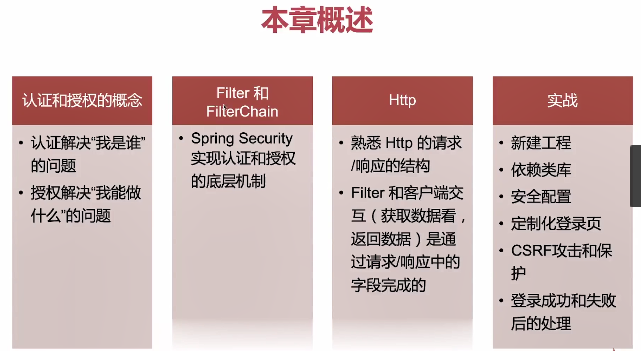
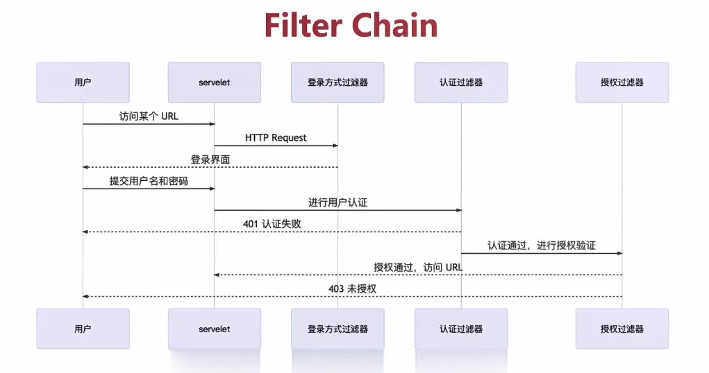

# 2 初识SpringSecurity



## 2.1 认证和授权的概念

### 2.1.1 什么是认证


### 2.1.2 什么是授权


## 2.2 过滤器和过滤器链

### 2.2.1 Spring Filters


### 2.2.2 过滤器示例


### 2.2.3 Filter Chain



```yaml
# 修改日志级别
logging:
    org:
      springframework:
        security: DEBUG
```

### 2.2.4 常见的内置过滤器


## 2.3 HTTP请求响应

### 2.3.1 HTTP请求结构


### 2.3.2 HTTP响应


### 2.3.3 HTTP Basic Auth认证流程


## 2.5 安全配置


```yaml
# 默认登录账号密码
spring:
  security:
    user:
      name: user
      password: 12345678
      roles: USER,ADMID
```

```java
//     
	@Override
    protected void configure(AuthenticationManagerBuilder auth) throws Exception {
        auth.inMemoryAuthentication()
            .withUser("user")
            .password(passwordEncoder().encode("12345678"))
            .roles("USER", "ADMIN");
    }

# 浏览器访问 user, 12345678
GET http://localhost:8080/api/greeting HTTP/1.1

// 放过静态资源
	@Override
    public void configure(WebSecurity web) throws Exception {
        web
            .ignoring()
            .antMatchers("/public/**")
            .requestMatchers(PathRequest.toStaticResources().atCommonLocations());
    }
```

## 2.6 定制登录页

### 2.6.1 引入依赖tpl

```xml
<dependency>
   <groupId>org.webjars</groupId>
   <artifactId>bootstrap</artifactId>
   <version>${bootstrap.version}</version>
</dependency>
<dependency>
   <groupId>org.webjars</groupId>
   <artifactId>webjars-locator-core</artifactId>
</dependency>
<dependency>
   <groupId>org.springframework.boot</groupId>
   <artifactId>spring-boot-starter-thymeleaf</artifactId>
</dependency>
```

### 2.6.2 SecurityConfig

```java
    @Override
    protected void configure(HttpSecurity http) throws Exception {
        http.authorizeRequests(req -> req
//               .antMatchers("/api/**").hasRole("USER")	//拦截所有请求
                .anyRequest().authenticated())
//            .formLogin(AbstractHttpConfigurer::disable) // 默认登录页
            .formLogin(from -> from.loginPage("/login")) // 指定登录页
            .httpBasic(withDefaults())  
            .csrf(withDefaults())// 显示浏览器对话框，需要禁用 CSRF ，或添加路径到忽略列表
        ;
    }
```

### 2.6.3 WebMvcConfig

```java
@RequiredArgsConstructor
@Configuration
public class WebMvcConfig implements WebMvcConfigurer {

    @Override
    public void addResourceHandlers(ResourceHandlerRegistry registry) {
        registry.addResourceHandler("/webjars/**")
            .addResourceLocations("/webjars/")
            .resourceChain(false);
        registry.setOrder(1);
    }

    @Override
    public void addViewControllers(ViewControllerRegistry registry) {
        registry.addViewController("/login").setViewName("login");
        registry.addViewController("/admin").setViewName("admin");
        registry.addViewController("/").setViewName("index");
        registry.setOrder(Ordered.HIGHEST_PRECEDENCE);
    }
```

### 2.6.4 前端集成以及国际化

```yaml
spring:
  messages:
    basename: messages
    encoding: UTF-8
```


```
http://localhost:8080/api/greeting
访问地址，跳转到登录页
http://localhost:8080/login		user/12345678
```

## 2.7 csrf, logout 和 rememberMe 的设置

### 2.7.1 csrf攻击


### 2.7.2 防止收到csrf攻击的方式

针对session攻击，对于无状态token（前后端分类）无效


不足。浏览器啊兼容性（IE）

```java
.csrf(withDefaults());
```

### 2.7.3 logout

```java
.logout(logout ->
    logout.logoutUrl("perform_out")
)
```

### 2.7.4 rememberMe功能


```yaml
# 因为密码加密取消yml方式
spring:
  application:
    name: uaa
#  security:
#    user:
#      name: user
#      password: 12345678
#      roles: USER,ADMID
```
```java
// cookie有效期
.rememberMe(rememberMe ->
    rememberMe.tokenValiditySeconds(30*24*3600)
)

 	@Override
    protected void configure(AuthenticationManagerBuilder auth) throws Exception {
        auth.inMemoryAuthentication()
            .withUser("user")
            .password(passwordEncoder().encode("12345678"))
            .roles("USER", "ADMIN");
    }

    @Bean
    PasswordEncoder passwordEncoder() { // 密码加密
        return new BCryptPasswordEncoder();
    }    
```

### 2.7.5 查看你cookie信息

访问http://localhost:8080/，登录后，查看你cookie信息


## 2.8 定制登录/退出登录的处理


```java
// 登录失败后自定义操作
private final ObjectMapper objectMapper;

.failureHandler(jsonLoginFailureHandler())
    
private AuthenticationFailureHandler jsonLoginFailureHandler() {
        return (req, res, exp) -> {
            res.setStatus(HttpStatus.UNAUTHORIZED.value());
            res.setContentType(MediaType.APPLICATION_JSON_VALUE);
            res.setCharacterEncoding("UTF-8");
//            val errData = Map.of(
//                "title", "认证失败",
//                "details", exp.getMessage()
//            );
            Map<String, String> errData = new HashMap() {{
                put("title", "认证失败");
                put("details", exp.getMessage());
            }};
            res.getWriter().println(objectMapper.writeValueAsString(errData));
        };
    }
```

```java
// 登录成功后自定义操作
.successHandler(jsonLoginSuccessHandler())

    private AuthenticationSuccessHandler jsonLoginSuccessHandler() {
        return (req, res, auth) -> {
            ObjectMapper objectMapper = new ObjectMapper();
            res.setStatus(HttpStatus.OK.value());
            res.getWriter().println(objectMapper.writeValueAsString(auth));
            log.debug("认证成功");
        };
    }
```

## 2.9 自定义 Filter

实现登录支持post+json，默认是表单方式提交

登录参数拦截

```java
package com.imooc.uaa.security.filter;

@RequiredArgsConstructor
public class RestAuthenticationFilter extends UsernamePasswordAuthenticationFilter {

    private final ObjectMapper objectMapper;

    @Override
    public Authentication attemptAuthentication(HttpServletRequest request, HttpServletResponse response) throws AuthenticationException {
        UsernamePasswordAuthenticationToken authRequest;
        try (InputStream is = request.getInputStream()) {
            val jsonNode = objectMapper.readTree(is);

            String username = jsonNode.get("username").textValue();
            String password = jsonNode.get("password").textValue();
            authRequest = new UsernamePasswordAuthenticationToken(username, password);
        } catch (IOException e) {
            throw new BadCredentialsException("没有找到用户名或密码参数");
        }
        setDetails(request, authRequest);
        return this.getAuthenticationManager().authenticate(authRequest);
    }
}
```

// 加入自定义拦截器链路, 以前默认session的处理策略，废弃

```java
// 加入自定义拦截器链路, 以前默认session的处理策略，废弃
@Override
protected void configure(HttpSecurity http) throws Exception {
    http.authorizeRequests(req -> req
            .antMatchers("/authorize/**").permitAll()
            .antMatchers("/admin/**").hasRole("ADMIN")
            .antMatchers("/api/**").hasRole("USER")
            .anyRequest().authenticated()
        )
        .addFilterAt(restAuthenticationFilter(), UsernamePasswordAuthenticationFilter.class)
        .csrf(csrf -> csrf.disable())// 显示浏览器对话框，需要禁用 CSRF ，或添加路径到忽略列表
    ;
}
```

```http
### RestAuthenticationFilter
POST http://localhost:8080/authorize/login
Content-Type: application/json

{
  "username": "user",
  "password": "12345678"
}
```

