# 3 密码的进化和验证

## 3.1 密码进化史

### 3.1.1 密码进化史

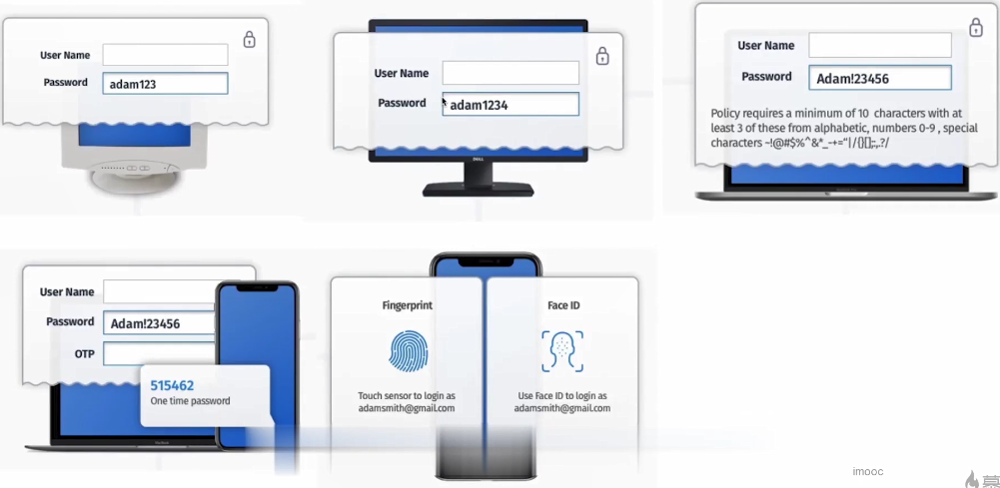

### 3.1.2 密码存储安全进化史

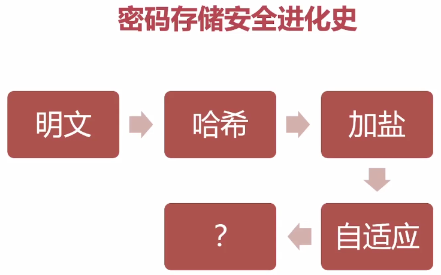

### 3.1.3 密码的进化

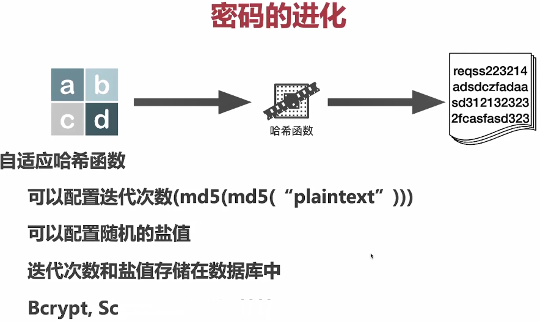

## 3.2 密码编辑器

### 3.2.1 多种编辑器共存

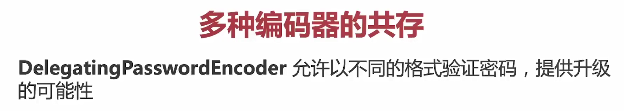

```java
@Bean
public PasswordEncoder passwordEncoder() {
    // 默认编码算法的 Id
    String idForEncode = "bcrypt";
    // 要支持的多种编码器
    Map encoders = new HashMap() {{
            put(idForEncode, new BCryptPasswordEncoder());
            put("SHA-1", new MessageDigestPasswordEncoder("SHA-1"));
    }};
    return new DelegatingPasswordEncoder(idForEncode, encoders);
}
```

### 3.2.2 表单和rest登录两种模式兼容

表单和rest登录两种模式兼容

```java
@Override
protected void configure(HttpSecurity http) throws Exception {
    http.authorizeRequests(req -> req
            .antMatchers("/authorize/**").permitAll()
            .antMatchers("/admin/**").hasRole("ADMIN")
            .antMatchers("/api/**").hasRole("USER")
            .anyRequest().authenticated()
        )
        .addFilterAt(restAuthenticationFilter(), UsernamePasswordAuthenticationFilter.class)
        .formLogin(from ->
            from.loginPage("/login")
                .successHandler(jsonLoginSuccessHandler())
                .failureHandler(jsonLoginFailureHandler())
                .permitAll()
        ) // 指定登录页
        .csrf(csrf -> csrf
                .ignoringAntMatchers("/authorize/**", "/admin/**", "/api/**")
        )// 显示浏览器对话框，需要禁用 CSRF ，或添加路径到忽略列表
        .logout(logout ->
            logout.logoutUrl("perform_out")
        )
        .rememberMe(rememberMe ->
            rememberMe.tokenValiditySeconds(30*24*3600)
        )
    ;
}
```

```java
@Override
protected void configure(AuthenticationManagerBuilder auth) throws Exception {
    auth.inMemoryAuthentication()
        .passwordEncoder(passwordEncoder())
        .withUser("user")
        .password("{bcrypt}$2a$10$jhS817qUHgOR4uQSoEBRxO58.rZ1dBCmCTjG8PeuQAX4eISf.zowm")
        .roles("USER", "ADMIN")
        .and()
        .withUser("zhangsan")
        .password("{SHA-1}7ce0359f12857f2a90c7de465f40a95f01cb5da9")
        .roles("USER");
}
```

页面访问登录 http://localhost:8080/login

user/12345678	zhangsan/abcd1234

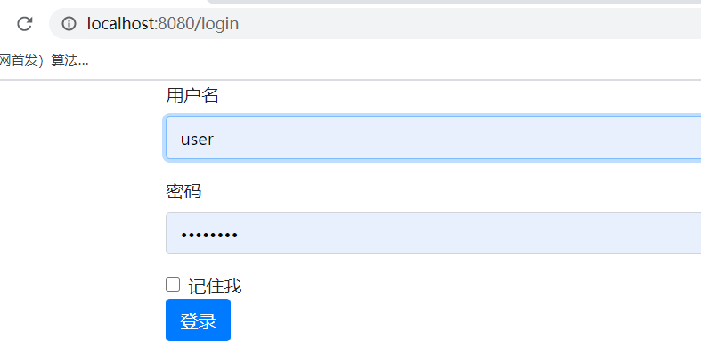

### 3.2.3 编码格式和密码迁移

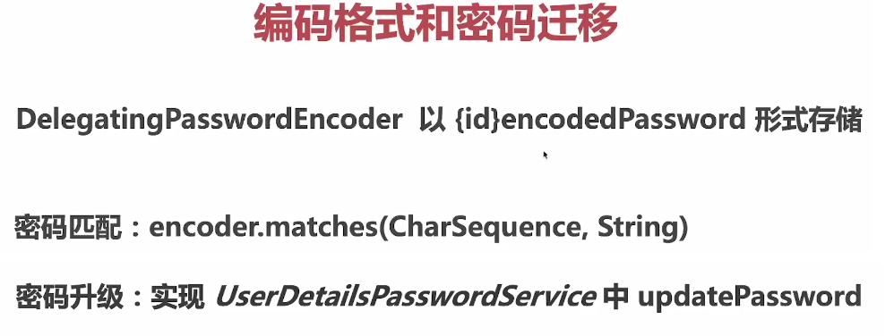

## 3.3 验证注解和自定义验证注解

### 3.3.1 JSR 380验证框架

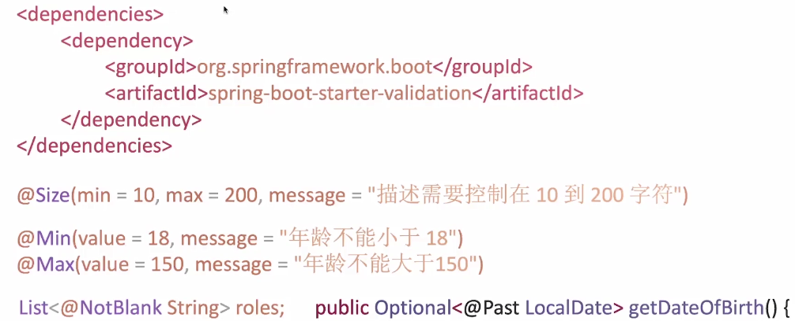

### 3.3.2 常用验证注解

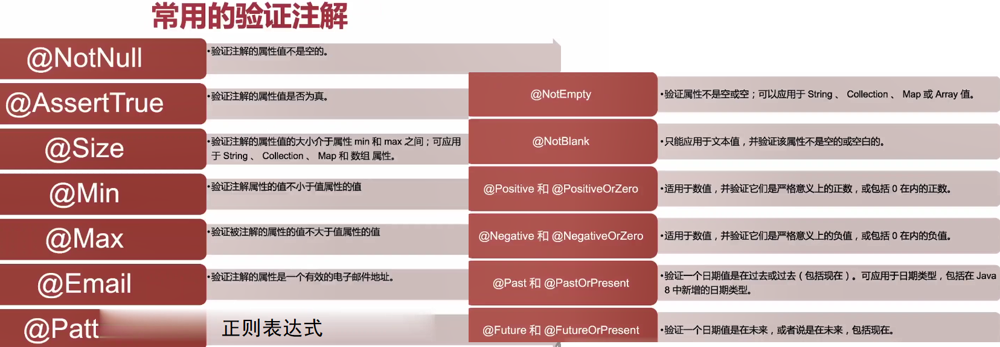

引入依赖

```xml
<dependency>
    <groupId>org.springframework.boot</groupId>
    <artifactId>spring-boot-starter-validation</artifactId>
</dependency>
```

常用校验dto

```java
package com.imooc.uaa.domain.dto;

@Data
public class UserDto implements Serializable {
    @NotNull
    @NotBlank
    @Size(min = 4, max = 50, message = "用户名长度必须在4到50个字符之间")
    private String username;
    @NotNull
    private String password;
    @NotNull
    private String matchingPassword;
    @NotNull
    private String email;
    @NotNull
    @NotBlank
    @Size(min = 4, max = 50, message = "姓名长度必须在4到50个字符之间")
    private String name;
}
```

```java
// 注册接口测试
package com.imooc.uaa.rest;

@RestController
@RequestMapping("/authorize")
public class AuthorizeResource {

    @PostMapping("/register")
    public UserDto register(@Valid @RequestBody UserDto userDto) {
        return userDto;
    }

}
```

```http
# @name register
POST {{host}}/authorize/register
Accept-Language: zh-CN
Content-Type: application/json

{
    "name": "张三李四",
    "username": "zhangsan",
    "password": "qwerty12345T!",
    "matchingPassword": "12345678",
    "email": "zs@local"
}
```

### 3.3.3 自定义邮箱注解

```java
package com.imooc.uaa.validation.annotation;

@Target({ TYPE, FIELD, ANNOTATION_TYPE })
@Retention(RUNTIME)
@Constraint(validatedBy = EmailValidator.class)
@Documented
public @interface ValidEmail {

    String message() default "{ValidEmail.email}";

    Class<?>[] groups() default {};

    Class<? extends Payload>[] payload() default {};
}
```

```java
package com.imooc.uaa.validation;

public class EmailValidator implements ConstraintValidator<ValidEmail, String> {
    private static final String EMAIL_PATTERN = "^[_A-Za-z0-9-\\+]+(\\.[_A-Za-z0-9-]+)*@" + "[A-Za-z0-9-]+(\\.[A-Za-z0-9]+)*(\\.[A-Za-z]{2,})$";

    @Override
    public void initialize(final ValidEmail constraintAnnotation) {}

    @Override
    public boolean isValid(final String username, final ConstraintValidatorContext context) {
        return (validateEmail(username));
    }

    private boolean validateEmail(final String email) {
        val pattern = Pattern.compile(EMAIL_PATTERN);
        val matcher = pattern.matcher(email);
        return matcher.matches();
    }
}
```

## 3.4 密码的验证规则和自定义注解和验证器

### 3.4.1 密码的验证规则

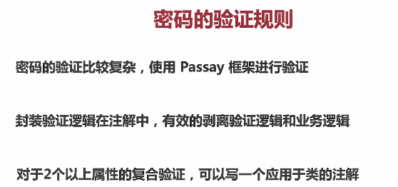

### 3.4.2 密码校验

```xml
		<passay.version>1.6.0</passay.version>

		<dependency>
			<groupId>org.passay</groupId>
			<artifactId>passay</artifactId>
			<version>${passay.version}</version>
		</dependency>
```

```java
com.imooc.uaa.validation.annotation.ValidPassword
com.imooc.uaa.validation.PasswordConstraintValidator

    @NotNull
    @ValidPassword
    private String password;
```

### 3.4.3 二次密码确认

这次验证的不是一个属性，而是对象

密码和确认密码是否一致

```java
package com.imooc.uaa.validation.annotation;

@Target({ TYPE, ANNOTATION_TYPE })
@Retention(RUNTIME)
@Constraint(validatedBy = PasswordMatchesValidator.class)
@Documented
public @interface PasswordMatches {

    String message() default "{PasswordMatches.userDto}";

    Class<?>[] groups() default {};

    Class<? extends Payload>[] payload() default {};

}
```

```java
package com.imooc.uaa.validation;

import javax.validation.ConstraintValidatorContext;

public class PasswordMatchesValidator implements ConstraintValidator<PasswordMatches, UserDto> {

    @Override
    public void initialize(final PasswordMatches constraintAnnotation) { }

    @Override
    public boolean isValid(final UserDto obj, final ConstraintValidatorContext context) {
        UserDto user = (UserDto) obj;
        return user.getPassword().equals(user.getMatchingPassword());
    }
}
```

```java
@PasswordMatches
@Data
public class UserDto implements Serializable {
```

## 3.5 验证消息国际化

 Passsay异常的国际化

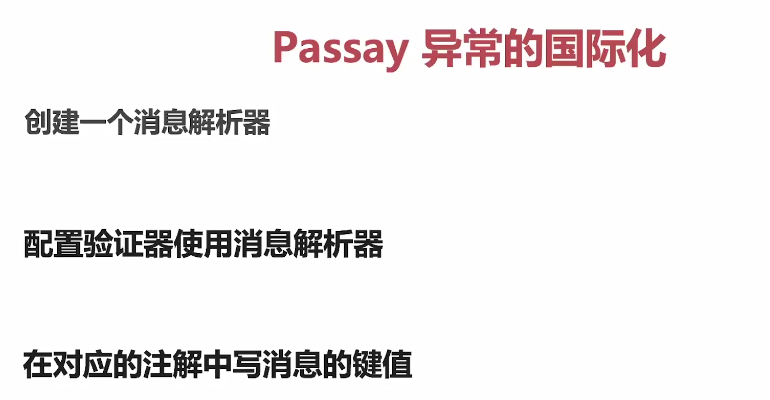

```java
@RequiredArgsConstructor
public class PasswordConstraintValidator implements ConstraintValidator<ValidPassword, String> {

    private final SpringMessageResolver messageResolver;
```


```java
@RequiredArgsConstructor
@Configuration
public class WebMvcConfig implements WebMvcConfigurer {


    private final MessageSource messageSource;

    /**
     * 配置 Java Validation 使用国际化的消息资源
     * @return LocalValidatorFactoryBean
     */
    @Bean
    public LocalValidatorFactoryBean getValidator() {
        LocalValidatorFactoryBean bean = new LocalValidatorFactoryBean();
        bean.setValidationMessageSource(messageSource);
        return bean;
    }

    /**
     * 配置 Passay 使用 Spring 的 MessageSource
     * @return MessageResolver
     */
    @Bean
    public MessageResolver messageResolver() {
        return new SpringMessageResolver(messageSource);
    }
```

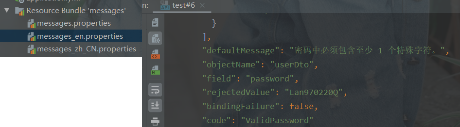

## 3.6 异常的统一处理

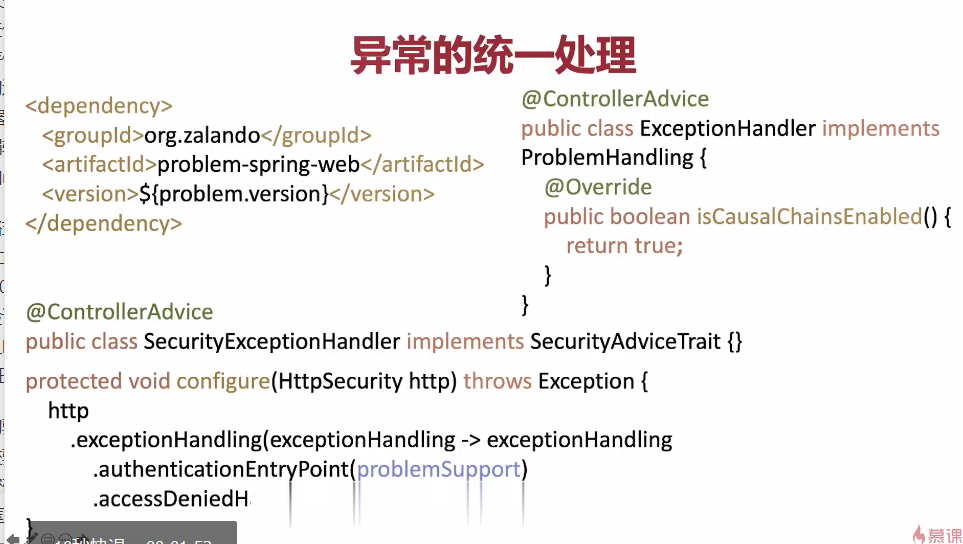

```java
com.imooc.uaa.exception.ExceptionHandler	// 普通异常
com.imooc.uaa.exception.SecurityExceptionHandler	// Security 的异常
```

```java
.exceptionHandling(exceptionHandling -> exceptionHandling
        .authenticationEntryPoint(securityProblemSupport)
        .accessDeniedHandler(securityProblemSupport))
```

## 3.7 多个安全配置共存

将seeson和token认证的分开处理

```java
public class SecurityConfig extends WebSecurityConfigurerAdapter {

    private final ObjectMapper objectMapper;
    private final SecurityProblemSupport securityProblemSupport;

    @Override
    protected void configure(HttpSecurity http) throws Exception {
        http
                .requestMatchers(req -> req.mvcMatchers("/api/**", "/admin/**", "/authorize/**"))
                .sessionManagement(sessionManagement -> sessionManagement
                        .sessionCreationPolicy(SessionCreationPolicy.STATELESS))
                .exceptionHandling(exceptionHandling -> exceptionHandling
                        .authenticationEntryPoint(securityProblemSupport)
                        .accessDeniedHandler(securityProblemSupport))
                .authorizeRequests(authorizeRequests -> authorizeRequests
                        .antMatchers("/authorize/**").permitAll()
                        .antMatchers("/admin/**").hasRole("ADMIN")
                        .antMatchers("/api/**").hasRole("USER")
                        .anyRequest().authenticated())
                .addFilterAt(restAuthenticationFilter(), UsernamePasswordAuthenticationFilter.class)
                .csrf(csrf -> csrf.ignoringAntMatchers("/authorize/**", "/admin/**", "/api/**"))
                .formLogin(AbstractHttpConfigurer::disable)
                .httpBasic(AbstractHttpConfigurer::disable);
    }
```

```java
package com.imooc.uaa.config;

@Slf4j
@RequiredArgsConstructor
@Configuration
@Order(100)
public class LoginSecurityConfig extends WebSecurityConfigurerAdapter {

    @Override
    protected void configure(HttpSecurity http) throws Exception {
        http
            .formLogin(login -> login
                .loginPage("/login")
                .failureUrl("/login?error")
                .defaultSuccessUrl("/")
                .permitAll())
            .logout(logout -> logout
                .logoutUrl("/perform_logout")
                .logoutSuccessUrl("/login")
            )
            .rememberMe(rememberMe -> rememberMe
                .key("someSecret")
                .tokenValiditySeconds(86400))
            .authorizeRequests(authorizeRequests -> authorizeRequests
                .anyRequest().authenticated());
    }

    @Override
    public void configure(WebSecurity web) throws Exception {
        web.ignoring()
            .requestMatchers(PathRequest.toStaticResources().atCommonLocations());
    }

```

