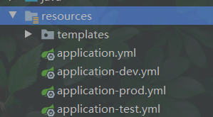

# 4 深入 Spring Security 认证


## 4.1 核心组件 - SecurityContext SecurityContextHolder Authentication

### 4.1.1 SpringSecurity的架构初探


### 4.1.2 核心组件


### 4.1.3 Authentication


```java
.httpBasic(Customizer.withDefaults());	// 加入请求头

GET {{host}}/api/principal HTTP/1.1
Authorization: Basic user 12345678
```

## 4.2 UserDetails

### 4.2.1  UserDetails和UserDetailsService


```java
@Override
protected void configure(AuthenticationManagerBuilder auth) throws Exception {
    auth
        .userDetailsService(userDetailsServiceImpl) // 配置 AuthenticationManager 使用 userService
        .passwordEncoder(passwordEncoder()) // 配置 AuthenticationManager 使用 userService
        .userDetailsPasswordManager(userDetailsPasswordServiceImpl); // 配置密码自动升级服务
}
```

### 4.2.2 数据库的表结构和定制化

集成spring 的内置H2数据库


```xml
<dependency>
   <groupId>com.h2database</groupId>
   <artifactId>h2</artifactId>
   <scope>runtime</scope>
</dependency>
<dependency>
   <groupId>org.springframework.boot</groupId>
   <artifactId>spring-boot-starter-jdbc</artifactId>
</dependency>
```

```yaml
spring:
  datasource:
    driver-class-name: org.h2.Driver
    password: ''
    # 数据库连接url
    # MODE=MySQL; 兼容mysql
    # DATABASE_TO_LOWER=TRUE; 表名转小写
    # CASE_INSENSITIVE_IDENTIFIERS=TRUE; 不区分大小写
    # DB_CLOSE_DELAY=-1 不自动关闭数据库连接
    url: jdbc:h2:mem:test;MODE=MySQL;DATABASE_TO_LOWER=TRUE;CASE_INSENSITIVE_IDENTIFIERS=TRUE;DB_CLOSE_DELAY=-1
    username: sa
    h2:
      console:
        # 显示 H2 嵌入式 UI管理界面
        enabled: true
        # 访问 H2 嵌入式 UI管理界面路径
        path: /h2-console
        settings:
          # 禁止输出 trace 信息
          trace: false
          # 禁止远程访问 H2 管理界面
          web-allow-others: false
```

```java
com.imooc.uaa.config.SecurityConfig

	@Override
	public void configure(WebSecurity web) throws Exception {
	    web
	        .ignoring()
	        .antMatchers("/error/**", "/h2-console/**")
	        .requestMatchers(PathRequest.toStaticResources().atCommonLocations());
	}
	
// 改为数据连接管理权限，以前是在内存里
    private final DataSource dataSource;
    @Override
    protected void configure(AuthenticationManagerBuilder auth) throws Exception {
        auth.jdbcAuthentication()
                .withDefaultSchema()
                .dataSource(dataSource)
				...
    }
```

访问：http://localhost:8080/h2-console


## 4.3 定制化数据库

spring-boot自动扫描


## 4.4深度定制化数据库


### 4.4.1 jpa建表实现类

```xml
<dependency>
   <groupId>org.springframework.boot</groupId>
   <artifactId>spring-boot-starter-data-jpa</artifactId>
</dependency>
```

```yaml
# jpa 相关依赖
spring:
  jpa:
    database: h2
    database-platform: org.hibernate.dialect.H2Dialect
    hibernate:
      ddl-auto: create-drop
```

```java
// 实现GrantedAuthority
public class Role implements GrantedAuthority, Serializable {
```

```java
// 实现UserDetails
public class User implements UserDetails, Serializable {
```

更新data.sql， 在resources下spring会自动扫描

### 4.4.2 jpa的mapper

```java
com.imooc.uaa.repository.RoleRepo
com.imooc.uaa.repository.UserRepo
```

### 4.4.3 实现UserDetailsService

```java
package com.imooc.uaa.security.userdetails;

@RequiredArgsConstructor
@Service
public class UserDetailsServiceImpl implements UserDetailsService {

    private final UserRepo userRepo;

    @Override
    public UserDetails loadUserByUsername(String username) throws UsernameNotFoundException {
        return userRepo.findOptionalByUsername(username)
            .orElseThrow(() -> new UsernameNotFoundException("未找到用户名"));
    }
}
```

### 4.4.4 实现UserDetailsPasswordService

```java
package com.imooc.uaa.security.userdetails;

@Transactional
@RequiredArgsConstructor
@Service
public class UserDetailsPasswordServiceImpl implements UserDetailsPasswordService {

    private final UserRepo userRepo;

    @Override
    public UserDetails updatePassword(UserDetails userDetails, String newPassword) {
        return userRepo.findOptionalByUsername(userDetails.getUsername())
            .map(user -> {
                return (UserDetails) userRepo.save(user.withPassword(newPassword));
            })
            .orElse(userDetails);
    }
}
```

### 4.4.5 集成springsecurity

```java
public class SecurityConfig extends WebSecurityConfigurerAdapter {

    private final UserDetailsServiceImpl userDetailsServiceImpl;
    private final UserDetailsPasswordServiceImpl userDetailsPasswordServiceImpl;

    @Override
    protected void configure(AuthenticationManagerBuilder auth) throws Exception {
        auth
                .userDetailsService(userDetailsServiceImpl) // 配置 AuthenticationManager 使用 userService
                .userDetailsPasswordManager(userDetailsPasswordServiceImpl) 
                .passwordEncoder(passwordEncoder()) // 配置密码自动升级服务
        ;
    }
```

登录测试。现在user,和张三的账号应该都在数据库

## 4.6 环境和环境变量


spring 环境切分



docker-compose.mysql.yml docker构建mysql

## 4.7 自动化测试


