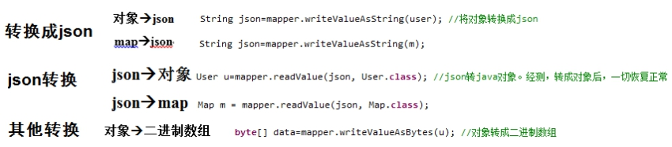
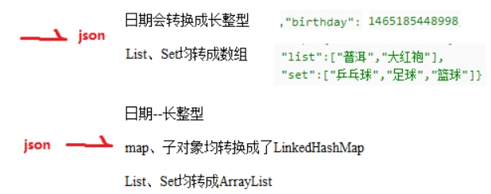

# 1 jackson

## 1.1 **概述**

​	

​	SpringMVC传回来的是字符,但是在success回调函数被调用前将其转换成json对象然后传给了data,所以data就是封装后的json对象,可以直接通过对象的方式获取值


## 1.2 转换器

### 1.2.1 **转换器**

ObjectMapper mapper = **new** ObjectMapper(); //转换器

 

###  1.2.2 特殊类型转换



```java
 日期格式化： @JSONField(format = "yyyy-MM-dd HH:mm:ss")
```


### 1.3.3 忽略属性

```java
https://blog.csdn.net/FORLOVEHUAN/article/details/98850910
1.@JSONField(serialize = false)
    
2.@JsonIgnore作用在属性和方法上，效果是一样的，都会屏蔽掉get、set方法 
  @JsonProperty作用在get、set方法上，可以保留get、set方法 
  @JsonIgnoreProperties(value = "{password}")
```


## 1.3 遍历迭代

### 1.3.1 @JsonFilter

https://www.iteye.com/blog/wangxinchun-2310812

```java
ObjectMapper mapper = new ObjectMapper();
mapper.configure(JsonParser.Feature.ALLOW_UNQUOTED_FIELD_NAMES, true);
mapper.configure(JsonParser.Feature.ALLOW_SINGLE_QUOTES, true);
mapper.configure(JsonParser.Feature.ALLOW_COMMENTS, true);
mapper.configure(JsonParser.Feature.ALLOW_UNQUOTED_CONTROL_CHARS, true);

mapper.setVisibility(PropertyAccessor.FIELD, Visibility.ANY);
mapper.addMixIn(Object.class, PropertyFilterMixIn.class);

FilterProvider filters = new SimpleFilterProvider().addFilter(
      "propertyFilterMixIn", new SimpleBeanPropertyFilter() {
         @Override
         public void serializeAsField(Object pojo,JsonGenerator jgen,SerializerProvider provider,PropertyWriter writer) throws Exception {
            String fieldName = writer.getName();
            if (finalApiBodyPermits.containsKey(fieldName)) {
               writer.serializeAsField(desens(pojo, fieldName),jgen, provider);
            } else {
               writer.serializeAsField(pojo, jgen,provider);
            }
         }
      });
mapper.setFilterProvider(filters);

result = mapper.writeValueAsString(returenObj);

过滤类
@JsonFilter("propertyFilterMixIn")
public class PropertyFilterMixIn implements Serializable {

}
```


## 1.4 问题

### 1.4.1 前端接受对象不能使用内部类

接受list<obj>时。不能使用内部类


