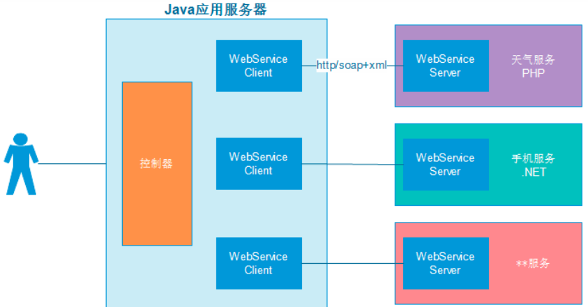
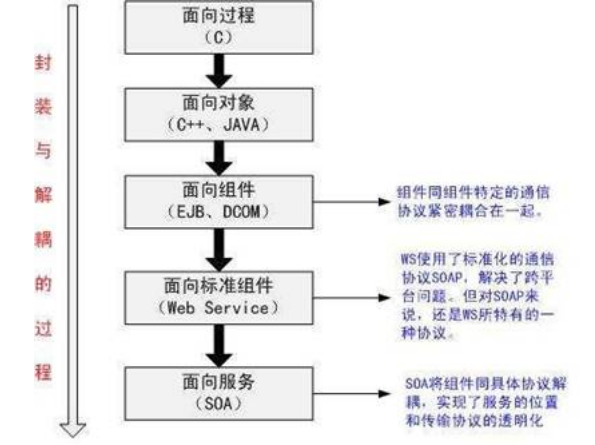
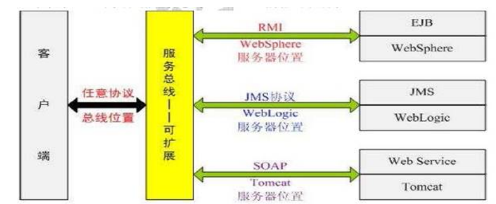

视频地址： https://www.bilibili.com/video/BV15t411S7V1

# 1   学习目标

(1)   webservice基本概念

(2)   ApacheCXF框架介绍

(3)   JAX-WS规范下webservice开发

(4)   JAX-RS规范下webservice开发

# 2   webservice 基本概念

## 2.1 什么是web服务

这里列举一些常见的web服务：

1.  手机淘宝、京东….

2.  天气预报

3.  手机号归属地

4.  股票查询

5.  发手机短消息

6.  手机充值功能

7.  中英文翻译

8.  银行转账业务

9.  公司的“进销存系统”在某商品缺货时自动给供应商下订单

## 2.2  简介

(1)   webservice 即web服务，它是一种跨编程语言和跨操作系统平台的远程调用技术。

如图：

(2)   JAVA 中共有三种WebService 规范，分别是JAX-WS（JAX-RPC）、JAXM&SAAJ、JAX-RS。 

(3)   webService三要素：soap、wsdl、uddi

注： 这里的一些概念将在下一章节详细讲解。

 

## 2.3  术语

### 2.3.1  webservice开发规范

JAVA 中共有三种WebService规范，分别是JAXM&SAAJ、JAX-WS（JAX-RPC）、JAX-RS。

下面来分别简要的介绍一下这三个规范。

(1.)JAX-WS：

​	JAX-WS（Java API For XML-WebService），JDK1.6 自带的版本为JAX-WS2.1，其底层支持为JAXB。JAX-WS（JSR 224）规范的API 位于javax.xml.ws.*包，其中大部分都是注解，提供API 操作Web 服务（通常在客户端使用的较多，由于客户端可以借助SDK 生成，因此这个包中的API 我们较少会直接使用）。

(2.)JAXM&SAAJ：

​	JAXM（JAVA API For XML Message）主要定义了包含了发送和接收消息所需的API，相当于Web 服务的服务器端，其API 位于javax.messaging.*包，它是JAVA EE 的可选包，因此你需要单独下载。

​	SAAJ（SOAP With Attachment API For Java，JSR 67）是与JAXM 搭配使用的API，为构建SOAP 包和解析SOAP 包提供了重要的支持，支持附件传输，它在服务器端、客户端都需要使用。这里还要提到的是SAAJ 规范，其API 位于javax.xml.soap.*包。

​	JAXM&SAAJ 与JAX-WS 都是基于SOAP 的Web 服务，相比之下JAXM&SAAJ暴漏了SOAP更多的底层细节，编码比较麻烦，而JAX-WS 更加抽象，隐藏了更多的细节，更加面向对象，实现起来你基本上不需要关心SOAP 的任何细节。那么如果你想控制SOAP 消息的更多细节，可以使用JAXM&SAAJ，目前版本为1.3。

(3.)JAX-RS：

​	JAX-RS 是JAVA 针对REST(RepresentationState Transfer)风格制定的一套Web 服务规范，由于推出的较晚，该规范（JSR 311，目前JAX-RS 的版本为1.0）并未随JDK1.6 一起发行，你需要到JCP 上单独下载JAX-RS 规范的接口，其API 位于javax.ws.rs.*包。这里的JAX-WS 和JAX-RS 规范我们采用Apache CXF 作为实现，CXF 是bjectweb Celtix和Codehaus XFire 合并而成。CXF 的核心是org.apache.cxf.Bus（总线），类似于Spring 的

ApplicationContext，Bus 由BusFactory 创建，默认是SpringBusFactory 类，可见默认CXF是依赖于Spring 的，Bus 都有一个ID，默认的BUS 的ID 是cxf。你要注意的是Apache CXF2.2 的发行包中的jar 你如果直接全部放到lib 目录，那么你必须使用JDK1.6，否则会报JAX-WS 版本不一致的问题。对于JAXM&SAAJ 规范我们采用JDK 中自带的默认实现。

 

 

### 2.3.2  SOAP 协议

(1)   SOAP即简单对象访问协议(Simple Object Access Protocol)，它是用于交换XML（标准通用标记语言下的一子集）编码信息的轻量级协议。它有三个主要方面：XML-envelope为描述信息内容和如何处理内容定义了框架，将程序对象编码成为XML对象的规则，执行远程过程调用(RPC)的约定。SOAP可以运行在任何其他传输协议上。

(2)   SOAP作为一个基于XML语言的协议用于有网上传输数据。

(3)   SOAP = 在HTTP的基础上+XML数据。

(4)   SOAP是基于HTTP的。

(5)   SOAP的组成如下

​	a)  Envelope – 必须的部分。以XML的根元素出现。

​	b)  Headers – 可选的。

​	c)  Body – 必须的。在body部分，包含要执行的服务器的方法。和发送到服务器的数据。

### 2.3.3 wsdl说明书

[Web Service描述语言WSDL（SebService Definition Language）就是用机器能阅读的方式提供的一个正式描述文档而基于XML（标准通用标记语言下的一个子集）的语言，用于描述Web Service及其函数、参数和返回值。因为是基于XML的，所以WSDL既是机器可阅读的，又是人可阅读的。](undefined)

wsdl说明书， 

                1） 通过wsdl说明书，就可以描述webservice服务端对外发布的服务；

       		2） wsdl说明书是一个基于xml文件，通过xml语言描述整个服务；

                3） 在wsdl说明中，描述了：

​			对外发布的服务名称（类）

​			接口方法名称（方法）

​			接口参数（方法参数）

​			服务返回的数据类型（方法返回值）

### 2.3.4 UDDI

​	Web 服务提供商又如何将自己开发的 Web 服务公布到因特网上，这就需要使用到 UDDI 了，UDDI的话，是一个跨产业，跨平台的开放性架构，可以帮助 Web 服务提供商在互联网上发布 Web 服务的信息。

​	UDDI 是一种目录服务，企业可以通过 UDDI 来注册和搜索 Web 服务。简单来时候话，UDDI 就是一个目录，只不过在这个目录中存放的是一些关于 Web 服务的信息而已。并且 UDDI 通过SOAP 进行通讯，构建于 . Net 之上。

​	UDDI 即 Universal Description，Discovery andIntegration，也就是通用的描述，发现以及整合。UDDI 的目的是为电子商务建立标准；UDDI是一套基于Web的、分布式的、为WebService提供的、信息注册中心的实现标准规范，同时也包含一组使企业能将自身提供的Web Service注册，以使别的企业能够发现的访问协议的实现标准。

 

## 2.4  应用场景

​	Web Service 可以适用于应用程序集成、软件重用、跨防火墙通信等需求。不同的业务要求不同。具体如下：

> (1)   跨防火墙通信

> (2)   应用系统集成

> (3)   软件和数据重用

​	简单来说，如果一个功能，需要被多个系统使用可以使用webservice开发一个服务端接口，供不同的客户端应用。主要应用在企业内部系统之间的接口调用、面向公网的webservice服务。

## 2.5  优缺点

### 2.5.1  优点：

a)  异构平台的互通性

​	理论上， Web Service 最大的优势是提供了异构平台的无缝街接技术手段。由于不同的用户使用不同的硬件平，不同的操作平台，不同的操作系统，不同的软件，不同的协议通信，这就产生了互相通信的需求。 Web Service 使任何两个应用程序，只要能读写XML，那么就能互相通信。

 

b)   更广泛的软件复用(例如手机淘宝可以复用已有淘宝的业务逻辑.)

​	软件的复用技术通过组合已有模块来搭建应用程序，能大幅度提高软件的生产效率和质量。用户只要获得了描述 Web Service 的 WSDL 文件，就可以方便地生成客户端代理，并通过代理访问 Web Service 。

 

c)   成本低、可读性强、应用范围广

​	Web Service 可用基于 XML 的 SOAP 来表示数据和调用请求。并且通过 HTTP 协议传输 XML 格式的数据

 

d)   迅捷的软件发行方式

​	(每个web Service称为一个生产者.不同的生产者可以相互协同合作完成整个应用)Web Service 将彻底地改变软件的发行方式。软件供应商可以把软件分解成若Web Service 模块构成的系统，直接在 Web 上发布。

 

e)  最重要的一点

​	客户端与服务端可能是用不同的语言开发的，但是，通过webservice提供服务接口，客户端与服务端之前可以传递对象。

 

### 2.5.2  缺点：

​	由于soap是基于xml传输，本身使用xml传输会传输一些无关内容从而影响效率，随着soap协议的完善，soap协议增加了许多内容，这样就导致了使用soap去完成简单的数据传输而携带的信息更多效率再受影响；

​	Web Service作为web跨平台访问的标准技术，很多公司都限定要求使用Web Service，但如果是简单的接口可以直接使用http传输自定义数据格式，开发更快捷。

 

## 2.6  面向服务架构SOA

​	SOA(Service-OrientedArchitecture)面向服务架构是一种思想，它将应用程序的不同功能单元通过中立的契约（独立于硬件平台、操作系统和编程语言）联系起来，使得各种形式的功能单元更好的集成。目前来说，WebService 是SOA 的一种较好的实现方WebService 采用HTTP 作为传输协议，SOAP（Simple Object Access Protocol）作为传输消息的格式。但WebService 并不是完全符合SOA 的概念，因为SOAP 协议是WebService 的特有协议，并未符合SOA 的传输协议透明化的要求。SOAP 是一种应用协议，早期应用于RPC 的实现，传输协议可以依赖于HTTP、SMTP 等。

​	SOA 的产生共经历了如下过程:

通常采用SOA 的系统叫做服务总线（BUS），结构如下图所示：

 
