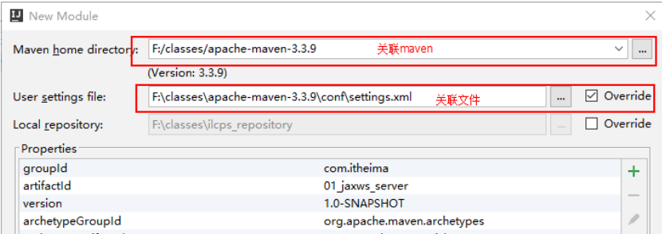
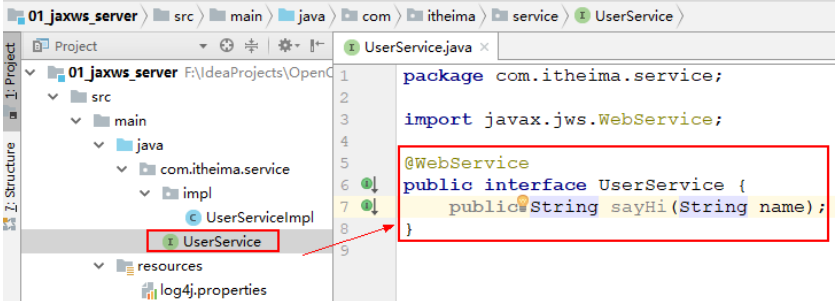
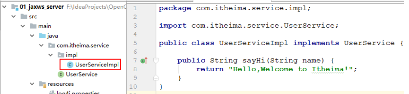
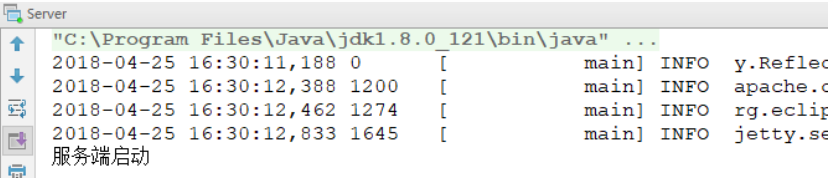
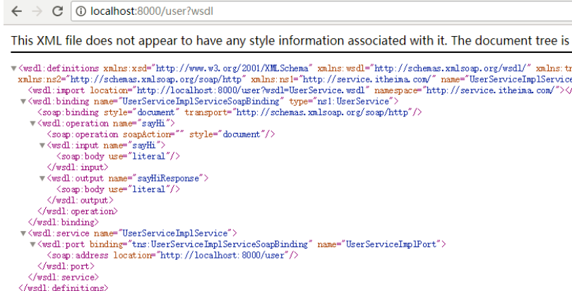
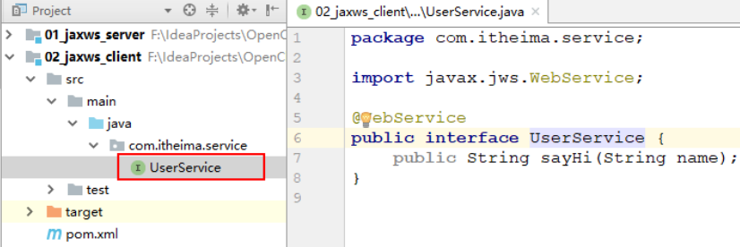
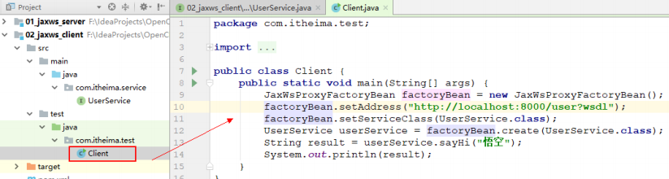
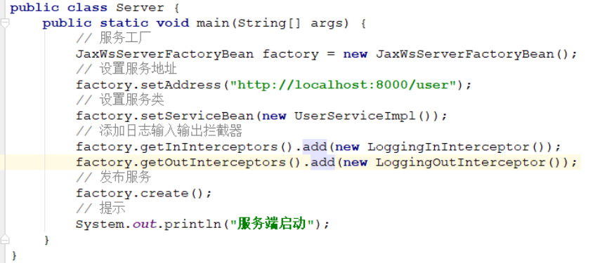
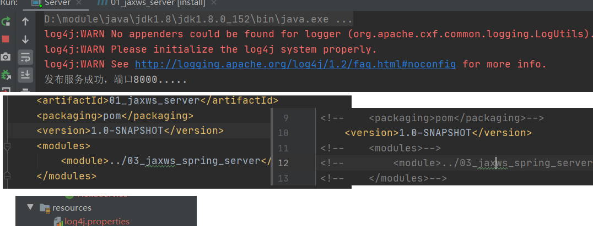

 

# 4   ApacheCXF 实现WebService（Jax-ws）

## 4.1  服务端

### 4.1.1  创建项目

- file--->new --->module...


- next




### 4.1.2  添加cxf依赖（目前是jar）

* 项目的pom.xml 添加如下依赖

  ```xml
  	<project xmlns="http://maven.apache.org/POM/4.0.0" xmlns:xsi="http://www.w3.org/2001/XMLSchema-instance"
  		xsi:schemaLocation="http://maven.apache.org/POM/4.0.0 http://maven.apache.org/xsd/maven-4.0.0.xsd">
  		<modelVersion>4.0.0</modelVersion>
  		<groupId>cn.itcast</groupId>
  		<artifactId>01_jaxws_server</artifactId>
  		<version>0.0.1-SNAPSHOT</version>
  		<name>服务端项目</name>
  	
  		<dependencies>
  			<!-- 要进行jaxws 服务开发 -->
  			<dependency>
  				<groupId>org.apache.cxf</groupId>
  				<artifactId>cxf-rt-frontend-jaxws</artifactId>
  				<version>3.0.1</version>
  			</dependency>
  	
  			<!-- 内置jetty web服务器 -->
  			<dependency>
  				<groupId>org.apache.cxf</groupId>
  				<artifactId>cxf-rt-transports-http-jetty</artifactId>
  				<version>3.0.1</version>
  			</dependency>
  	
  			<!-- 日志实现 -->
  			<dependency>
  				<groupId>org.slf4j</groupId>
  				<artifactId>slf4j-log4j12</artifactId>
  				<version>1.7.12</version>
  			</dependency>
  			<dependency>
  				<groupId>junit</groupId>
  				<artifactId>junit</artifactId>
  				<version>4.10</version>
  				<scope>test</scope>
  			</dependency>
  		</dependencies>
  	
  	
  		<build>
  			<pluginManagement>
  				<plugins>
  					<plugin>
  						<groupId>org.apache.maven.plugins</groupId>
  						<artifactId>maven-compiler-plugin</artifactId>
  						<version>3.2</version>
  						<configuration>
  							<source>1.8</source>
  							<target>1.8</target>
  							<encoding>UTF-8</encoding>
  							<showWarnings>true</showWarnings>
  						</configuration>
  					</plugin>
  				</plugins>
  			</pluginManagement>
  		</build>
  	</project>
  ```

  ​


### 4.1.3  写服务接口



### 4.1.4  写服务接口实现



### 4.1.5  发布服务

```java
public class Server {
    public static void main(String[] args) {
        // 服务工厂
        JaxWsServerFactoryBean factory = new JaxWsServerFactoryBean();
        // 设置服务地址
        factory.setAddress("http://localhost:8000/user");
        // 设置服务类
        factory.setServiceBean(new UserServiceImpl());
        // 发布服务
        factory.create();
        // 提示
        System.out.println("服务端启动");
    }
}
```

### 4.1.6  访问wsdl说明书

* 服务发布成功：



 

* 访问wsdl说明书

  阅读顺序，从下往上读。

  


## 4.2  客户端

写客户端之前要先明确：

1. 服务端地址
2. 服务端接口、接口方法（方法参数、返回值）


### 4.2.1  创建项目

 

创建项目：02_jaxws_client


### 4.2.2  添加依赖

与服务端项目依赖一致。

 

 

 

### 4.2.3  服务接口



 

### 4.2.4  远程访问服务端



 

 

## 4.3  添加日志拦截器，观察soap协议内容

### 4.3.1  服务端



### 4.3.2  客户端调用，观察日志

* 查看soap请求、soap响应传输的xml数据：


```xml
2018-04-10 10:52:30,439 72440  [tp2017085051-18] INFO  serServiceImplPort.UserService  - Inbound Message
----------------------------
ID: 4
Address: http://192.168.95.62:8000/userService
Encoding: UTF-8
Http-Method: POST      soap请求
Content-Type: text/xml; charset=UTF-8
Headers: {Accept=[*/*], Cache-Control=[no-cache], connection=[keep-alive], Content-Length=[193], content-type=[text/xml; charset=UTF-8], Host=[192.168.95.62:8000], Pragma=[no-cache], SOAPAction=[""], User-Agent=[Apache CXF 3.0.1]}
Payload: <soap:Envelope xmlns:soap="http://schemas.xmlsoap.org/soap/envelope/"><soap:Body><ns2:welcome xmlns:ns2="http://service.itcast.cn/"><arg0>请求数据</arg0></ns2:welcome></soap:Body></soap:Envelope>
--------------------------------------
2018-04-10 10:52:30,442 72443  [tp2017085051-18] INFO  serServiceImplPort.UserService  - Outbound Message
---------------------------
ID: 4
Response-Code: 200      soap响应
Encoding: UTF-8
Content-Type: text/xml
Headers: {}
Payload: <soap:Envelope xmlns:soap="http://schemas.xmlsoap.org/soap/envelope/"><soap:Body><ns2:welcomeResponse xmlns:ns2="http://service.itcast.cn/"><return>响应数据</return></ns2:welcomeResponse></soap:Body></soap:Envelope>
--------------------------------------

```

### 4.3.3 问题，日志无法显示

​	是jar 不能是pom

​	在resources下添加log4j

