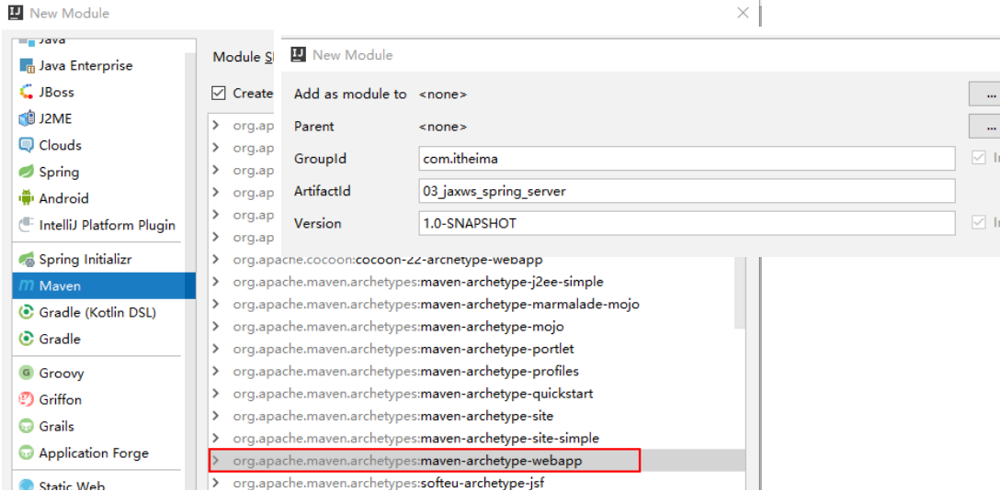
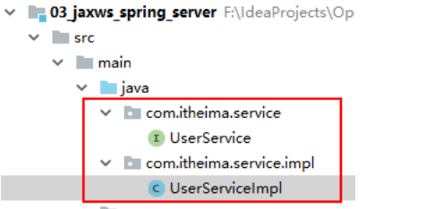
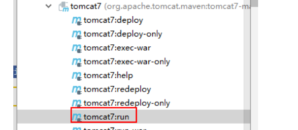
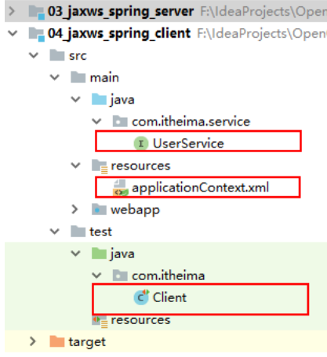
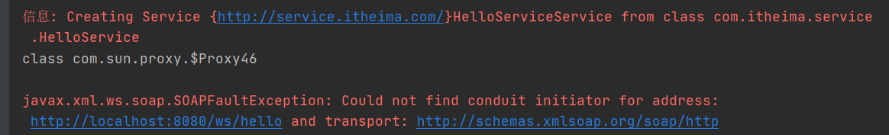

# 5   Spring 整合 ApacheCXF 实现WebService（Jax-ws）

## 5.1  服务端

### 5.1.1  创建web项目

* file--->new --->module...




### 5.1.2  添加依赖

* pom.xml


```xml
		<dependency>
            <groupId>org.apache.cxf</groupId>
            <artifactId>cxf-rt-frontend-jaxws</artifactId>
            <version>3.0.1</version>
        </dependency>
        <dependency>
            <groupId>org.apache.cxf</groupId>
            <artifactId>cxf-rt-transports-http</artifactId>
            <version>3.0.1</version>
        </dependency>
```


### 5.1.3  web.xml 配置CXFServlet

```xml
<!DOCTYPE web-app PUBLIC
        "-//Sun Microsystems, Inc.//DTD Web Application 2.3//EN"
        "http://java.sun.com/dtd/web-app_2_3.dtd" >

<web-app>
    <display-name>Archetype Created Web Application</display-name>
    <context-param>
        <param-name>contextConfigLocation</param-name>
        <param-value>classpath:applicationContext.xml</param-value>
    </context-param>
    <listener>
        <listener-class>org.springframework.web.context.ContextLoaderListener</listener-class>
    </listener>

    <!-- webservice服务端，发布服务需要配置CXFServlet -->
    <!-- 这里配置的servlet路径，最为最终服务路径的一部分： -->
    <!-- 服务访问路径：http://localhost:8080/web.xml配置路径/spring配置的路径 -->
    <servlet>
        <servlet-name>cxfServlet</servlet-name>
        <servlet-class>org.apache.cxf.transport.servlet.CXFServlet</servlet-class>
    </servlet>
    <servlet-mapping>
        <servlet-name>cxfServlet</servlet-name>
        <url-pattern>/ws/*</url-pattern>
    </servlet-mapping>

</web-app>
```


 

### 5.1.4  服务接口、服务实现

项目目录结构：




 

 

### 5.1.5  Spring 整合 ApacheCXF 

 applicationContext.xml

```xml
<?xml version="1.0" encoding="UTF-8"?>
<beans xmlns="http://www.springframework.org/schema/beans"
       xmlns:xsi="http://www.w3.org/2001/XMLSchema-instance"
       xmlns:cxf="http://cxf.apache.org/core"
       xmlns:jaxws="http://cxf.apache.org/jaxws"
       xmlns:jaxrs="http://cxf.apache.org/jaxrs"
       xsi:schemaLocation="
        http://www.springframework.org/schema/beans
        http://www.springframework.org/schema/beans/spring-beans.xsd
        http://cxf.apache.org/core
        http://cxf.apache.org/schemas/core.xsd
        http://cxf.apache.org/jaxws
        http://cxf.apache.org/schemas/jaxws.xsd
        http://cxf.apache.org/jaxrs
        http://cxf.apache.org/schemas/jaxrs.xsd">

    <!--
        Spring整合ApacheCXF，发布jaxws服务：
        1. 服务地址
        2. 服务bean

        完整服务地址：
        http://localhost:8080/ws/userService
     -->
    <jaxws:server address="/userService">
        <jaxws:serviceBean>
            <bean class="com.itheima.service.impl.UserServiceImpl"></bean>
        </jaxws:serviceBean>
    </jaxws:server>
</beans>
```


### 5.1.6  启动服务，发布服务



 

### 5.1.7  访问wsdl说明书

地址：<http://localhost:8080/ws/hello?wsdl>

 

 

## 5.2  客户端

### 5.2.1  创建项目

​	复制03项目创建04_jaxws_spring_client项目, web.xml配置内容可以删除。服务实现也删除。



 

### 5.2.2  添加依赖

复制项目时候已经完成。（与03_jaxws_spring_server中pom.xml配置一样）

### 5.2.3  service接口

复制项目时候已经完成。

### 5.2.4  Spring 整合 ApacheCXF 配置

```xml
<?xml version="1.0" encoding="UTF-8"?>
<beans xmlns="http://www.springframework.org/schema/beans"
       xmlns:xsi="http://www.w3.org/2001/XMLSchema-instance"
       xmlns:cxf="http://cxf.apache.org/core"
       xmlns:jaxws="http://cxf.apache.org/jaxws"
       xmlns:jaxrs="http://cxf.apache.org/jaxrs"
       xsi:schemaLocation="
        http://www.springframework.org/schema/beans
        http://www.springframework.org/schema/beans/spring-beans.xsd
        http://cxf.apache.org/core
        http://cxf.apache.org/schemas/core.xsd
        http://cxf.apache.org/jaxws
        http://cxf.apache.org/schemas/jaxws.xsd
        http://cxf.apache.org/jaxrs
        http://cxf.apache.org/schemas/jaxrs.xsd">


    <!--
        Spring整合ApacheCXF，客户端配置
        关键点：
            通过Spring整合ApacheCXF，创建客户端的代理对象，远程访问服务端。
        jaxws:client
            id  应用中注入的接口的代理对象的名称
            address 服务端访问地址
            serviceClass  指定接口路径，会根据该类型生成代理对象
    -->
    <jaxws:client
            id="userService"
            address="http://localhost:8080/ws/userService"
            serviceClass="com.itheima.service.UserService"></jaxws:client>
</beans>
```


 

### 5.2.5  junit测试

```java
package com.itheima;

import com.itheima.service.UserService;
import org.junit.Test;
import org.junit.runner.RunWith;
import org.springframework.test.context.ContextConfiguration;
import org.springframework.test.context.junit4.SpringJUnit4ClassRunner;

import javax.annotation.Resource;

@RunWith(SpringJUnit4ClassRunner.class)
@ContextConfiguration("classpath:applicationContext.xml")
public class Client {
    // 注入远程访问服务端的接口的代理对象。
    @Resource
    private UserService userService;

    @Test
    public void test() throws Exception {
        // org.apache.cxf.jaxws.JaxWsClientProxy@2826f61
        System.out.println(userService);
        // class com.sun.proxy.$Proxy45
        System.out.println(userService.getClass());

        // 远程调用服务接口
        String content = userService.sayHi("球球");
        System.out.println(content);
    }
}
```

## 5.3 问题

### 5.3.1 启动时client 找不到地址

```xml
https://www.it610.com/article/1292059712468099072.htm
<dependency>
        <groupId>org.apache.cxfgroupId>
        <artifactId>cxf-rt-transports-httpartifactId>
        <version>3.0.1version>
    dependency>
```



