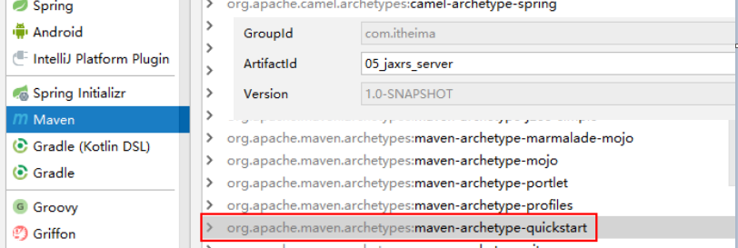
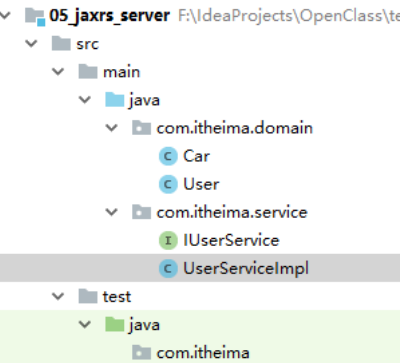
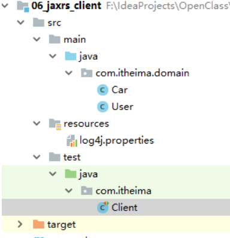

# 7   ApacheCXF实现webservice(Jax-rs)

* 基于restful风格的webservice，请求使用的是http协议，可以传递xml/json数据


## 7.1  服务端

### 7.1.1  创建项目




### 7.1.2  添加依赖

pom.xml

```xml
<?xml version="1.0" encoding="UTF-8"?>

<project xmlns="http://maven.apache.org/POM/4.0.0" xmlns:xsi="http://www.w3.org/2001/XMLSchema-instance"
         xsi:schemaLocation="http://maven.apache.org/POM/4.0.0 http://maven.apache.org/xsd/maven-4.0.0.xsd">

    <groupId>com.itheima</groupId>
    <artifactId>05_jaxrs_server</artifactId>
    <version>1.0-SNAPSHOT</version>
    <modelVersion>4.0.0</modelVersion>
    <name>05_jaxrs_server</name>

    <dependencies>
        <!-- jaxrs 支持包 -->
        <dependency>
            <groupId>org.apache.cxf</groupId>
            <artifactId>cxf-rt-frontend-jaxrs</artifactId>
            <version>3.0.1</version>
        </dependency>

        <!-- 内置的jetty服务器 -->
        <dependency>
            <groupId>org.apache.cxf</groupId>
            <artifactId>cxf-rt-transports-http-jetty</artifactId>
            <version>3.0.1</version>
        </dependency>

        <dependency>
            <groupId>org.slf4j</groupId>
            <artifactId>slf4j-log4j12</artifactId>
            <version>1.7.12</version>
        </dependency>

        <!-- 客户端调用时候使用的包(WebClient工具类调用服务端) -->
        <dependency>
            <groupId>org.apache.cxf</groupId>
            <artifactId>cxf-rt-rs-client</artifactId>
            <version>3.0.1</version>
        </dependency>

        <!-- 基于restful风格的webservice，客户端与服务端之间可以传递json，这个就是json支持相关包 -->
        <dependency>
            <groupId>org.apache.cxf</groupId>
            <artifactId>cxf-rt-rs-extension-providers</artifactId>
            <version>3.0.1</version>
        </dependency>
        <dependency>
            <groupId>org.codehaus.jettison</groupId>
            <artifactId>jettison</artifactId>
            <version>1.3.7</version>
        </dependency>
        <dependency>
            <groupId>junit</groupId>
            <artifactId>junit</artifactId>
            <version>4.10</version>
            <scope>test</scope>
        </dependency>
    </dependencies>
```

```xml
  <build>
      <pluginManagement>
          <plugins>
              <!-- maven的jdk编译插件 -->
              <plugin>
                  <groupId>org.apache.maven.plugins</groupId>
                  <artifactId>maven-compiler-plugin</artifactId>
                  <version>3.2</version>
                  <configuration>
                      <source>1.8</source>
                      <target>1.8</target>
                      <encoding>UTF-8</encoding>
                      <showWarnings>true</showWarnings>
                  </configuration>
              </plugin>
          </plugins>
      </pluginManagement>
  </build>
```


### 7.1.3  服务接口、实现、实体类


#### 7.1.3.2 准备代码



```java
/**
@XmlRootElement 指定根元素，作用：客户端与服务端传递对象数据时候，序列化为xml或json的根元素的名称
- 客户端与服务端传递XML: <Car1></Car>  这里的根元素Car是由name="Car"指定的
- 客户端与服务端传递JSON: {"Car": {"id":100,"name":"","price":100}}
- */
@XmlRootElement(name = "Car")
public class Car {
	private Integer id;
	private String carName;
	private Double price;   省略get、set
}

@XmlRootElement(name = "User")
public class User {
    private Integer id;
    private String username;
    private String city;
    private List<Car> cars = new ArrayList<Car>();  省略get、set
}

@Path("/userService")  // 路径；访问当前服务接口时候的路径。
@Produces("/")
public interface IUserService {
    
    @POST
    @Path("/user")	  // 路径； 访问当前服务接口的方法路径
    // @Consumes 服务端支持的请求的数据格式(xml、json)
    @Consumes({ "application/xml", "application/json" })
    public void saveUser(User user);

    @PUT
    @Path("/user")
    @Consumes({ "application/xml", "application/json" })
    public void updateUser(User user);

    @GET
    @Path("/user")
    // @Produces 服务端支持的响应的数据格式
    @Produces({ "application/xml", "application/json" })
    public List<User> findAllUsers();

    @GET
    @Path("/user/{id}")
    @Consumes("application/xml")
    @Produces({ "application/xml", "application/json" })
    public User finUserById(@PathParam("id") Integer id);

    @DELETE
    @Path("/user/{id}")
    @Consumes({"application/xml", "application/json"})
    public void deleteUser(@PathParam("id") Integer id);
}
```
```java
public class UserServiceImpl implements IUserService {
    public void saveUser(User user) {
        System.out.println("save user:" + user);
    }

    public void updateUser(User user) {
        System.out.println("update user:" + user);
    }

    public List<User> findAllUsers() {
        List<User> users = new ArrayList<User>();

        // 汽车
        List<Car> carList1 = new ArrayList<Car>();
        Car car1 = new Car(101,"保时捷",1000000d);
        Car car2 = new Car(102,"林肯",400000d);
        carList1.add(car1);
        carList1.add(car2);

        // 用户
        User user1 = new User(1,"小明","广州",carList1);
        User user2 = new User(2,"小丽","深圳",carList1);

        // 用户集合
        users.add(user1);
        users.add(user2);

        return users;
    }

    public User finUserById(Integer id) {
        if (id == 1) {
            return new User(1,"小明","广州",null);
        }
        return null;
    }

    public void deleteUser(Integer id) {
        System.out.println("delete user id :" + id);
    }
}
```


####  7.1.3.2 使用的注解分析

使用的注解：

@XmlRootElement 指定根元素，作用：客户端与服务端传递对象数据时候，序列化为xml或json的根元素的名称

@Path("/userService")  路径；访问当前服务接口时候的路径、接口方法的路径。

@POST   insert操作

@PUT    update操作

@GET    select 查询操作

@DELETE   delete删除操作

@Consumes 服务端支持的请求的数据格式(xml、json)

@Produces 服务端支持的响应的数据格式

### 7.1.4  发布服务

```java
package com.itheima;

import com.itheima.service.UserServiceImpl;
import org.apache.cxf.interceptor.LoggingInInterceptor;
import org.apache.cxf.interceptor.LoggingOutInterceptor;
import org.apache.cxf.jaxrs.JAXRSServerFactoryBean;

public class Server {

    /**
     * 发布restful风格的webservice的服务
     */
    public static void main(String[] args) {
        //1.创建服务工厂
        JAXRSServerFactoryBean factory = new JAXRSServerFactoryBean();
    
        //2.设置服务地址、
        factory.setAddress("http://localhost:8001/rs");
    
        //3.实例化服务类、
        factory.setServiceBean(new UserServiceImpl());
    
        // 添加日志拦截器
        factory.getInInterceptors().add(new LoggingInInterceptor());
        factory.getOutInterceptors().add(new LoggingOutInterceptor());
    
        //4.创建服务
        factory.create();
    
        System.out.println("发布服务成功..8001");
    }

}
```


 

 

## 7.2  客户端

### 7.2.1  创建项目

创建项目



 


### 7.2.2  添加依赖

```xml
<?xml version="1.0" encoding="UTF-8"?>
<project xmlns="http://maven.apache.org/POM/4.0.0" xmlns:xsi="http://www.w3.org/2001/XMLSchema-instance" xsi:schemaLocation="http://maven.apache.org/POM/4.0.0 http://maven.apache.org/xsd/maven-4.0.0.xsd">

<groupId>com.itheima</groupId>
<artifactId>06_jaxrs_client</artifactId>
<version>1.0-SNAPSHOT</version>
<modelVersion>4.0.0</modelVersion>
<name>06_jaxrs_client</name>

<dependencies>
    <!-- jaxrs 支持包 -->
    <dependency>
        <groupId>org.apache.cxf</groupId>
        <artifactId>cxf-rt-frontend-jaxrs</artifactId>
        <version>3.0.1</version>
    </dependency>

    <!-- 内置的jetty服务器 -->
    <dependency>
        <groupId>org.apache.cxf</groupId>
        <artifactId>cxf-rt-transports-http-jetty</artifactId>
        <version>3.0.1</version>
    </dependency>

    <dependency>
        <groupId>org.slf4j</groupId>
        <artifactId>slf4j-log4j12</artifactId>
        <version>1.7.12</version>
    </dependency>

    <!-- 客户端调用时候使用的包(WebClient工具类调用服务端) -->
    <dependency>
        <groupId>org.apache.cxf</groupId>
        <artifactId>cxf-rt-rs-client</artifactId>
        <version>3.0.1</version>
    </dependency>

    <!-- 基于restful风格的webservice，客户端与服务端之间可以传递json，这个就是json支持相关包 -->
    <dependency>
        <groupId>org.apache.cxf</groupId>
        <artifactId>cxf-rt-rs-extension-providers</artifactId>
        <version>3.0.1</version>
    </dependency>
    <dependency>
        <groupId>org.codehaus.jettison</groupId>
        <artifactId>jettison</artifactId>
        <version>1.3.7</version>
    </dependency>
    <dependency>
        <groupId>junit</groupId>
        <artifactId>junit</artifactId>
        <version>4.10</version>
        <scope>test</scope>
    </dependency>
</dependencies>


<build>
    <pluginManagement>
        <plugins>
            <!-- maven的jdk编译插件 -->
            <plugin>
                <groupId>org.apache.maven.plugins</groupId>
                <artifactId>maven-compiler-plugin</artifactId>
                <version>3.2</version>
                <configuration>
                    <source>1.8</source>
                    <target>1.8</target>
                    <encoding>UTF-8</encoding>
                    <showWarnings>true</showWarnings>
                </configuration>
            </plugin>
        </plugins>
    </pluginManagement>
</build>
```
### 7.2.3  写junit，远程访问服务端

WebClient

       .create()     指定服务端地址

       .type()      指定请求数据格式（xml、json）

       .accept()    指定响应数据格式

       .post()/put()/delete()/get()  指定请求类型

  ```java
package com.itheima;

import com.itheima.domain.User;
import org.apache.cxf.interceptor.LoggingInInterceptor;
import org.apache.cxf.interceptor.LoggingOutInterceptor;
import org.apache.cxf.jaxrs.JAXRSServerFactoryBean;
import org.apache.cxf.jaxrs.client.WebClient;
import org.junit.Test;

import javax.ws.rs.core.MediaType;
import java.util.Collection;

public class Client {

    @Test
    public void save() throws Exception {
        // 基于restful风格的webservice开发的客户端调用，直接通过一个类：WebClient类完成
        WebClient
                .create("http://localhost:8001/rs/userService/user")  // 地址
                .type(MediaType.APPLICATION_JSON)                     // 请求数据格式是json
                .post(new User(100,"Kobe","gz",null));                  // 发送请求的类型
    }

    @Test
    public void update() throws Exception {
        WebClient
                .create("http://localhost:8001/ws/userService/user")  // 地址
                .type(MediaType.APPLICATION_JSON)                     // 请求数据格式是json
                .put(new User(100,"Kobe","gz",null));                   // 发送请求的类型
    }

    @Test
    public void delete() throws Exception {

    }

    @Test
    public void findOne() throws Exception {
        User user =
                WebClient
                        .create("http://localhost:8001/ws/userService/user/1")  // 地址
                        .accept(MediaType.APPLICATION_JSON)  // 响应的数据格式
                        .get(User.class);
        System.out.println(user);
    }

    @Test
    public void findAll() throws Exception {
        Collection<? extends User> collection =
                WebClient
                        .create("http://localhost:8001/ws/userService/user")
                        .accept(MediaType.APPLICATION_JSON)
                        .getCollection(User.class);
        System.out.println(collection);
    }
}
  ```


