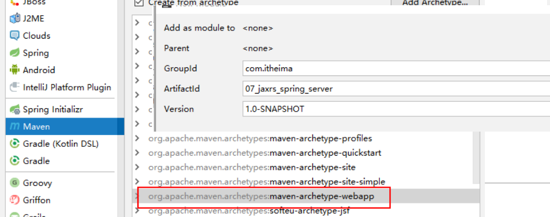
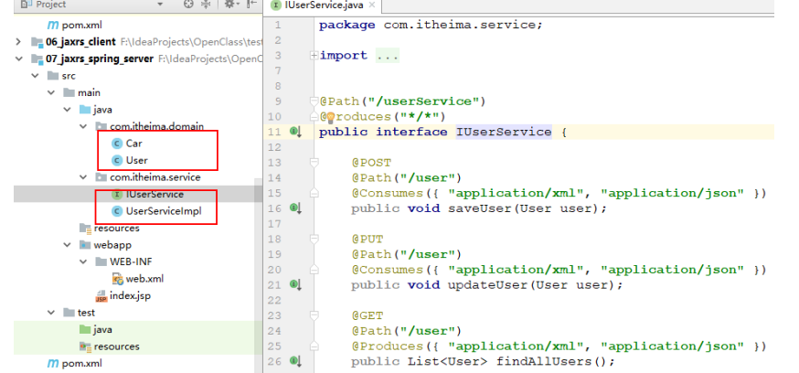
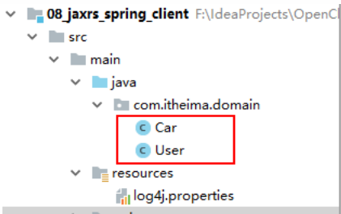

# 8   Sping整合CXF实现基于Restful风格的webservice(jax-rs)

 

## 8.1  服务端

### 8.1.1  创建web项目




### 8.1.2  添加依赖

```HTML
<?xml version="1.0" encoding="UTF-8"?>

<project xmlns="http://maven.apache.org/POM/4.0.0" xmlns:xsi="http://www.w3.org/2001/XMLSchema-instance"
         xsi:schemaLocation="http://maven.apache.org/POM/4.0.0 http://maven.apache.org/xsd/maven-4.0.0.xsd">
    <modelVersion>4.0.0</modelVersion>

    <groupId>com.itheima</groupId>
    <artifactId>07_jaxrs_spring_server</artifactId>
    <version>1.0-SNAPSHOT</version>
    <packaging>war</packaging>

    <name>07_jaxrs_spring_server</name>

    <dependencies>
        <!-- cxf 进行rs开发 必须导入 -->
        <dependency>
            <groupId>org.apache.cxf</groupId>
            <artifactId>cxf-rt-frontend-jaxrs</artifactId>
            <version>3.0.1</version>
        </dependency>
        <!-- 日志引入 -->
        <dependency>
            <groupId>org.slf4j</groupId>
            <artifactId>slf4j-log4j12</artifactId>
            <version>1.7.12</version>
        </dependency>

        <!-- 客户端 -->
        <dependency>
            <groupId>org.apache.cxf</groupId>
            <artifactId>cxf-rt-rs-client</artifactId>
            <version>3.0.1</version>
        </dependency>

        <!-- 扩展json提供者 -->
        <dependency>
            <groupId>org.apache.cxf</groupId>
            <artifactId>cxf-rt-rs-extension-providers</artifactId>
            <version>3.0.1</version>
        </dependency>

        <!-- 转换json工具包，被extension providers 依赖 -->
        <dependency>
            <groupId>org.codehaus.jettison</groupId>
            <artifactId>jettison</artifactId>
            <version>1.3.7</version>
        </dependency>

        <!-- spring 核心 -->
        <dependency>
            <groupId>org.springframework</groupId>
            <artifactId>spring-context</artifactId>
            <version>4.2.4.RELEASE</version>
        </dependency>
        <!-- spring web集成 -->
        <dependency>
            <groupId>org.springframework</groupId>
            <artifactId>spring-web</artifactId>
            <version>4.2.4.RELEASE</version>
        </dependency>
        <!-- spring 整合junit -->
        <dependency>
            <groupId>org.springframework</groupId>
            <artifactId>spring-test</artifactId>
            <version>4.2.4.RELEASE</version>
        </dependency>
        <!-- junit 开发包 -->
        <dependency>
            <groupId>junit</groupId>
            <artifactId>junit</artifactId>
            <version>4.12</version>
        </dependency>
    </dependencies>


    <build>
        <pluginManagement>
            <plugins>
                <!-- maven的jdk编译插件 -->
                <plugin>
                    <groupId>org.apache.maven.plugins</groupId>
                    <artifactId>maven-compiler-plugin</artifactId>
                    <version>3.2</version>
                    <configuration>
                        <source>1.8</source>
                        <target>1.8</target>
                        <encoding>UTF-8</encoding>
                        <showWarnings>true</showWarnings>
                    </configuration>
                </plugin>
                <!-- 运行tomcat7方法：tomcat7:run -->
                <plugin>
                    <groupId>org.apache.tomcat.maven</groupId>
                    <artifactId>tomcat7-maven-plugin</artifactId>
                    <version>2.2</version>
                    <configuration>
                        <!-- 指定端口 -->
                        <port>8080</port>
                        <!-- 请求路径 -->
                        <path>/</path>
                    </configuration>
                </plugin>
            </plugins>
        </pluginManagement>
    </build>
</project>
```

### 8.1.3  web.xml

```xml
<?xml version="1.0" encoding="UTF-8"?>
<web-app xmlns:xsi="http://www.w3.org/2001/XMLSchema-instance"
         xmlns="http://java.sun.com/xml/ns/javaee"
         xsi:schemaLocation="http://java.sun.com/xml/ns/javaee http://java.sun.com/xml/ns/javaee/web-app_2_5.xsd"
         version="2.5">

    <servlet>
        <servlet-name>cxfservlet</servlet-name>
        <servlet-class>org.apache.cxf.transport.servlet.CXFServlet</servlet-class>
        <load-on-startup>1</load-on-startup>
    </servlet>
    <servlet-mapping>
        <servlet-name>cxfservlet</servlet-name>
        <url-pattern>/ws/*</url-pattern>
    </servlet-mapping>

    <!-- 1. 配置springioc容器 -->
    <context-param>
        <param-name>contextConfigLocation</param-name>
        <param-value>classpath:applicationContext.xml</param-value>
    </context-param>
    <listener>
        <listener-class>org.springframework.web.context.ContextLoaderListener</listener-class>
    </listener>

</web-app>
```


### 8.1.4  服务接口、实现、实体类

与之前案例一样：



 

### 8.1.5  Spring整合CXF

```xml
<?xml version="1.0" encoding="UTF-8"?>
<beans xmlns="http://www.springframework.org/schema/beans"
       xmlns:xsi="http://www.w3.org/2001/XMLSchema-instance"
       xmlns:cxf="http://cxf.apache.org/core"
       xmlns:jaxws="http://cxf.apache.org/jaxws"
       xmlns:jaxrs="http://cxf.apache.org/jaxrs"
       xsi:schemaLocation="
        http://www.springframework.org/schema/beans
        http://www.springframework.org/schema/beans/spring-beans.xsd
        http://cxf.apache.org/core
        http://cxf.apache.org/schemas/core.xsd
        http://cxf.apache.org/jaxws
        http://cxf.apache.org/schemas/jaxws.xsd
        http://cxf.apache.org/jaxrs
        http://cxf.apache.org/schemas/jaxrs.xsd">

    <!--
        Spring整合ApacheCXF，发布jaxws服务：
        1. 服务地址
        2. 服务bean

        完整服务地址：
        http://localhost:8080/ws/userService
     -->
    <jaxrs:server address="/userService">
        <jaxrs:serviceBeans>
            <bean class="com.itheima.service.UserServiceImpl"></bean>
        </jaxrs:serviceBeans>
        <jaxrs:inInterceptors>
            <bean class="org.apache.cxf.interceptor.LoggingInInterceptor" />
        </jaxrs:inInterceptors>
        <jaxrs:outInterceptors>
            <bean class="org.apache.cxf.interceptor.LoggingOutInterceptor" />
        </jaxrs:outInterceptors>
    </jaxrs:server>

</beans>
```


### 8.1.6  发布服务

tomcat:run

 

## 8.2  客户端

### 8.2.1  创建项目

创建服务端



### 8.2.2  添加依赖

上面已经完成

### 8.2.3  实体类

上面已经完成

 

### 8.2.4  测试

```java
package com.itheima;

import com.itheima.domain.User;
import org.apache.cxf.jaxrs.client.WebClient;

public class Client {

    public static void main(String[] args) {
        // 测试1： 保存
        WebClient
                .create("http://localhost:8080/ws/userService/userService/user")
                .post(new User());

        // 测试2：删除（传入id）
        WebClient
                .create("http://localhost:8080/ws/userService/userService/user/100")
                .delete();
    }
}

```


