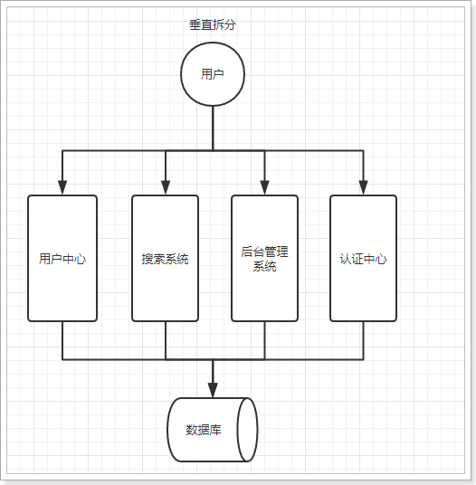
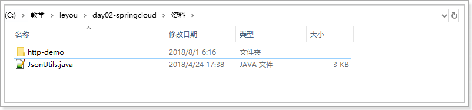
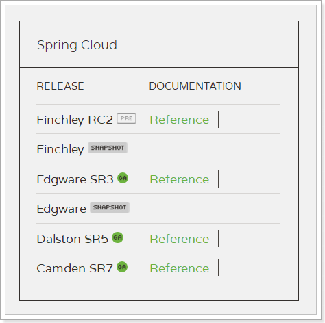
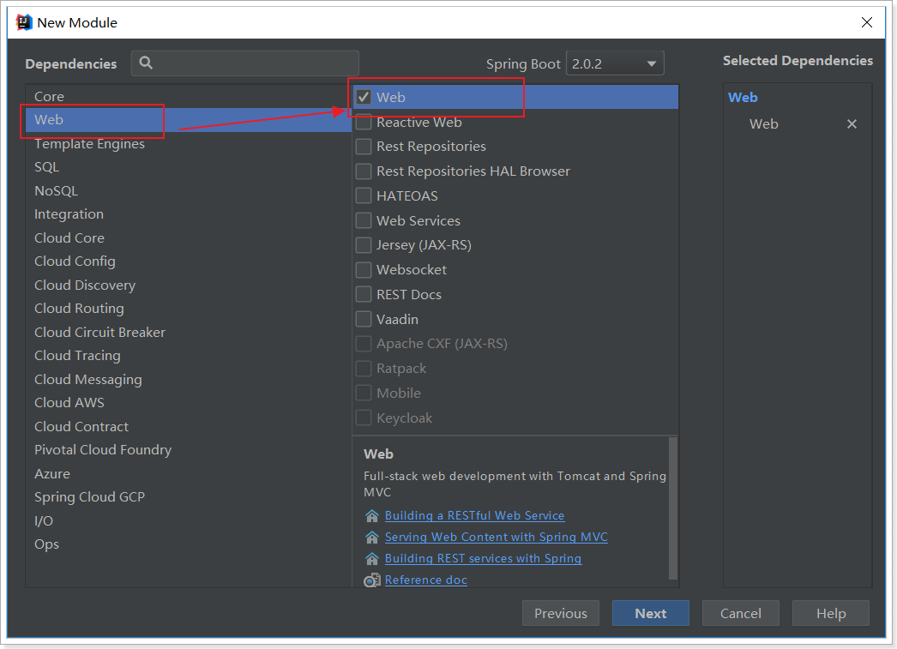
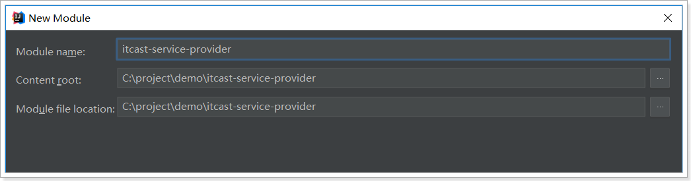
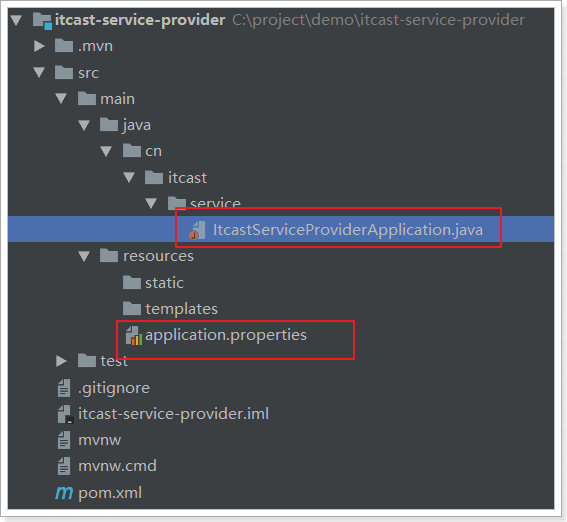
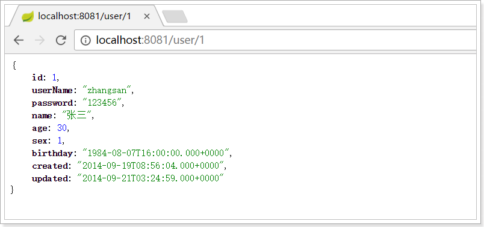
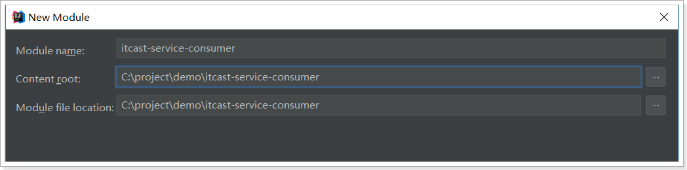
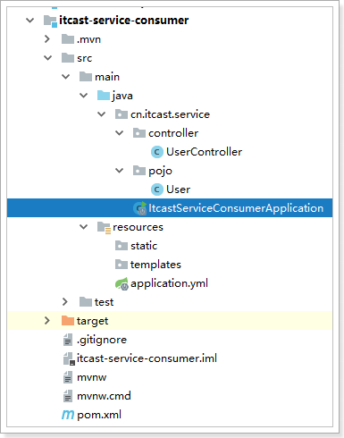

# 0.学习目标

- 了解系统架构的演变
- 了解RPC与Http的区别
- 知道什么是SpringCloud
- 独立搭建Eureka注册中心
- 独立配置Robbin负载均衡


# 1.系统架构演变

随着互联网的发展，网站应用的规模不断扩大。需求的激增，带来的是技术上的压力。系统架构也因此不断的演进、升级、迭代。从单一应用，到垂直拆分，到分布式服务，到SOA，以及现在火热的微服务架构，还有在Google带领下来势汹涌的Service Mesh。我们到底是该乘坐微服务的船只驶向远方，还是偏安一隅得过且过？

其实生活不止眼前的苟且，还有诗和远方。所以我们今天就回顾历史，看一看系统架构演变的历程；把握现在，学习现在最火的技术架构；展望未来，争取成为一名优秀的Java工程师。


## 1.1.集中式架构

当网站流量很小时，只需一个应用，将所有功能都部署在一起，以减少部署节点和成本。此时，用于简化增删改查工作量的数据访问框架(ORM)是影响项目开发的关键。

 

存在的问题：

- 代码耦合，开发维护困难
- 无法针对不同模块进行针对性优化
- 无法水平扩展
- 单点容错率低，并发能力差


## 1.2.垂直拆分

当访问量逐渐增大，单一应用无法满足需求，此时为了应对更高的并发和业务需求，我们根据业务功能对系统进行拆分：

 

优点：

- 系统拆分实现了流量分担，解决了并发问题
- 可以针对不同模块进行优化
- 方便水平扩展，负载均衡，容错率提高

缺点：

- 系统间相互独立，会有很多重复开发工作，影响开发效率


## 1.3.分布式服务

当垂直应用越来越多，应用之间交互不可避免，将核心业务抽取出来，作为独立的服务，逐渐形成稳定的服务中心，使前端应用能更快速的响应多变的市场需求。此时，用于提高业务复用及整合的分布式调用是关键。

 

优点：

- 将基础服务进行了抽取，系统间相互调用，提高了代码复用和开发效率

缺点：

- 系统间耦合度变高，调用关系错综复杂，难以维护


## 1.4.流动计算架构（SOA）

SOA ：面向服务的架构

当服务越来越多，容量的评估，小服务资源的浪费等问题逐渐显现，此时需增加一个调度中心基于访问压力实时管理集群容量，提高集群利用率。此时，用于提高机器利用率的资源调度和治理中心(SOA)是关键


以前出现了什么问题？

- 服务越来越多，需要管理每个服务的地址
- 调用关系错综复杂，难以理清依赖关系
- 服务过多，服务状态难以管理，无法根据服务情况动态管理

服务治理要做什么？

- 服务注册中心，实现服务自动注册和发现，无需人为记录服务地址
- 服务自动订阅，服务列表自动推送，服务调用透明化，无需关心依赖关系
- 动态监控服务状态监控报告，人为控制服务状态

缺点：

- 服务间会有依赖关系，一旦某个环节出错会影响较大
- 服务关系复杂，运维、测试部署困难，不符合DevOps思想


## 1.5.微服务

前面说的SOA，英文翻译过来是面向服务。微服务，似乎也是服务，都是对系统进行拆分。因此两者非常容易混淆，但其实却有一些差别：

微服务的特点：

- 单一职责：微服务中每一个服务都对应唯一的业务能力，做到单一职责
- 微：微服务的服务拆分粒度很小，例如一个用户管理就可以作为一个服务。每个服务虽小，但“五脏俱全”。
- 面向服务：面向服务是说每个服务都要对外暴露Rest风格服务接口API。并不关心服务的技术实现，做到与平台和语言无关，也不限定用什么技术实现，只要提供Rest的接口即可。
- 自治：自治是说服务间互相独立，互不干扰
  - 团队独立：每个服务都是一个独立的开发团队，人数不能过多。
  - 技术独立：因为是面向服务，提供Rest接口，使用什么技术没有别人干涉
  - 前后端分离：采用前后端分离开发，提供统一Rest接口，后端不用再为PC、移动段开发不同接口
  - 数据库分离：每个服务都使用自己的数据源
  - 部署独立，服务间虽然有调用，但要做到服务重启不影响其它服务。有利于持续集成和持续交付。每个服务都是独立的组件，可复用，可替换，降低耦合，易维护


微服务结构图：


# 2.服务调用方式

## 2.1.RPC和HTTP

无论是微服务还是SOA，都面临着服务间的远程调用。那么服务间的远程调用方式有哪些呢？

常见的远程调用方式有以下2种：

- RPC：Remote Produce Call远程过程调用，类似的还有RMI。自定义数据格式，基于原生TCP通信，速度快，效率高。早期的webservice，现在热门的dubbo，都是RPC的典型代表

- Http：http其实是一种网络传输协议，基于TCP，规定了数据传输的格式。现在客户端浏览器与服务端通信基本都是采用Http协议，也可以用来进行远程服务调用。缺点是消息封装臃肿，优势是对服务的提供和调用方没有任何技术限定，自由灵活，更符合微服务理念。

  现在热门的Rest风格，就可以通过http协议来实现。


如果你们公司全部采用Java技术栈，那么使用Dubbo作为微服务架构是一个不错的选择。

相反，如果公司的技术栈多样化，而且你更青睐Spring家族，那么SpringCloud搭建微服务是不二之选。在我们的项目中，我们会选择SpringCloud套件，因此我们会使用Http方式来实现服务间调用。


## 2.2.Http客户端工具

既然微服务选择了Http，那么我们就需要考虑自己来实现对请求和响应的处理。不过开源世界已经有很多的http客户端工具，能够帮助我们做这些事情，例如：

- HttpClient
- OKHttp
- URLConnection

接下来，不过这些不同的客户端，API各不相同


## 2.3.Spring的RestTemplate

Spring提供了一个RestTemplate模板工具类，对基于Http的客户端进行了封装，并且实现了对象与json的序列化和反序列化，非常方便。RestTemplate并没有限定Http的客户端类型，而是进行了抽象，目前常用的3种都有支持：

- HttpClient
- OkHttp
- JDK原生的URLConnection（默认的）


我们导入课前资料提供的demo工程：




首先在项目中注册一个`RestTemplate`对象，可以在启动类位置注册：

```java
@SpringBootApplication
public class HttpDemoApplication {

	public static void main(String[] args) {
		SpringApplication.run(HttpDemoApplication.class, args);
	}

	@Bean
	public RestTemplate restTemplate() {
   
		return new RestTemplate();
	}
}
```


在测试类中直接`@Autowired`注入：

```java
@RunWith(SpringRunner.class)
@SpringBootTest(classes = HttpDemoApplication.class)
public class HttpDemoApplicationTests {

	@Autowired
	private RestTemplate restTemplate;

	@Test
	public void httpGet() {
        // 调用springboot案例中的rest接口
		User user = this.restTemplate.getForObject("http://localhost/user/1", User.class);
		System.out.println(user);
	}
}
```

- 通过RestTemplate的getForObject()方法，传递url地址及实体类的字节码，RestTemplate会自动发起请求，接收响应，并且帮我们对响应结果进行反序列化。


学习完了Http客户端工具，接下来就可以正式学习微服务了。


# 3.初识SpringCloud

微服务是一种架构方式，最终肯定需要技术架构去实施。

微服务的实现方式很多，但是最火的莫过于Spring Cloud了。为什么？

- 后台硬：作为Spring家族的一员，有整个Spring全家桶靠山，背景十分强大。
- 技术强：Spring作为Java领域的前辈，可以说是功力深厚。有强力的技术团队支撑，一般人还真比不了
- 群众基础好：可以说大多数程序员的成长都伴随着Spring框架，试问：现在有几家公司开发不用Spring？SpringCloud与Spring的各个框架无缝整合，对大家来说一切都是熟悉的配方，熟悉的味道。
- 使用方便：相信大家都体会到了SpringBoot给我们开发带来的便利，而SpringCloud完全支持SpringBoot的开发，用很少的配置就能完成微服务框架的搭建


## 3.1.简介

SpringCloud是Spring旗下的项目之一，[官网地址：http://projects.spring.io/spring-cloud/](http://projects.spring.io/spring-cloud/)

Spring最擅长的就是集成，把世界上最好的框架拿过来，集成到自己的项目中。

SpringCloud也是一样，它将现在非常流行的一些技术整合到一起，实现了诸如：配置管理，服务发现，智能路由，负载均衡，熔断器，控制总线，集群状态等等功能。其主要涉及的组件包括：

- Eureka：服务治理组件，包含服务注册中心，服务注册与发现机制的实现。（服务治理，服务注册/发现） 
- Zuul：网关组件，提供智能路由，访问过滤功能 
- Ribbon：客户端负载均衡的服务调用组件（客户端负载） 
- Feign：服务调用，给予Ribbon和Hystrix的声明式服务调用组件 （声明式服务调用） 
- Hystrix：容错管理组件，实现断路器模式，帮助服务依赖中出现的延迟和为故障提供强大的容错能力。(熔断、断路器，容错) 

架构图：

 

以上只是其中一部分。


## 3.2.版本

因为Spring Cloud不同其他独立项目，它拥有很多子项目的大项目。所以它的版本是版本名+版本号 （如Angel.SR6）。  

版本名：是伦敦的地铁名  

版本号：SR（Service Releases）是固定的 ,大概意思是稳定版本。后面会有一个递增的数字。 

所以 Edgware.SR3就是Edgware的第3个Release版本。  

 

我们在项目中，会是以Finchley的版本。

其中包含的组件，也都有各自的版本，如下表：

| Component                 | Edgware.SR3    | Finchley.RC1     | Finchley.BUILD-SNAPSHOT |
| ------------------------- | -------------- | ---------------- | ----------------------- |
| spring-cloud-aws          | 1.2.2.RELEASE  | 2.0.0.RC1        | 2.0.0.BUILD-SNAPSHOT    |
| spring-cloud-bus          | 1.3.2.RELEASE  | 2.0.0.RC1        | 2.0.0.BUILD-SNAPSHOT    |
| spring-cloud-cli          | 1.4.1.RELEASE  | 2.0.0.RC1        | 2.0.0.BUILD-SNAPSHOT    |
| spring-cloud-commons      | 1.3.3.RELEASE  | 2.0.0.RC1        | 2.0.0.BUILD-SNAPSHOT    |
| spring-cloud-contract     | 1.2.4.RELEASE  | 2.0.0.RC1        | 2.0.0.BUILD-SNAPSHOT    |
| spring-cloud-config       | 1.4.3.RELEASE  | 2.0.0.RC1        | 2.0.0.BUILD-SNAPSHOT    |
| spring-cloud-netflix      | 1.4.4.RELEASE  | 2.0.0.RC1        | 2.0.0.BUILD-SNAPSHOT    |
| spring-cloud-security     | 1.2.2.RELEASE  | 2.0.0.RC1        | 2.0.0.BUILD-SNAPSHOT    |
| spring-cloud-cloudfoundry | 1.1.1.RELEASE  | 2.0.0.RC1        | 2.0.0.BUILD-SNAPSHOT    |
| spring-cloud-consul       | 1.3.3.RELEASE  | 2.0.0.RC1        | 2.0.0.BUILD-SNAPSHOT    |
| spring-cloud-sleuth       | 1.3.3.RELEASE  | 2.0.0.RC1        | 2.0.0.BUILD-SNAPSHOT    |
| spring-cloud-stream       | Ditmars.SR3    | Elmhurst.RELEASE | Elmhurst.BUILD-SNAPSHOT |
| spring-cloud-zookeeper    | 1.2.1.RELEASE  | 2.0.0.RC1        | 2.0.0.BUILD-SNAPSHOT    |
| spring-boot               | 1.5.10.RELEASE | 2.0.1.RELEASE    | 2.0.0.BUILD-SNAPSHOT    |
| spring-cloud-task         | 1.2.2.RELEASE  | 2.0.0.RC1        | 2.0.0.RELEASE           |
| spring-cloud-vault        | 1.1.0.RELEASE  | 2.0.0.RC1        | 2.0.0.BUILD-SNAPSHOT    |
| spring-cloud-gateway      | 1.0.1.RELEASE  | 2.0.0.RC1        | 2.0.0.BUILD-SNAPSHOT    |
| spring-cloud-openfeign    |                | 2.0.0.RC1        | 2.0.0.BUILD-SNAPSHOT    |


接下来，我们就一一学习SpringCloud中的重要组件。


# 4.微服务场景模拟

首先，我们需要模拟一个服务调用的场景，搭建两个工程：itcast-service-provider（服务提供方）和itcast-service-consumer（服务调用方）。方便后面学习微服务架构

服务提供方：使用mybatis操作数据库，实现对数据的增删改查；并对外提供rest接口服务。

服务消费方：使用restTemplate远程调用服务提供方的rest接口服务，获取数据。

## 4.1.服务提供者

我们新建一个项目：itcast-service-provider，对外提供根据id查询用户的服务。

### 4.1.1.Spring脚手架创建工程

借助于Spring提供的快速搭建工具：


next-->填写项目信息：


next -->  添加web依赖：



添加mybatis依赖：


Next -->  填写项目位置：



生成的项目结构，已经包含了引导类（itcastServiceProviderApplication）：

 

依赖也已经全部自动引入：

```xml
<?xml version="1.0" encoding="UTF-8"?>
<project xmlns="http://maven.apache.org/POM/4.0.0" xmlns:xsi="http://www.w3.org/2001/XMLSchema-instance"
         xsi:schemaLocation="http://maven.apache.org/POM/4.0.0 http://maven.apache.org/xsd/maven-4.0.0.xsd">
    <modelVersion>4.0.0</modelVersion>

    <groupId>cn.itcast.service</groupId>
    <artifactId>itcast-service-provider</artifactId>
    <version>0.0.1-SNAPSHOT</version>
    <packaging>jar</packaging>

    <name>itcast-service-provider</name>
    <description>Demo project for Spring Boot</description>

    <parent>
        <groupId>org.springframework.boot</groupId>
        <artifactId>spring-boot-starter-parent</artifactId>
        <version>2.0.6.RELEASE</version>
        <relativePath/> <!-- lookup parent from repository -->
    </parent>

    <properties>
        <project.build.sourceEncoding>UTF-8</project.build.sourceEncoding>
        <project.reporting.outputEncoding>UTF-8</project.reporting.outputEncoding>
        <java.version>1.8</java.version>
    </properties>

    <dependencies>
        <dependency>
            <groupId>org.springframework.boot</groupId>
            <artifactId>spring-boot-starter-jdbc</artifactId>
        </dependency>
        <dependency>
            <groupId>org.springframework.boot</groupId>
            <artifactId>spring-boot-starter-web</artifactId>
        </dependency>
        <dependency>
            <groupId>org.mybatis.spring.boot</groupId>
            <artifactId>mybatis-spring-boot-starter</artifactId>
            <version>1.3.2</version>
        </dependency>

        <dependency>
            <groupId>mysql</groupId>
            <artifactId>mysql-connector-java</artifactId>
            <scope>runtime</scope>
        </dependency>
        <dependency>
            <groupId>org.springframework.boot</groupId>
            <artifactId>spring-boot-starter-test</artifactId>
            <scope>test</scope>
        </dependency>
        <!-- 需要手动引入通用mapper的启动器，spring没有收录该依赖 -->
        <dependency>
            <groupId>tk.mybatis</groupId>
            <artifactId>mapper-spring-boot-starter</artifactId>
            <version>2.0.4</version>
        </dependency>
    </dependencies>

    <build>
        <plugins>
            <plugin>
                <groupId>org.springframework.boot</groupId>
                <artifactId>spring-boot-maven-plugin</artifactId>
            </plugin>
        </plugins>
    </build>

</project>
```

当然，因为要使用通用mapper，所以我们**需要手动加一条依赖**：

```xml
<dependency>
    <groupId>tk.mybatis</groupId>
    <artifactId>mapper-spring-boot-starter</artifactId>
    <version>2.0.4</version>
</dependency>
```

非常快捷啊！


### 4.1.2.编写代码

 

#### 4.1.2.1.配置

属性文件,这里我们采用了yaml语法，而不是properties：

```yaml
server:
  port: 8081
spring:
  datasource:
    url: jdbc:mysql://localhost:3306/mybatis #你学习mybatis时，使用的数据库地址
    username: root
    password: root
mybatis:
  type-aliases-package: cn.itcast.service.pojo
```


#### 4.1.2.2.实体类

```java
@Table(name = "tb_user")
public class User implements Serializable {

    private static final long serialVersionUID = 1L;

    @Id
    @GeneratedValue(strategy = GenerationType.IDENTITY)
    private Long id;

    // 用户名
    private String userName;

    // 密码
    private String password;

    // 姓名
    private String name;

    // 年龄
    private Integer age;

    // 性别，1男性，2女性
    private Integer sex;

    // 出生日期
    private Date birthday;

    // 创建时间
    private Date created;

    // 更新时间
    private Date updated;

    public Long getId() {
        return id;
    }

    public void setId(Long id) {
        this.id = id;
    }

    public String getUserName() {
        return userName;
    }

    public void setUserName(String userName) {
        this.userName = userName;
    }

    public String getPassword() {
        return password;
    }

    public void setPassword(String password) {
        this.password = password;
    }

    public String getName() {
        return name;
    }

    public void setName(String name) {
        this.name = name;
    }

    public Integer getAge() {
        return age;
    }

    public void setAge(Integer age) {
        this.age = age;
    }

    public Integer getSex() {
        return sex;
    }

    public void setSex(Integer sex) {
        this.sex = sex;
    }

    public Date getBirthday() {
        return birthday;
    }

    public void setBirthday(Date birthday) {
        this.birthday = birthday;
    }

    public Date getCreated() {
        return created;
    }

    public void setCreated(Date created) {
        this.created = created;
    }

    public Date getUpdated() {
        return updated;
    }

    public void setUpdated(Date updated) {
        this.updated = updated;
    }
}
```


#### 4.1.2.3.UserMapper

```java
@Mapper
public interface UserMapper extends tk.mybatis.mapper.common.Mapper<User>{
}
```


#### 4.1.2.4.UserService

```java
@Service
public class UserService {

    @Autowired
    private UserMapper userMapper;

    public User queryById(Long id) {
        return this.userMapper.selectByPrimaryKey(id);
    }
}
```


#### 4.1.2.5.UserController

添加一个对外查询的接口：

```java
@RestController
@RequestMapping("user")
public class UserController {

    @Autowired
    private UserService userService;

    @GetMapping("{id}")
    public User queryById(@PathVariable("id") Long id) {
        return this.userService.queryById(id);
    }
}
```


### 4.1.3.启动并测试

启动项目，访问接口：http://localhost:8081/user/1




## 4.2.服务调用者

搭建itcast-service-consumer服务消费方工程。

### 4.2.1.创建工程

与上面类似，这里不再赘述，需要注意的是，我们调用itcast-service-provider的解耦获取数据，因此不需要mybatis相关依赖了。




pom：

```xml
<?xml version="1.0" encoding="UTF-8"?>
<project xmlns="http://maven.apache.org/POM/4.0.0" xmlns:xsi="http://www.w3.org/2001/XMLSchema-instance"
         xsi:schemaLocation="http://maven.apache.org/POM/4.0.0 http://maven.apache.org/xsd/maven-4.0.0.xsd">
    <modelVersion>4.0.0</modelVersion>

    <groupId>cn.itcast.service</groupId>
    <artifactId>itcast-service-consumer</artifactId>
    <version>0.0.1-SNAPSHOT</version>
    <packaging>jar</packaging>

    <name>itcast-service-consumer</name>
    <description>Demo project for Spring Boot</description>

    <parent>
        <groupId>org.springframework.boot</groupId>
        <artifactId>spring-boot-starter-parent</artifactId>
        <version>2.0.4.RELEASE</version>
        <relativePath/> <!-- lookup parent from repository -->
    </parent>

    <properties>
        <project.build.sourceEncoding>UTF-8</project.build.sourceEncoding>
        <project.reporting.outputEncoding>UTF-8</project.reporting.outputEncoding>
        <java.version>1.8</java.version>
    </properties>

    <dependencies>
        <dependency>
            <groupId>org.springframework.boot</groupId>
            <artifactId>spring-boot-starter-web</artifactId>
        </dependency>

        <dependency>
            <groupId>org.springframework.boot</groupId>
            <artifactId>spring-boot-starter-test</artifactId>
            <scope>test</scope>
        </dependency>
    </dependencies>

    <build>
        <plugins>
            <plugin>
                <groupId>org.springframework.boot</groupId>
                <artifactId>spring-boot-maven-plugin</artifactId>
            </plugin>
        </plugins>
    </build>


</project>

```


### 4.2.2.编写代码

 

首先在引导类中注册`RestTemplate`：

```java
@SpringBootApplication
public class ItcastServiceConsumerApplication {

    @Bean
    public RestTemplate restTemplate() {
        return new RestTemplate();
    }

    public static void main(String[] args) {
        SpringApplication.run(ItcastServiceConsumerApplication.class, args);
    }
}
```

编写配置（application.yml）：

```
server:
  port: 80
```

编写UserController：

```java
@Controller
@RequestMapping("consumer/user")
public class UserController {

    @Autowired
    private RestTemplate restTemplate;

    @GetMapping
    @ResponseBody
    public User queryUserById(@RequestParam("id") Long id){
        User user = this.restTemplate.getForObject("http://localhost:8081/user/" + id, User.class);
        return user;
    }

}
```

pojo对象（User）：

```java
public class User implements Serializable {

    private static final long serialVersionUID = 1L;

    private Long id;

    // 用户名
    private String userName;

    // 密码
    private String password;

    // 姓名
    private String name;

    // 年龄
    private Integer age;

    // 性别，1男性，2女性
    private Integer sex;

    // 出生日期
    private Date birthday;

    // 创建时间
    private Date created;

    // 更新时间
    private Date updated;

    public Long getId() {
        return id;
    }

    public void setId(Long id) {
        this.id = id;
    }

    public String getUserName() {
        return userName;
    }

    public void setUserName(String userName) {
        this.userName = userName;
    }

    public String getPassword() {
        return password;
    }

    public void setPassword(String password) {
        this.password = password;
    }

    public String getName() {
        return name;
    }

    public void setName(String name) {
        this.name = name;
    }

    public Integer getAge() {
        return age;
    }

    public void setAge(Integer age) {
        this.age = age;
    }

    public Integer getSex() {
        return sex;
    }

    public void setSex(Integer sex) {
        this.sex = sex;
    }

    public Date getBirthday() {
        return birthday;
    }

    public void setBirthday(Date birthday) {
        this.birthday = birthday;
    }

    public Date getCreated() {
        return created;
    }

    public void setCreated(Date created) {
        this.created = created;
    }

    public Date getUpdated() {
        return updated;
    }

    public void setUpdated(Date updated) {
        this.updated = updated;
    }
}
```


### 4.2.3.启动测试

因为我们没有配置端口，那么默认就是8080，我们访问：http://localhost/consumer/user?id=1


一个简单的远程服务调用案例就实现了。


## 4.3.有没有问题？

简单回顾一下，刚才我们写了什么：

- itcast-service-provider：一个提供根据id查询用户的微服务。
- itcast-service-consumer：一个服务调用者，通过RestTemplate远程调用itcast-service-provider。

存在什么问题？

- 在consumer中，我们把url地址硬编码到了代码中，不方便后期维护
- consumer需要记忆provider的地址，如果出现变更，可能得不到通知，地址将失效
- consumer不清楚provider的状态，服务宕机也不知道
- provider只有1台服务，不具备高可用性
- 即便provider形成集群，consumer还需自己实现负载均衡

其实上面说的问题，概括一下就是分布式服务必然要面临的问题：

- 服务管理
  - 如何自动注册和发现
  - 如何实现状态监管
  - 如何实现动态路由
- 服务如何实现负载均衡
- 服务如何解决容灾问题
- 服务如何实现统一配置

以上的问题，我们都将在SpringCloud中得到答案。


