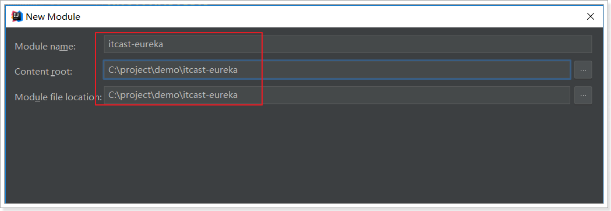
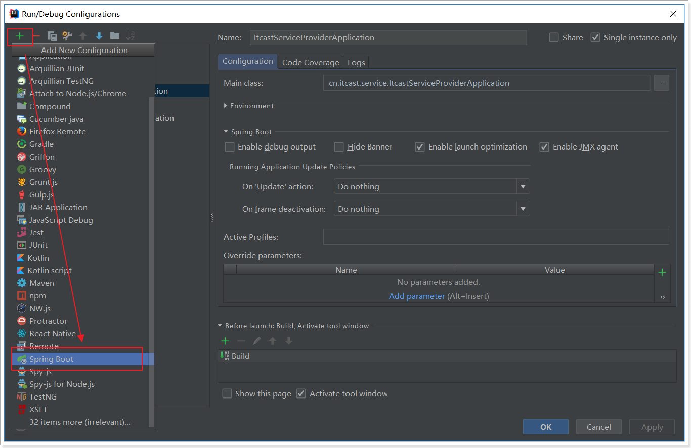
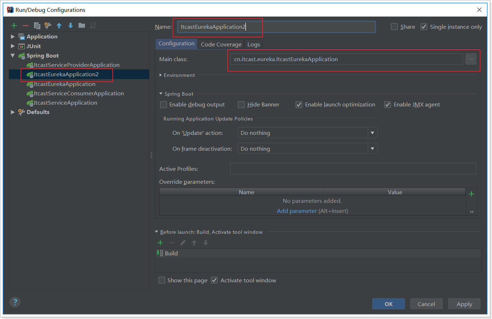
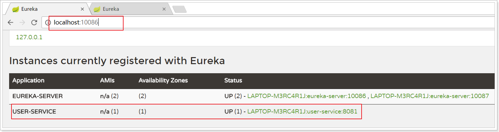
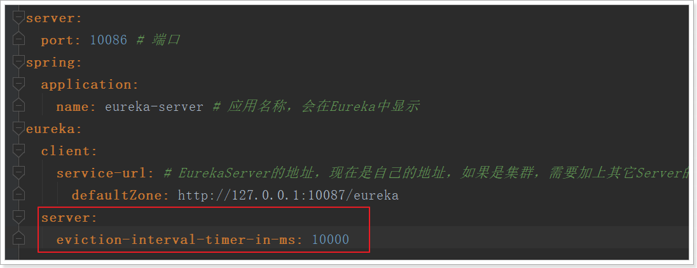

# 5.Eureka注册中心

## 5.1.认识Eureka

首先我们来解决第一问题，服务的管理。

> 问题分析

在刚才的案例中，itcast-service-provider对外提供服务，需要对外暴露自己的地址。而consumer（调用者）需要记录服务提供者的地址。将来地址出现变更，还需要及时更新。这在服务较少的时候并不觉得有什么，但是在现在日益复杂的互联网环境，一个项目肯定会拆分出十几，甚至数十个微服务。此时如果还人为管理地址，不仅开发困难，将来测试、发布上线都会非常麻烦，这与DevOps的思想是背道而驰的。

> 网约车

这就好比是 网约车出现以前，人们出门叫车只能叫出租车。一些私家车想做出租却没有资格，被称为黑车。而很多人想要约车，但是无奈出租车太少，不方便。私家车很多却不敢拦，而且满大街的车，谁知道哪个才是愿意载人的。一个想要，一个愿意给，就是缺少引子，缺乏管理啊。

此时滴滴这样的网约车平台出现了，所有想载客的私家车全部到滴滴注册，记录你的车型（服务类型），身份信息（联系方式）。这样提供服务的私家车，在滴滴那里都能找到，一目了然。

此时要叫车的人，只需要打开APP，输入你的目的地，选择车型（服务类型），滴滴自动安排一个符合需求的车到你面前，为你服务，完美！

> Eureka做什么？

Eureka就好比是滴滴，负责管理、记录服务提供者的信息。服务调用者无需自己寻找服务，而是把自己的需求告诉Eureka，然后Eureka会把符合你需求的服务告诉你。

同时，服务提供方与Eureka之间通过`“心跳”`机制进行监控，当某个服务提供方出现问题，Eureka自然会把它从服务列表中剔除。

这就实现了服务的自动注册、发现、状态监控。


## 5.2.原理图

> 基本架构：

 


- Eureka：就是服务注册中心（可以是一个集群），对外暴露自己的地址
- 提供者：启动后向Eureka注册自己信息（地址，提供什么服务）
- 消费者：向Eureka订阅服务，Eureka会将对应服务的所有提供者地址列表发送给消费者，并且定期更新
- 心跳(续约)：提供者定期通过http方式向Eureka刷新自己的状态


## 5.3.入门案例

### 5.3.1.搭建EurekaServer

接下来我们创建一个项目，启动一个EurekaServer：

依然使用spring提供的快速搭建工具：


选择依赖：EurekaServer-服务注册中心依赖，Eureka Discovery-服务提供方和服务消费方。因为，对于eureka来说：服务提供方和服务消费方都属于客户端




完整的Pom文件：

```xml
<?xml version="1.0" encoding="UTF-8"?>
<project xmlns="http://maven.apache.org/POM/4.0.0" xmlns:xsi="http://www.w3.org/2001/XMLSchema-instance"
         xsi:schemaLocation="http://maven.apache.org/POM/4.0.0 http://maven.apache.org/xsd/maven-4.0.0.xsd">
    <modelVersion>4.0.0</modelVersion>

    <groupId>cn.itcast.eureka</groupId>
    <artifactId>itcast-eureka</artifactId>
    <version>0.0.1-SNAPSHOT</version>
    <packaging>jar</packaging>

    <name>itcast-eureka</name>
    <description>Demo project for Spring Boot</description>

    <parent>
        <groupId>org.springframework.boot</groupId>
        <artifactId>spring-boot-starter-parent</artifactId>
        <version>2.0.6.RELEASE</version>
        <relativePath/> <!-- lookup parent from repository -->
    </parent>

    <properties>
        <project.build.sourceEncoding>UTF-8</project.build.sourceEncoding>
        <project.reporting.outputEncoding>UTF-8</project.reporting.outputEncoding>
        <java.version>1.8</java.version>
        <spring-cloud.version>Finchley.RC2</spring-cloud.version>
    </properties>

    <dependencies>
        <dependency>
            <groupId>org.springframework.cloud</groupId>
            <artifactId>spring-cloud-starter-netflix-eureka-server</artifactId>
        </dependency>

    </dependencies>

    <build>
        <plugins>
            <plugin>
                <groupId>org.springframework.boot</groupId>
                <artifactId>spring-boot-maven-plugin</artifactId>
            </plugin>
        </plugins>
    </build>

</project>
```

编写application.yml配置：

```yaml
server:
  port: 10086 # 端口
spring:
  application:
    name: eureka-server # 应用名称，会在Eureka中显示
eureka:
  client:
    service-url: # EurekaServer的地址，现在是自己的地址，如果是集群，需要加上其它Server的地址。
      defaultZone: http://127.0.0.1:${server.port}/eureka
```

修改引导类，在类上添加@EnableEurekaServer注解：

```java
@SpringBootApplication
@EnableEurekaServer // 声明当前springboot应用是一个eureka服务中心
public class ItcastEurekaApplication {

    public static void main(String[] args) {
        SpringApplication.run(ItcastEurekaApplication.class, args);
    }
}
```

启动服务，并访问：http://127.0.0.1:10086


### 5.3.2.注册到Eureka

注册服务，就是在服务上添加Eureka的客户端依赖，客户端代码会自动把服务注册到EurekaServer中。

修改itcast-service-provider工程

1. 在pom.xml中，添加springcloud的相关依赖。
2. 在application.yml中，添加springcloud的相关依赖。
3. 在引导类上添加注解，把服务注入到eureka注册中心。

具体操作

#### 5.3.2.1.pom.xml

参照itcast-eureka，先添加SpringCloud依赖：

```xml
<!-- SpringCloud的依赖 -->
<dependencyManagement>
    <dependencies>
        <dependency>
            <groupId>org.springframework.cloud</groupId>
            <artifactId>spring-cloud-dependencies</artifactId>
            <version>Finchley.SR2</version>
            <type>pom</type>
            <scope>import</scope>
        </dependency>
    </dependencies>
</dependencyManagement>
```

然后是Eureka客户端：

```xml
<!-- Eureka客户端 -->
<dependency>
    <groupId>org.springframework.cloud</groupId>
    <artifactId>spring-cloud-starter-netflix-eureka-client</artifactId>
</dependency>
```

完整pom.xml:

```xml
<?xml version="1.0" encoding="UTF-8"?>
<project xmlns="http://maven.apache.org/POM/4.0.0" xmlns:xsi="http://www.w3.org/2001/XMLSchema-instance"
         xsi:schemaLocation="http://maven.apache.org/POM/4.0.0 http://maven.apache.org/xsd/maven-4.0.0.xsd">
    <modelVersion>4.0.0</modelVersion>

    <groupId>cn.itcast.service</groupId>
    <artifactId>itcast-service-provider</artifactId>
    <version>0.0.1-SNAPSHOT</version>
    <packaging>jar</packaging>

    <name>itcast-service-provider</name>
    <description>Demo project for Spring Boot</description>

    <parent>
        <groupId>org.springframework.boot</groupId>
        <artifactId>spring-boot-starter-parent</artifactId>
        <version>2.0.6.RELEASE</version>
        <relativePath/> <!-- lookup parent from repository -->
    </parent>

    <properties>
        <project.build.sourceEncoding>UTF-8</project.build.sourceEncoding>
        <project.reporting.outputEncoding>UTF-8</project.reporting.outputEncoding>
        <java.version>1.8</java.version>
    </properties>

    <dependencies>
        <dependency>
            <groupId>org.springframework.boot</groupId>
            <artifactId>spring-boot-starter-jdbc</artifactId>
        </dependency>
        <dependency>
            <groupId>org.springframework.boot</groupId>
            <artifactId>spring-boot-starter-web</artifactId>
        </dependency>
        <dependency>
            <groupId>org.mybatis.spring.boot</groupId>
            <artifactId>mybatis-spring-boot-starter</artifactId>
            <version>1.3.2</version>
        </dependency>

        <dependency>
            <groupId>mysql</groupId>
            <artifactId>mysql-connector-java</artifactId>
            <scope>runtime</scope>
        </dependency>
        <dependency>
            <groupId>org.springframework.boot</groupId>
            <artifactId>spring-boot-starter-test</artifactId>
            <scope>test</scope>
        </dependency>
        <dependency>
            <groupId>tk.mybatis</groupId>
            <artifactId>mapper-spring-boot-starter</artifactId>
            <version>2.0.4</version>
        </dependency>
        <dependency>
            <groupId>org.springframework.cloud</groupId>
            <artifactId>spring-cloud-starter-netflix-eureka-client</artifactId>
        </dependency>
    </dependencies>

    <build>
        <plugins>
            <plugin>
                <groupId>org.springframework.boot</groupId>
                <artifactId>spring-boot-maven-plugin</artifactId>
            </plugin>
        </plugins>
    </build>

    <dependencyManagement>
        <dependencies>
            <dependency>
                <groupId>org.springframework.cloud</groupId>
                <artifactId>spring-cloud-dependencies</artifactId>
                <version>Finchley.SR1</version>
                <type>pom</type>
                <scope>import</scope>
            </dependency>
        </dependencies>
    </dependencyManagement>

</project>
```

#### 5.3.2.2.application.yml

```yaml
server:
  port: 8081
spring:
  datasource:
    url: jdbc:mysql://localhost:3306/heima
    username: root
    password: root
    driverClassName: com.mysql.jdbc.Driver
  application:
    name: service-provider # 应用名称，注册到eureka后的服务名称
mybatis:
  type-aliases-package: cn.itcast.service.pojo
eureka:
  client:
    service-url: # EurekaServer地址
      defaultZone: http://127.0.0.1:10086/eureka
```

注意：

- 这里我们添加了spring.application.name属性来指定应用名称，将来会作为应用的id使用。


#### 5.3.2.3.引导类

在引导类上开启Eureka客户端功能

通过添加`@EnableDiscoveryClient`来开启Eureka客户端功能

```java
@SpringBootApplication
@EnableDiscoveryClient
public class ItcastServiceProviderApplication {

    public static void main(String[] args) {
        SpringApplication.run(ItcastServiceApplication.class, args);
    }
}
```


> 重启项目，访问[Eureka监控页面](http://127.0.0.1:10086)查看


我们发现service-provider服务已经注册成功了


### 5.3.3.从Eureka获取服务

接下来我们修改itcast-service-consumer，尝试从EurekaServer获取服务。

方法与消费者类似，只需要在项目中添加EurekaClient依赖，就可以通过服务名称来获取信息了！

1. pom.xml

```xml
<?xml version="1.0" encoding="UTF-8"?>
<project xmlns="http://maven.apache.org/POM/4.0.0" xmlns:xsi="http://www.w3.org/2001/XMLSchema-instance"
         xsi:schemaLocation="http://maven.apache.org/POM/4.0.0 http://maven.apache.org/xsd/maven-4.0.0.xsd">
    <modelVersion>4.0.0</modelVersion>

    <groupId>cn.itcast.service</groupId>
    <artifactId>itcast-service-consumer</artifactId>
    <version>0.0.1-SNAPSHOT</version>
    <packaging>jar</packaging>

    <name>itcast-service-consumer</name>
    <description>Demo project for Spring Boot</description>

    <parent>
        <groupId>org.springframework.boot</groupId>
        <artifactId>spring-boot-starter-parent</artifactId>
        <version>2.0.6.RELEASE</version>
        <relativePath/> <!-- lookup parent from repository -->
    </parent>

    <properties>
        <project.build.sourceEncoding>UTF-8</project.build.sourceEncoding>
        <project.reporting.outputEncoding>UTF-8</project.reporting.outputEncoding>
        <java.version>1.8</java.version>
    </properties>

    <dependencies>
        <dependency>
            <groupId>org.springframework.boot</groupId>
            <artifactId>spring-boot-starter-web</artifactId>
        </dependency>

        <dependency>
            <groupId>org.springframework.boot</groupId>
            <artifactId>spring-boot-starter-test</artifactId>
            <scope>test</scope>
        </dependency>
        <!-- Eureka客户端 -->
        <dependency>
            <groupId>org.springframework.cloud</groupId>
            <artifactId>spring-cloud-starter-netflix-eureka-client</artifactId>
        </dependency>
    </dependencies>

    <build>
        <plugins>
            <plugin>
                <groupId>org.springframework.boot</groupId>
                <artifactId>spring-boot-maven-plugin</artifactId>
            </plugin>
        </plugins>
    </build>

    <!-- SpringCloud的依赖 -->
    <dependencyManagement>
        <dependencies>
            <dependency>
                <groupId>org.springframework.cloud</groupId>
                <artifactId>spring-cloud-dependencies</artifactId>
                <version>Finchley.SR2</version>
                <type>pom</type>
                <scope>import</scope>
            </dependency>
        </dependencies>
    </dependencyManagement>
</project>

```

2. 修改配置

```yaml
server:
  port: 80
spring:
  application:
    name: service-consumer
eureka:
  client:
    service-url:
      defaultZone: http://localhost:10086/eureka
```


3. 在启动类开启Eureka客户端

```java
@SpringBootApplication
@EnableDiscoveryClient // 开启Eureka客户端
public class ItcastServiceConsumerApplication {

    @Bean
    public RestTemplate restTemplate(){
        return new RestTemplate();
    }

    public static void main(String[] args) {
        SpringApplication.run(ItcastServiceConsumerApplication.class, args);
    }
}
```

4. 修改UserController代码，用DiscoveryClient类的方法，根据服务名称，获取服务实例：

```java
@Controller
@RequestMapping("consumer/user")
public class UserController {

    @Autowired
    private RestTemplate restTemplate;

    @Autowired
    private DiscoveryClient discoveryClient; // eureka客户端，可以获取到eureka中服务的信息

    @GetMapping
    @ResponseBody
    public User queryUserById(@RequestParam("id") Long id){
        // 根据服务名称，获取服务实例。有可能是集群，所以是service实例集合
        List<ServiceInstance> instances = discoveryClient.getInstances("service-provider");
        // 因为只有一个Service-provider。所以获取第一个实例
        ServiceInstance instance = instances.get(0);
        // 获取ip和端口信息，拼接成服务地址
        String baseUrl = "http://" + instance.getHost() + ":" + instance.getPort() + "/user/" + id;
        User user = this.restTemplate.getForObject(baseUrl, User.class);
        return user;
    }

}
```


5）Debug跟踪运行：


生成的URL：


访问结果：


## 5.4.Eureka详解

接下来我们详细讲解Eureka的原理及配置。

### 5.4.1.基础架构

Eureka架构中的三个核心角色：

- 服务注册中心

  Eureka的服务端应用，提供服务注册和发现功能，就是刚刚我们建立的itcast-eureka。

- 服务提供者

  提供服务的应用，可以是SpringBoot应用，也可以是其它任意技术实现，只要对外提供的是Rest风格服务即可。本例中就是我们实现的itcast-service-provider。

- 服务消费者

  消费应用从注册中心获取服务列表，从而得知每个服务方的信息，知道去哪里调用服务方。本例中就是我们实现的itcast-service-consumer。


### 5.4.2.高可用的Eureka Server

Eureka Server即服务的注册中心，在刚才的案例中，我们只有一个EurekaServer，事实上EurekaServer也可以是一个集群，形成高可用的Eureka中心。

> 服务同步

多个Eureka Server之间也会互相注册为服务，当服务提供者注册到Eureka Server集群中的某个节点时，该节点会把服务的信息同步给集群中的每个节点，从而实现**数据同步**。因此，无论客户端访问到Eureka Server集群中的任意一个节点，都可以获取到完整的服务列表信息。


> 动手搭建高可用的EurekaServer

我们假设要运行两个EurekaServer的集群，端口分别为：10086和10087。只需要把itcast-eureka启动两次即可。

1）启动第一个eurekaServer，我们修改原来的EurekaServer配置：

```yaml
server:
  port: 10086 # 端口
spring:
  application:
    name: eureka-server # 应用名称，会在Eureka中显示
eureka:
  client:
    service-url: # 配置其他Eureka服务的地址，而不是自己，比如10087
      defaultZone: http://127.0.0.1:10087/eureka
```

所谓的高可用注册中心，其实就是把EurekaServer自己也作为一个服务进行注册，这样多个EurekaServer之间就能互相发现对方，从而形成集群。因此我们做了以下修改：

- 把service-url的值改成了另外一台EurekaServer的地址，而不是自己

启动报错，很正常。因为10087服务没有启动：


2）启动第二个eurekaServer，再次修改itcast-eureka的配置：

```yaml
server:
  port: 10087 # 端口
spring:
  application:
    name: eureka-server # 应用名称，会在Eureka中显示
eureka:
  client:
    service-url: # 配置其他Eureka服务的地址，而不是自己，比如10087
      defaultZone: http://127.0.0.1:10086/eureka
```

注意：idea中一个应用不能启动两次，我们需要重新配置一个启动器：






然后启动即可。

3）访问集群，测试：


4）客户端注册服务到集群

因为EurekaServer不止一个，因此注册服务的时候，service-url参数需要变化：

```yaml
eureka:
  client:
    service-url: # EurekaServer地址,多个地址以','隔开
      defaultZone: http://127.0.0.1:10086/eureka,http://127.0.0.1:10087/eureka
```


10086：



10087：


### 5.4.3.服务提供者

服务提供者要向EurekaServer注册服务，并且完成服务续约等工作。

> 服务注册

服务提供者在启动时，会检测配置属性中的：`eureka.client.register-with-eureka=true`参数是否正确，事实上默认就是true。如果值确实为true，则会向EurekaServer发起一个Rest请求，并携带自己的元数据信息，Eureka Server会把这些信息保存到一个双层Map结构中。

- 第一层Map的Key就是服务id，一般是配置中的`spring.application.name`属性
- 第二层Map的key是服务的实例id。一般host+ serviceId + port，例如：`locahost:service-provider:8081`
- 值则是服务的实例对象，也就是说一个服务，可以同时启动多个不同实例，形成集群。

> 服务续约

在注册服务完成以后，服务提供者会维持一个心跳（定时向EurekaServer发起Rest请求），告诉EurekaServer：“我还活着”。这个我们称为服务的续约（renew）；

有两个重要参数可以修改服务续约的行为：

```yaml
eureka:
  instance:
    lease-expiration-duration-in-seconds: 90
    lease-renewal-interval-in-seconds: 30
```

- lease-renewal-interval-in-seconds：服务续约(renew)的间隔，默认为30秒
- lease-expiration-duration-in-seconds：服务失效时间，默认值90秒

也就是说，默认情况下每个30秒服务会向注册中心发送一次心跳，证明自己还活着。如果超过90秒没有发送心跳，EurekaServer就会认为该服务宕机，会从服务列表中移除，这两个值在生产环境不要修改，默认即可。

但是在开发时，这个值有点太长了，经常我们关掉一个服务，会发现Eureka依然认为服务在活着。所以我们在开发阶段可以适当调小。

```yaml
eureka:
  instance:
    lease-expiration-duration-in-seconds: 10 # 10秒即过期
    lease-renewal-interval-in-seconds: 5 # 5秒一次心跳
```


### 5.4.4.服务消费者

> 获取服务列表

当服务消费者启动时，会检测`eureka.client.fetch-registry=true`参数的值，如果为true，则会拉取Eureka Server服务的列表只读备份，然后缓存在本地。并且`每隔30秒`会重新获取并更新数据。我们可以通过下面的参数来修改：

```yaml
eureka:
  client:
    registry-fetch-interval-seconds: 5
```

生产环境中，我们不需要修改这个值。

但是为了开发环境下，能够快速得到服务的最新状态，我们可以将其设置小一点。


### 5.4.5.失效剔除和自我保护

> 服务下线

当服务进行正常关闭操作时，它会触发一个服务下线的REST请求给Eureka Server，告诉服务注册中心：“我要下线了”。服务中心接受到请求之后，将该服务置为下线状态。

> 失效剔除

有些时候，我们的服务提供方并不一定会正常下线，可能因为内存溢出、网络故障等原因导致服务无法正常工作。Eureka Server需要将这样的服务剔除出服务列表。因此它会开启一个定时任务，每隔60秒对所有失效的服务（超过90秒未响应）进行剔除。

可以通过`eureka.server.eviction-interval-timer-in-ms`参数对其进行修改，单位是毫秒，生产环境不要修改。

这个会对我们开发带来极大的不变，你对服务重启，隔了60秒Eureka才反应过来。开发阶段可以适当调整，比如：10秒




> 自我保护

我们关停一个服务，就会在Eureka面板看到一条警告：


这是触发了Eureka的自我保护机制。当一个服务未按时进行心跳续约时，Eureka会统计最近15分钟心跳失败的服务实例的比例是否超过了85%。在生产环境下，因为网络延迟等原因，心跳失败实例的比例很有可能超标，但是此时就把服务剔除列表并不妥当，因为服务可能没有宕机。Eureka就会把当前实例的注册信息保护起来，不予剔除。生产环境下这很有效，保证了大多数服务依然可用。

但是这给我们的开发带来了麻烦， 因此开发阶段我们都会关闭自我保护模式：（itcast-eureka）

```yaml
eureka:
  server:
    enable-self-preservation: false # 关闭自我保护模式（缺省为打开）
    eviction-interval-timer-in-ms: 1000 # 扫描失效服务的间隔时间（缺省为60*1000ms）
```


