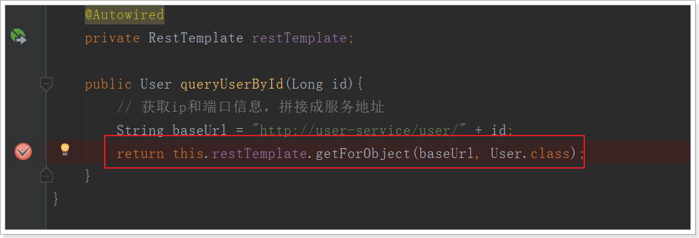
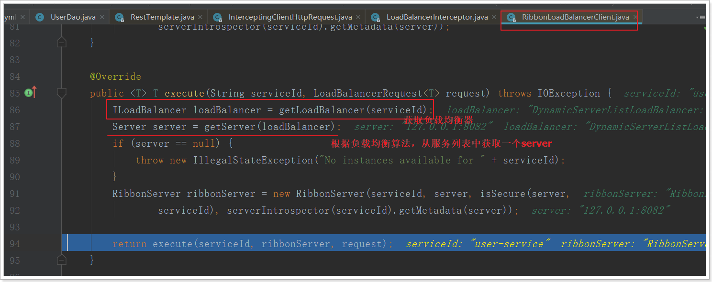
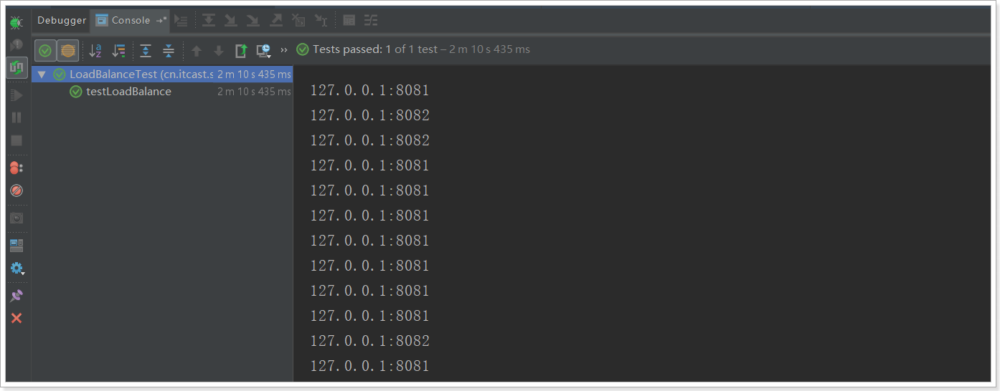

# 6.负载均衡Ribbon

在刚才的案例中，我们启动了一个itcast-service-provider，然后通过DiscoveryClient来获取服务实例信息，然后获取ip和端口来访问。

但是实际环境中，我们往往会开启很多个itcast-service-provider的集群。此时我们获取的服务列表中就会有多个，到底该访问哪一个呢？

一般这种情况下我们就需要编写负载均衡算法，在多个实例列表中进行选择。

不过Eureka中已经帮我们集成了负载均衡组件：Ribbon，简单修改代码即可使用。

什么是Ribbon：


接下来，我们就来使用Ribbon实现负载均衡。


## 6.1.启动两个服务实例

首先参照itcast-eureka启动两个ItcastServiceProviderApplication实例，一个8081，一个8082。

 

Eureka监控面板：


## 6.2.开启负载均衡

因为Eureka中已经集成了Ribbon，所以我们无需引入新的依赖，直接修改代码。

修改itcast-service-consumer的引导类，在RestTemplate的配置方法上添加`@LoadBalanced`注解：

```java
@Bean
@LoadBalanced
public RestTemplate restTemplate() {
    return new RestTemplate();
}
```


修改调用方式，不再手动获取ip和端口，而是直接通过服务名称调用：

```java
@Controller
@RequestMapping("consumer/user")
public class UserController {

    @Autowired
    private RestTemplate restTemplate;

    //@Autowired
    //private DiscoveryClient discoveryClient; // 注入discoveryClient，通过该客户端获取服务列表

    @GetMapping
    @ResponseBody
    public User queryUserById(@RequestParam("id") Long id){
        // 通过client获取服务提供方的服务列表，这里我们只有一个
        // ServiceInstance instance = discoveryClient.getInstances("service-provider").get(0);
        String baseUrl = "http://service-provider/user/" + id;
        User user = this.restTemplate.getForObject(baseUrl, User.class);
        return user;
    }

}
```

访问页面，查看结果：


完美！


## 6.3.源码跟踪

为什么我们只输入了service名称就可以访问了呢？之前还要获取ip和端口。

显然有人帮我们根据service名称，获取到了服务实例的ip和端口。它就是`LoadBalancerInterceptor`

在如下代码打断点：



一路源码跟踪：RestTemplate.getForObject --> RestTemplate.execute --> RestTemplate.doExecute：


点击进入AbstractClientHttpRequest.execute --> AbstractBufferingClientHttpRequest.executeInternal --> InterceptingClientHttpRequest.executeInternal --> InterceptingClientHttpRequest.execute:


继续跟入：LoadBalancerInterceptor.intercept方法


继续跟入execute方法：发现获取了8082端口的服务



再跟下一次，发现获取的是8081：


## 6.4.负载均衡策略

Ribbon默认的负载均衡策略是简单的轮询，我们可以测试一下：

编写测试类，在刚才的源码中我们看到拦截中是使用RibbonLoadBalanceClient来进行负载均衡的，其中有一个choose方法，找到choose方法的接口方法，是这样介绍的：

 

现在这个就是负载均衡获取实例的方法。

我们注入这个类的对象，然后对其测试：

 

测试内容：

```java
@RunWith(SpringRunner.class)
@SpringBootTest(classes = ItcastServiceConsumerApplication.class)
public class LoadBalanceTest {

    @Autowired
    private RibbonLoadBalancerClient client;

    @Test
    public void testLoadBalance(){
        for (int i = 0; i < 100; i++) {
            ServiceInstance instance = this.client.choose("service-provider");
            System.out.println(instance.getHost() + ":" +instance.getPort());
        }
    }
}

```

结果：


符合了我们的预期推测，确实是轮询方式。


我们是否可以修改负载均衡的策略呢？

继续跟踪源码，发现这么一段代码：

 

我们看看这个rule是谁：

 

这里的rule默认值是一个`RoundRobinRule`，看类的介绍：

 

这不就是轮询的意思嘛。

我们注意到，这个类其实是实现了接口IRule的，查看一下：

 

定义负载均衡的规则接口。

它有以下实现：

 

SpringBoot也帮我们提供了修改负载均衡规则的配置入口，在itcast-service-consumer的application.yml中添加如下配置：

```yaml
server:
  port: 80
spring:
  application:
    name: service-consumer
eureka:
  client:
    service-url:
      defaultZone: http://127.0.0.1:10086/eureka
service-provider:
  ribbon:
    NFLoadBalancerRuleClassName: com.netflix.loadbalancer.RandomRule
```

格式是：`{服务名称}.ribbon.NFLoadBalancerRuleClassName`，值就是IRule的实现类。


再次测试，发现结果变成了随机：



