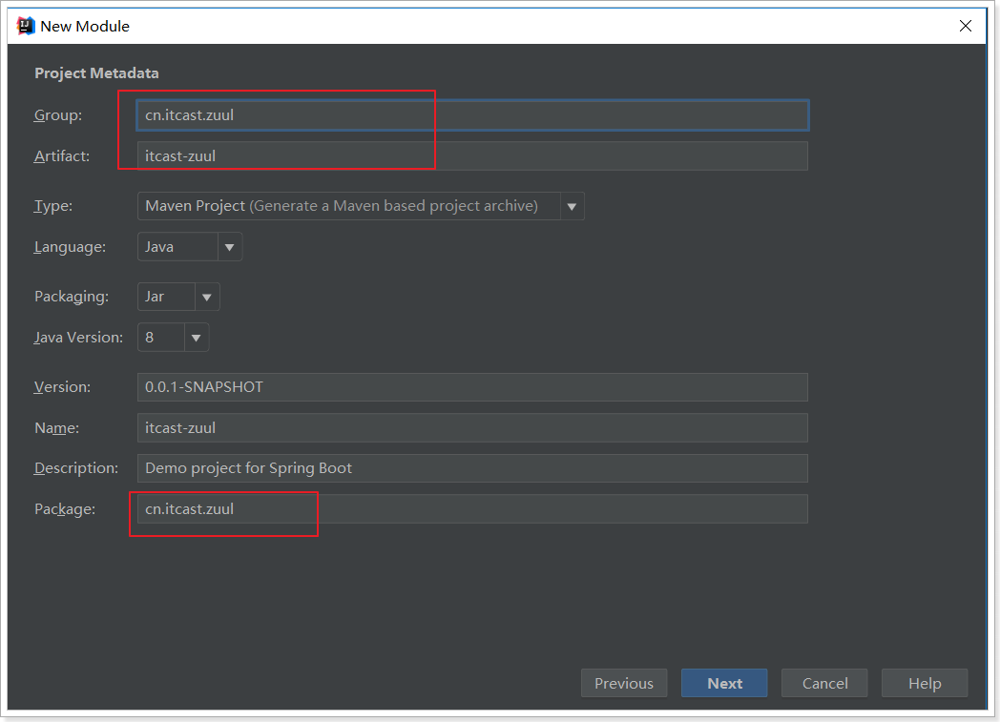
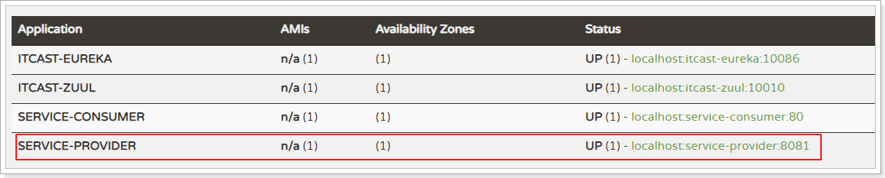
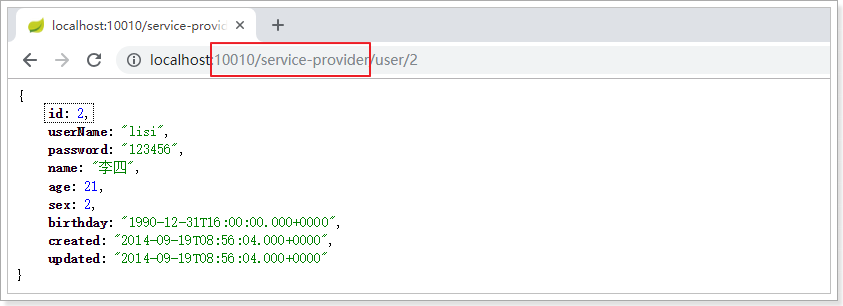
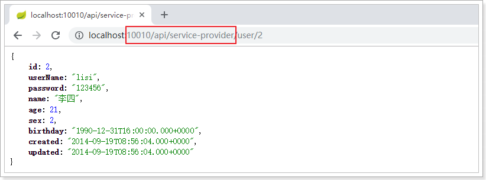
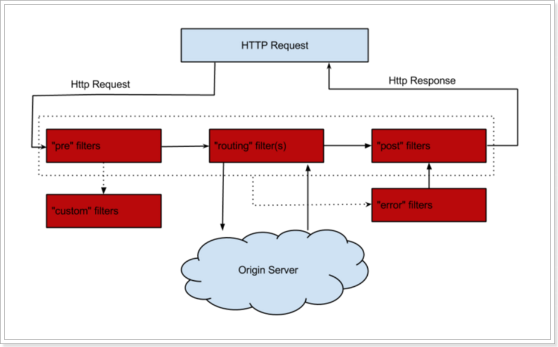
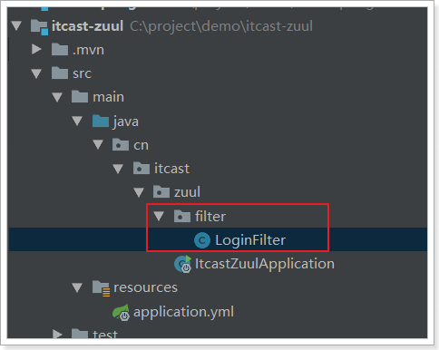
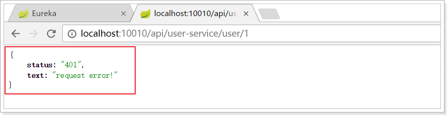

# 3.Zuul网关

通过前面的学习，使用Spring Cloud实现微服务的架构基本成型，大致是这样的：


	我们使用Spring Cloud Netflix中的Eureka实现了服务注册中心以及服务注册与发现；而服务间通过Ribbon或Feign实现服务的消费以及均衡负载。为了使得服务集群更为健壮，使用Hystrix的融断机制来避免在微服务架构中个别服务出现异常时引起的故障蔓延。
	
	在该架构中，我们的服务集群包含：内部服务Service A和Service B，他们都会注册与订阅服务至Eureka Server，而Open Service是一个对外的服务，通过均衡负载公开至服务调用方。我们把焦点聚集在对外服务这块，直接暴露我们的服务地址，这样的实现是否合理，或者是否有更好的实现方式呢？
	

先来说说这样架构需要做的一些事儿以及存在的不足：
先来说说这样架构需要做的一些事儿以及存在的不足：

- 破坏了服务无状态特点。

  	为了保证对外服务的安全性，我们需要实现对服务访问的权限控制，而开放服务的权限控制机制将会贯穿并污染整个开放服务的业务逻辑，这会带来的最直接问题是，破坏了服务集群中REST API无状态的特点。

  	从具体开发和测试的角度来说，在工作中除了要考虑实际的业务逻辑之外，还需要额外考虑对接口访问的控制处理。
- 无法直接复用既有接口。

  	当我们需要对一个即有的集群内访问接口，实现外部服务访问时，我们不得不通过在原有接口上增加校验逻辑，或增加一个代理调用来实现权限控制，无法直接复用原有的接口。


面对类似上面的问题，我们要如何解决呢？答案是：服务网关！


为了解决上面这些问题，我们需要将权限控制这样的东西从我们的服务单元中抽离出去，而最适合这些逻辑的地方就是处于对外访问最前端的地方，我们需要一个更强大一些的均衡负载器的 服务网关。

 

服务网关是微服务架构中一个不可或缺的部分。通过服务网关统一向外系统提供REST API的过程中，除了具备`服务路由`、`均衡负载`功能之外，它还具备了`权限控制`等功能。Spring Cloud Netflix中的Zuul就担任了这样的一个角色，为微服务架构提供了前门保护的作用，同时将权限控制这些较重的非业务逻辑内容迁移到服务路由层面，使得服务集群主体能够具备更高的可复用性和可测试性。


## 3.1.简介

官网：https://github.com/Netflix/zuul

 

Zuul：维基百科

电影《捉鬼敢死队》中的怪兽，Zuul，在纽约引发了巨大骚乱。

事实上，在微服务架构中，Zuul就是守门的大Boss！一夫当关，万夫莫开！


## 3.2.Zuul加入后的架构

 

不管是来自于客户端（PC或移动端）的请求，还是服务内部调用。一切对服务的请求都会经过Zuul这个网关，然后再由网关来实现 鉴权、动态路由等等操作。Zuul就是我们服务的统一入口。


## 3.3.快速入门

### 3.3.1.新建工程

填写基本信息：



添加Zuul依赖：


### 3.3.2.编写配置

```yaml
server:
  port: 10010 #服务端口
spring:
  application:
    name: api-gateway #指定服务名
```


### 3.3.3.编写引导类

通过`@EnableZuulProxy `注解开启Zuul的功能：

```java
@SpringBootApplication
@EnableZuulProxy // 开启网关功能
public class ItcastZuulApplication {

    public static void main(String[] args) {
        SpringApplication.run(ItcastZuulApplication.class, args);
    }
}
```


### 3.3.4.编写路由规则

我们需要用Zuul来代理service-provider服务，先看一下控制面板中的服务状态：



- ip为：127.0.0.1
- 端口为：8081

映射规则：

```yaml
server:
  port: 10010 #服务端口
spring:
  application:
    name: api-gateway #指定服务名
zuul:
  routes:
    service-provider: # 这里是路由id，随意写
      path: /service-provider/** # 这里是映射路径
      url: http://127.0.0.1:8081 # 映射路径对应的实际url地址
```

我们将符合`path` 规则的一切请求，都代理到 `url`参数指定的地址

本例中，我们将 `/service-provider/**`开头的请求，代理到http://127.0.0.1:8081


### 3.3.5.启动测试

访问的路径中需要加上配置规则的映射路径，我们访问：http://127.0.0.1:10010/service-provider/user/1




## 3.4.面向服务的路由

在刚才的路由规则中，我们把路径对应的服务地址写死了！如果同一服务有多个实例的话，这样做显然就不合理了。我们应该根据服务的名称，去Eureka注册中心查找 服务对应的所有实例列表，然后进行动态路由才对！

对itcast-zuul工程修改优化：

### 3.4.1.添加Eureka客户端依赖

```xml
<dependency>
    <groupId>org.springframework.cloud</groupId>
    <artifactId>spring-cloud-starter-netflix-eureka-client</artifactId>
</dependency>
```


### 3.4.2.添加Eureka配置，获取服务信息

```yaml
eureka:
  client:
    registry-fetch-interval-seconds: 5 # 获取服务列表的周期：5s
    service-url:
      defaultZone: http://127.0.0.1:10086/eureka
```


### 3.4.3.开启Eureka客户端发现功能

```java
@SpringBootApplication
@EnableZuulProxy // 开启Zuul的网关功能
@EnableDiscoveryClient
public class ZuulDemoApplication {

	public static void main(String[] args) {
		SpringApplication.run(ZuulDemoApplication.class, args);
	}
}
```


### 3.4.4.修改映射配置，通过服务名称获取

因为已经有了Eureka客户端，我们可以从Eureka获取服务的地址信息，因此映射时无需指定IP地址，而是通过服务名称来访问，而且Zuul已经集成了Ribbon的负载均衡功能。

```yaml
zuul:
  routes:
    service-provider: # 这里是路由id，随意写
      path: /service-provider/** # 这里是映射路径
      serviceId: service-provider # 指定服务名称
```


### 3.4.5.启动测试

再次启动，这次Zuul进行代理时，会利用Ribbon进行负载均衡访问：


## 3.5.简化的路由配置

在刚才的配置中，我们的规则是这样的：

- `zuul.routes.<route>.path=/xxx/**`： 来指定映射路径。`<route>`是自定义的路由名
- `zuul.routes.<route>.serviceId=service-provider`：来指定服务名。

而大多数情况下，我们的`<route>`路由名称往往和服务名会写成一样的。因此Zuul就提供了一种简化的配置语法：`zuul.routes.<serviceId>=<path>`

比方说上面我们关于service-provider的配置可以简化为一条：

```yaml
zuul:
  routes:
    service-provider: /service-provider/** # 这里是映射路径
```

省去了对服务名称的配置。


## 3.6.默认的路由规则

在使用Zuul的过程中，上面讲述的规则已经大大的简化了配置项。但是当服务较多时，配置也是比较繁琐的。因此Zuul就指定了默认的路由规则：

- 默认情况下，一切服务的映射路径就是服务名本身。例如服务名为：`service-provider`，则默认的映射路径就	是：`/service-provider/**`

也就是说，刚才的映射规则我们完全不配置也是OK的，不信就试试看。


## 3.7.路由前缀

配置示例：

```yaml
zuul:
  routes:
    service-provider: /service-provider/**
    service-consumer: /service-consumer/**
  prefix: /api # 添加路由前缀
```

我们通过`zuul.prefix=/api`来指定了路由的前缀，这样在发起请求时，路径就要以/api开头。




## 3.8.过滤器

Zuul作为网关的其中一个重要功能，就是实现请求的鉴权。而这个动作我们往往是通过Zuul提供的过滤器来实现的。

### 3.8.1.ZuulFilter

ZuulFilter是过滤器的顶级父类。在这里我们看一下其中定义的4个最重要的方法：

```java
public abstract ZuulFilter implements IZuulFilter{

    abstract public String filterType();

    abstract public int filterOrder();
    
    boolean shouldFilter();// 来自IZuulFilter

    Object run() throws ZuulException;// IZuulFilter
}
```

- `shouldFilter`：返回一个`Boolean`值，判断该过滤器是否需要执行。返回true执行，返回false不执行。
- `run`：过滤器的具体业务逻辑。
- `filterType`：返回字符串，代表过滤器的类型。包含以下4种：
  - `pre`：请求在被路由之前执行
  - `route`：在路由请求时调用
  - `post`：在route和errror过滤器之后调用
  - `error`：处理请求时发生错误调用
- `filterOrder`：通过返回的int值来定义过滤器的执行顺序，数字越小优先级越高。


### 3.8.2.过滤器执行生命周期

这张是Zuul官网提供的请求生命周期图，清晰的表现了一个请求在各个过滤器的执行顺序。



正常流程：
- 请求到达首先会经过pre类型过滤器，而后到达route类型，进行路由，请求就到达真正的服务提供者，执行请求，返回结果后，会到达post过滤器。而后返回响应。

异常流程：
- 整个过程中，pre或者route过滤器出现异常，都会直接进入error过滤器，在error处理完毕后，会将请求交给POST过滤器，最后返回给用户。
- 如果是error过滤器自己出现异常，最终也会进入POST过滤器，将最终结果返回给请求客户端。
- 如果是POST过滤器出现异常，会跳转到error过滤器，但是与pre和route不同的是，请求不会再到达POST过滤器了。

所有内置过滤器列表：

 


### 3.8.3.使用场景

场景非常多：

- 请求鉴权：一般放在pre类型，如果发现没有访问权限，直接就拦截了
- 异常处理：一般会在error类型和post类型过滤器中结合来处理。
- 服务调用时长统计：pre和post结合使用。


## 3.9.自定义过滤器

接下来我们来自定义一个过滤器，模拟一个登录的校验。基本逻辑：如果请求中有access-token参数，则认为请求有效，放行。

### 3.9.1.定义过滤器类

 

内容：

```java
@Component
public class LoginFilter extends ZuulFilter {
    /**
     * 过滤器类型，前置过滤器
     * @return
     */
    @Override
    public String filterType() {
        return "pre";
    }

    /**
     * 过滤器的执行顺序
     * @return
     */
    @Override
    public int filterOrder() {
        return 1;
    }

    /**
     * 该过滤器是否生效
     * @return
     */
    @Override
    public boolean shouldFilter() {
        return true;
    }

    /**
     * 登陆校验逻辑
     * @return
     * @throws ZuulException
     */
    @Override
    public Object run() throws ZuulException {
        // 获取zuul提供的上下文对象
        RequestContext context = RequestContext.getCurrentContext();
        // 从上下文对象中获取请求对象
        HttpServletRequest request = context.getRequest();
        // 获取token信息
        String token = request.getParameter("access-token");
        // 判断
        if (StringUtils.isBlank(token)) {
            // 过滤该请求，不对其进行路由
            context.setSendZuulResponse(false);
            // 设置响应状态码，401
            context.setResponseStatusCode(HttpStatus.SC_UNAUTHORIZED);
            // 设置响应信息
            context.setResponseBody("{\"status\":\"401\", \"text\":\"request error!\"}");
        }
        // 校验通过，把登陆信息放入上下文信息，继续向后执行
        context.set("token", token);
        return null;
    }
}
```


### 3.9.2.测试

没有token参数时，访问失败：



添加token参数后：


## 3.10.负载均衡和熔断

Zuul中默认就已经集成了Ribbon负载均衡和Hystix熔断机制。但是所有的超时策略都是走的默认值，比如熔断超时时间只有1S，很容易就触发了。因此建议我们手动进行配置：

```yaml
hystrix:
  command:
    default:
      execution:
        isolation:
          thread:
            timeoutInMilliseconds: 2000 # 设置hystrix的超时时间为6000ms
```


