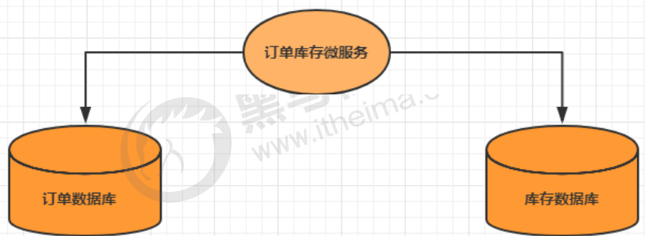
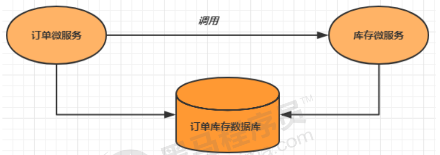
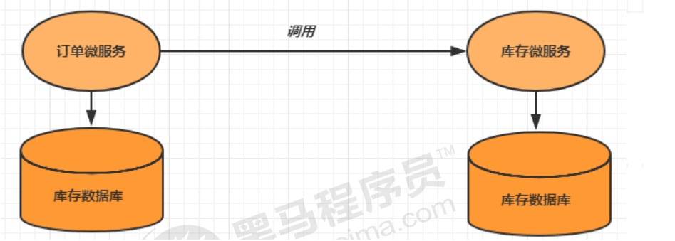
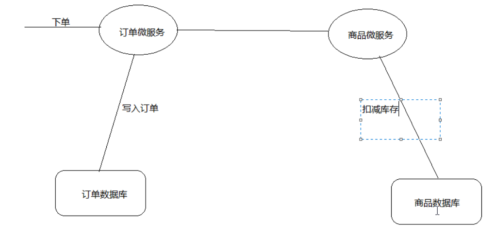
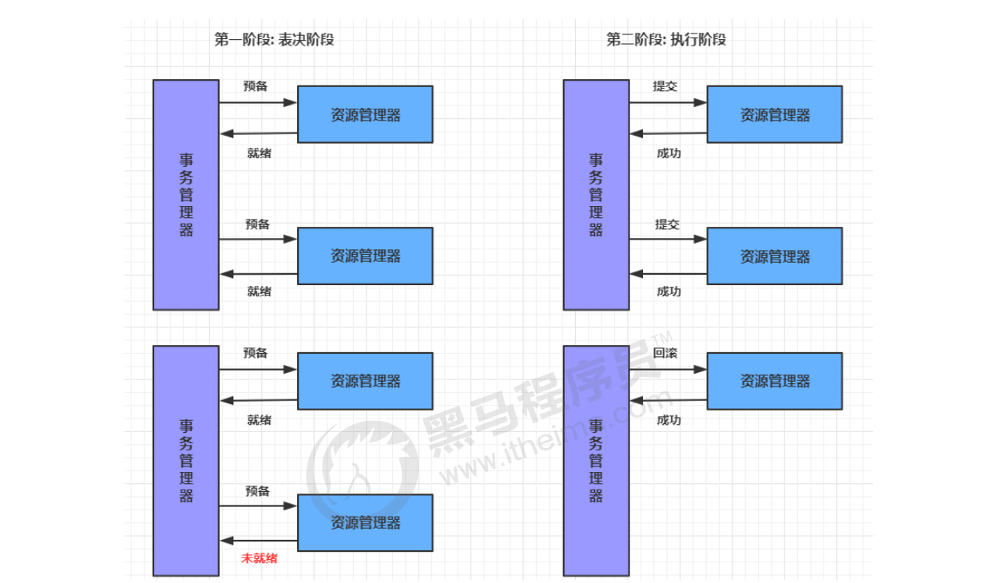
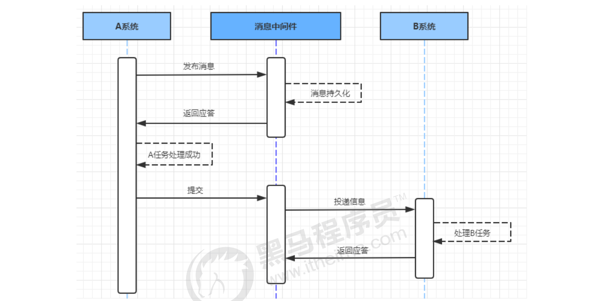
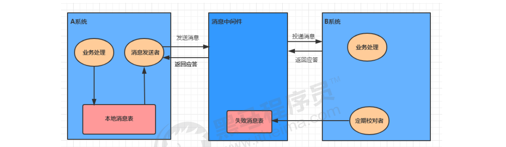
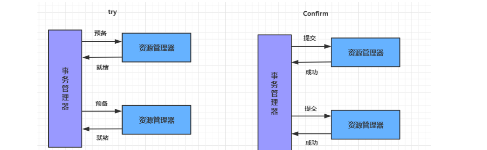
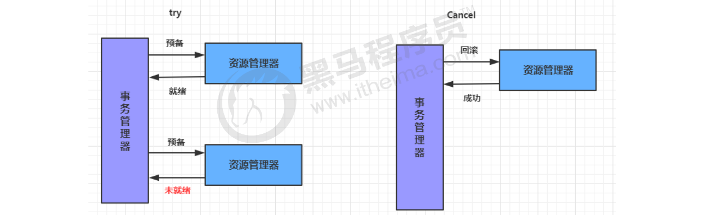

# 10.1 分布式事务基础

## 10.1.1 事务

​	事务指的就是一个操作单元，在这个操作单元中的所有操作最终要保持一致的行为，要么所有操作都成功，要么所有的操作都被撤销。简单地说，事务提供一种“要么什么都不做，要么做全套”机制。

## 10.1.2 本地事物

​	本地事物其实可以认为是数据库提供的事务机制。说到数据库事务就不得不说，数据库事务中的四大特性: 

- A：原子性(Atomicity)，一个事务中的所有操作，要么全部完成，要么全部不完成
- C：一致性(Consistency)，在一个事务执行之前和执行之后数据库都必须处于一致性状态
- I：隔离性(Isolation)，在并发环境中，当不同的事务同时操作相同的数据时，事务之间互不影响
- D：持久性(Durability)，指的是只要事务成功结束，它对数据库所做的更新就必须永久的保存下来

​      数据库事务在实现时会将一次事务涉及的所有操作全部纳入到一个不可分割的执行单元，该执行单元中的所有操作要么都成功，要么都失败，只要其中任一操作执行失败，都将导致整个事务的回滚

## 10.1.3 分布式事务

​	分布式事务指事务的参与者、支持事务的服务器、资源服务器以及事务管理器分别位于不同的分布式系统的不同节点之上。

​	简单的说，就是一次大的操作由不同的小操作组成，这些小的操作分布在不同的服务器上，且属于不同的应用，分布式事务需要保证这些小操作要么全部成功，要么全部失败。

​	本质上来说，分布式事务就是为了保证不同数据库的数据一致性。

## 10.1.4 分布式事务的场景

#### 单体系统访问多个数据库

- 单体系统访问多个数据库

  一个服务需要调用多个数据库实例完成数据的增删改操作

  

#### 多个微服务访问同一个数据库

- 多个微服务访问同一个数据库

多个服务需要调用一个数据库实例完成数据的增删改操作

#### 多个微服务访问多个数据库

- 多个微服务访问多个数据库

多个服务需要调用一个数据库实例完成数据的增删改操作

# 10.2 分布式事务解决方案

## 10.2.1 全局事务

​	全局事务基于DTP模型实现。DTP是由X/Open组织提出的一种分布式事务模型——X/OpenDistributed Transaction Processing Reference Model。它规定了要实现分布式事务，需要三种角色：

- AP: Application 应用系统 (微服务)
- TM: Transaction Manager 事务管理器 (全局事务管理)
- RM: Resource Manager 资源管理器 (数据库)

整个事务分成两个阶段:

- 阶段一: 表决阶段，所有参与者都将本事务执行预提交，并将能否成功的信息反馈发给协调者。9
- 阶段二: 执行阶段，协调者根据所有参与者的反馈，通知所有参与者，步调一致地执行提交或者回滚。1

**优点**

- 提高了数据一致性的概率，实现成本较低

**缺点**

- 单点问题: 事务协调者宕机
- 同步阻塞: 延迟了提交时间，加长了资源阻塞时间
- 数据不一致: 提交第二阶段，依然存在commit结果未知的情况，有可能导致数据不一致

## 10.2.2 可靠消息服务

​	基于可靠消息服务的方案是通过消息中间件保证上、下游应用数据操作的一致性。假设有A和B两个系统，分别可以处理任务A和任务B。此时存在一个业务流程，需要将任务A和任务B在同一个事务中处理。就可以使用消息中间件来实现这种分布式事务。

**第一步: 消息由系统A投递到中间件**

1.  在系统A处理任务A前，首先向消息中间件发送一条消息
2. 消息中间件收到后将该条消息持久化，但并不投递。持久化成功后，向A回复一个确认应答
3. 系统A收到确认应答后，则可以开始处理任务A 
4. 任务A处理完成后，向消息中间件发送Commit或者Rollback请求。该请求发送完成后，对系统A而言，该事务的处理过程就结束了
5. 如果消息中间件收到Commit，则向B系统投递消息；如果收到Rollback，则直接丢弃消息。但是如果消息中间件收不到Commit和Rollback指令，那么就要依靠"超时询问机制"。

> **超时询问机制**
>
> ​	系统A除了实现正常的业务流程外，还需提供一个事务询问的接口，供消息中间件调用。当消息中间件收到发布消息便开始计时，如果到了超时没收到确认指令，就会主动调用系统A提供的事务询问接口询问该系统目前的状态。该接口会返回三种结果，中间件根据三种结果做出不同反应：
>
> - 提交:将该消息投递给系统B
> - 回滚:直接将条消息丢弃
> - 处理中:继续等待

**第二步: 消息由中间件投递到系统B**

​	消息中间件向下游系统投递完消息后便进入阻塞等待状态，下游系统便立即进行任务的处理，任务

处理完成后便向消息中间件返回应答。

- 如果消息中间件收到确认应答后便认为该事务处理完毕如果消息中间件在等待确认应答超时之后就会重新投递，直到下游消费者返回消费成功响应为止。
- 一般消息中间件可以设置消息重试的次数和时间间隔，如果最终还是不能成功投递，则需要手工干预。这里之所以使用人工干预，而不是使用让Ａ系统回滚，主要是考虑到整个系统设计的复杂度问题。

基于可靠消息服务的分布式事务，前半部分使用异步，注重性能；后半部分使用同步，注重开发成本。

## 10.2.3 最大努力通知

​	最大努力通知也被称为定期校对，其实是对第二种解决方案的进一步优化。它引入了本地消息表来记录错误消息，然后加入失败消息的定期校对功能，来进一步保证消息会被下游系统消费。

**第一步: 消息由系统A投递到中间件**

1.  处理业务的同一事务中，向本地消息表中写入一条记录
2. 准备专门的消息发送者不断地发送本地消息表中的消息到消息中间件，如果发送失败则重试

**第二步: 消息由中间件投递到系统B** 

1. 消息中间件收到消息后负责将该消息同步投递给相应的下游系统，并触发下游系统的任务执行
2. 当下游系统处理成功后，向消息中间件反馈确认应答，消息中间件便可以将该条消息删除，从而该事务完成
3. 对于投递失败的消息，利用重试机制进行重试，对于重试失败的，写入错误消息表
4. 消息中间件需要提供失败消息的查询接口，下游系统会定期查询失败消息，并将其消费

这种方式的优缺点：

**优点：** 一种非常经典的实现，实现了最终一致性。

**缺点：** 消息表会耦合到业务系统中，如果没有封装好的解决方案，会有很多杂活需要处理。

## 10.2.4 TCC事务

TCC即为Try Confifirm Cancel，它属于补偿型分布式事务。TCC实现分布式事务一共有三个步骤：

- Try：尝试待执行的业务

  这个过程并未执行业务，只是完成所有业务的一致性检查，并预留好执行所需的全部资源

- Confifirm：确认执行业务

  确认执行业务操作，不做任何业务检查， 只使用Try阶段预留的业务资源。通常情况下，采用TCC则认为 Confifirm阶段是不会出错的。即：只要Try成功，Confifirm一定成功。若Confifirm阶段真的出错了，需引入重试机制或人工处理。

- Cancel：取消待执行的业务

  取消Try阶段预留的业务资源。通常情况下，采用TCC则认为Cancel阶段也是一定成功的。若Cancel阶段真的出错了，需引入重试机制或人工处理。

TCC两阶段提交与XA两阶段提交的区别是：

XA是资源层面的分布式事务，强一致性，在两阶段提交的整个过程中，一直会持有资源的锁。

TCC是业务层面的分布式事务，最终一致性，不会一直持有资源的锁。

TCC事务的优缺点：

**优点：**把数据库层的二阶段提交上提到了应用层来实现，规避了数据库层的2PC性能低下问题。

**缺点：**TCC的Try、Confifirm和Cancel操作功能需业务提供，开发成本高。

