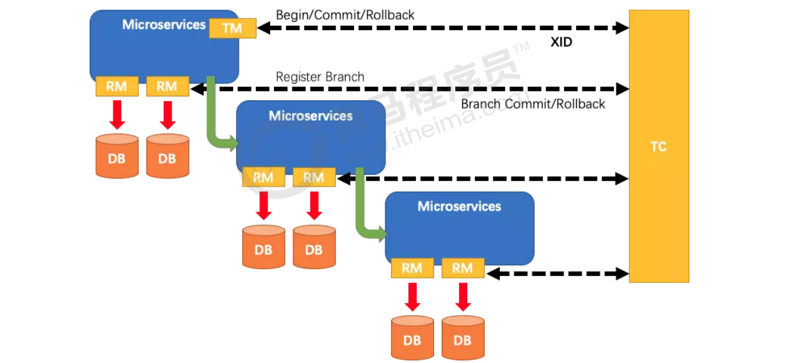

# 10.3 Seata介绍

## 介绍

​	2019 年 1 月，阿里巴巴中间件团队发起了开源项目 Fescar（Fast & EaSy Commit And Rollback），其愿景是让分布式事务的使用像本地事务的使用一样，简单和高效，并逐步解决开发者们遇到的分布式事务方面的所有难题。后来更名为 Seata，意为：Simple Extensible Autonomous Transaction Architecture，是一套分布式事务解决方案。

​	Seata的设计目标是对业务无侵入，因此从业务无侵入的2PC方案着手，在传统2PC的基础上演进。它把一个分布式事务理解成一个包含了若干分支事务的全局事务。全局事务的职责是协调其下管辖的分支事务达成一致，要么一起成功提交，要么一起失败回滚。此外，通常分支事务本身就是一个关系数据库的本地事务。

## Seata主要由三个重要组件组成

**Seata主要由三个重要组件组成：**

- TC：Transaction Coordinator 事务协调器，管理全局的分支事务的状态，用于全局性事务的提交和回滚。
- TM：Transaction Manager 事务管理器，用于开启、提交或者回滚全局事务。
- RM：Resource Manager 资源管理器，用于分支事务上的资源管理，向TC注册分支事务，上报分支事务的状态，接受TC的命令来提交或者回滚分支事务。

## Seata的执行流程如下

**Seata的执行流程如下:** 

1. A服务的TM向TC申请开启一个全局事务，TC就会创建一个全局事务并返回一个唯一的XID

2.  A服务的RM向TC注册分支事务，并及其纳入XID对应全局事务的管辖

3. A服务执行分支事务，向数据库做操作

4. A服务开始远程调用B服务，此时XID会在微服务的调用链上传播

5. B服务的RM向TC注册分支事务，并将其纳入XID对应的全局事务的管辖

6. B服务执行分支事务，向数据库做操作

7. 全局事务调用链处理完毕，TM根据有无异常向TC发起全局事务的提交或者回滚

8. TC协调其管辖之下的所有分支事务， 决定是否回滚

   ​

## **Seata实现2PC与传统2PC的差别：** 

**Seata实现2PC与传统2PC的差别：** 

1.  架构层次方面，传统2PC方案的 RM 实际上是在数据库层，RM本质上就是数据库自身，通过XA协议实现，而 Seata的RM是以jar包的形式作为中间件层部署在应用程序这一侧的。
2. 两阶段提交方面，传统2PC无论第二阶段的决议是commit还是rollback，事务性资源的锁都要保持到Phase2完成才释放。而Seata的做法是在Phase1 就将本地事务提交，这样就可以省去Phase2持锁的时间，整体提高效率。