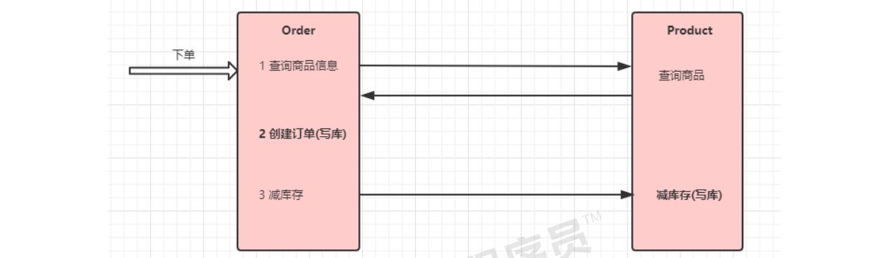

# 10.4 Seata实现分布式事务控制

​	本示例通过Seata中间件实现分布式事务，模拟电商中的下单和扣库存的过程

我们通过订单微服务执行下单操作，然后由订单微服务调用商品微服务扣除库存



## 10.4.1 案例基本代码

### 10.4.1.1 修改order微服务

#### OrderController5

```java
@RestController
@Slf4j
public class OrderController5 {

    @Autowired
    private OrderServiceImpl5 orderService;

    @RequestMapping("/order/prod/{pid}")
    public Order order(@PathVariable("pid") Integer pid) {
        return orderService.createOrder(pid);
    }

}
```

#### OrderService

```java
@Service
@Slf4j
public class OrderServiceImpl5{

    @Autowired
    private OrderDao orderDao;

    @Autowired
    private ProductService productService;

    @Autowired
    private RocketMQTemplate rocketMQTemplate;

    @GlobalTransactional//全局事务控制
    public Order createOrder(Integer pid) {
        log.info("接收到{}号商品的下单请求,接下来调用商品微服务查询此商品信息", pid);

        //1 调用商品微服务,查询商品信息
        Product product = productService.findByPid(pid);
        log.info("查询到{}号商品的信息,内容是:{}", pid, JSON.toJSONString(product));

        //2 下单(创建订单)
        Order order = new Order();
        order.setUid(1);
        order.setUsername("测试用户");
        order.setPid(pid);
        order.setPname(product.getPname());
        order.setPprice(product.getPprice());
        order.setNumber(1);
        orderDao.save(order);
        log.info("创建订单成功,订单信息为{}", JSON.toJSONString(order));

        //3 扣库存m
        productService.reduceInventory(pid, order.getNumber());

        //4 向mq中投递一个下单成功的消息
        rocketMQTemplate.convertAndSend("order-topic", order);


        return order;
    }

}
```

#### ProductService

```java
@FeignClient(value = "service-product") public interface ProductService { 
    //减库存 		
    @RequestMapping("/product/reduceInventory") void reduceInventory(@RequestParam("pid") Integer pid, @RequestParam("num") int num); 
}
```

### 10.4.1.2 修改Product微服务

#### controller

```java
	//减少库存 
	@RequestMapping("/product/reduceInventory") 
	public void reduceInventory(Integer pid, int num) { 
		productService.reduceInventory(pid, num); 
	}
```

#### service

```java
@Override 
public void reduceInventory(Integer pid, int num) { 
    Product product = productDao.findById(pid).get(); 
    product.setStock(product.getStock() - num);//减库存 
    productDao.save(product); 
}
```

### 10.4.1.3 异常模拟

在ProductServiceImpl的代码中模拟一个异常, 然后调用下单接口

```java
	@Transactional
    @Override
    public void reduceInventory(Integer pid, Integer number) {
        //查询
        Product product = productDao.findById(pid).get();
        //省略校验

        //内存中扣减
        product.setStock(product.getStock() - number);

        //模拟异常
        //int i = 1 / 0;

        //保存
        productDao.save(product);
    }
```

