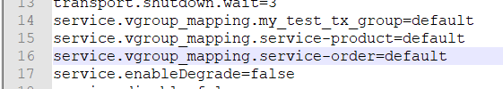
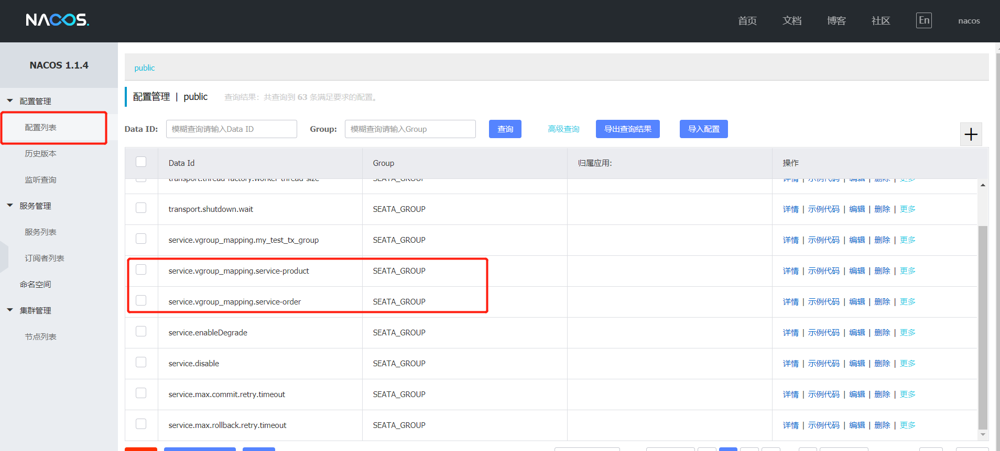
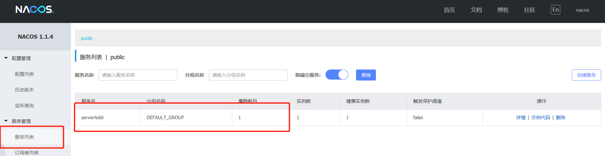

# 10.4.2 启动Seata

## 10.4.2.1 下载seata

下载地址：https://github.com/seata/seata/releases/v0.9.0/

## 10.4.2.2 修改配置文件

将下载得到的压缩包进行解压，进入conf目录，调整下面的配置文件：

- **registry.conf**

```properties
registry { 
	type = "nacos" 
	nacos { 
		serverAddr = "localhost" 
		namespace = "public" 
		cluster = "default" 
	} 
}
	
config { 
	type = "nacos" 
	nacos { 
		serverAddr = "localhost" 
		namespace = "public" 
		cluster = "default" 
	} 
}
```

- **nacos-config.txt**



​	这里的语法为： service.vgroup_mapping.${your-service-gruop}=default ，中间的

${your-service-gruop} 为自己定义的服务组名称， 这里需要我们在程序的配置文件中配置。

## 10.4.2.3 初始化seata在nacos的配置

```sh
# 初始化seata 的nacos配置 
# 注意: 这里要保证nacos是已经正常运行的 
cd conf 
nacos-config.sh 127.0.0.1
```

执行成功后可以打开Nacos的控制台，在配置列表中，可以看到初始化了很多Group为SEATA_GROUP的配置。



## 10.4.2.4 启动seata服务

```sh
cd bin 
seata-server.bat -p 9000 -m file
```

启动后在 Nacos 的服务列表下面可以看到一个名为 serverAddr 的服务。

