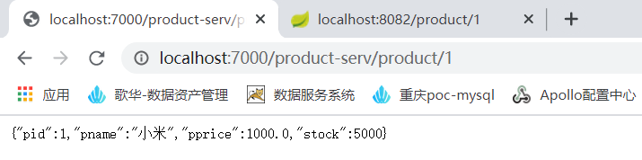
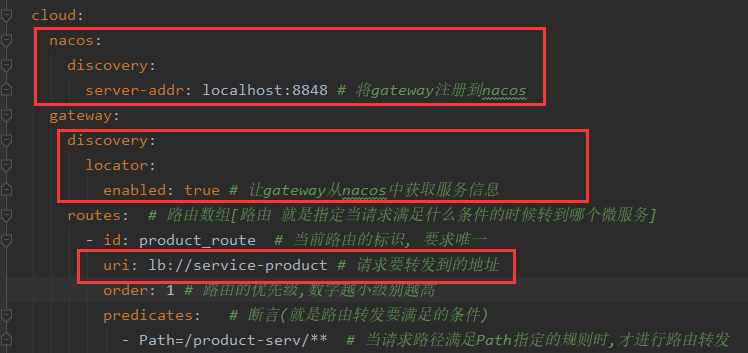
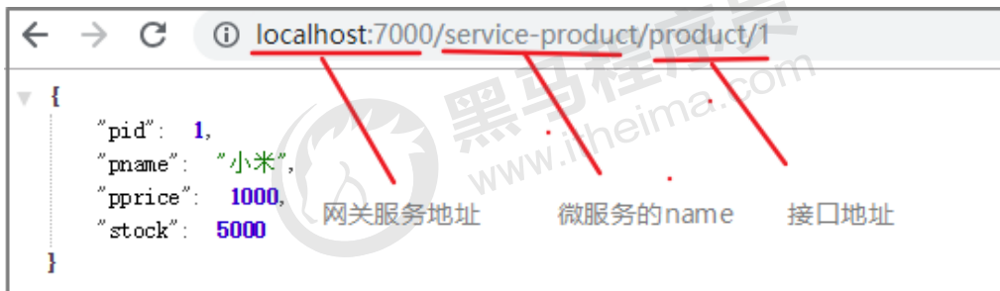

# 5.3 Gateway快速入门

要求: 通过浏览器访问api网关,然后通过网关将请求转发到商品微服务

## 5.3.1 基础版

### 第1步：创建一个 api-gateway 的模块,导入相关依赖

```xml-dtd
<?xml version="1.0" encoding="UTF-8"?>
<project xmlns="http://maven.apache.org/POM/4.0.0"
         xmlns:xsi="http://www.w3.org/2001/XMLSchema-instance"
         xsi:schemaLocation="http://maven.apache.org/POM/4.0.0
        http://maven.apache.org/xsd/maven-4.0.0.xsd">
    <parent>
        <artifactId>springcloud-alibaba</artifactId>
        <groupId>com.itheima</groupId>
        <version>1.0-SNAPSHOT</version>
    </parent>
    <modelVersion>4.0.0</modelVersion>
    <artifactId>api-gateway</artifactId>
    <dependencies>
        <!--gateway网关-->
        <dependency>
            <groupId>org.springframework.cloud</groupId>
            <artifactId>spring-cloud-starter-gateway</artifactId>
        </dependency>

    </dependencies>
</project>
```

### 第2步: 创建主类

```java
package com.itheima;

@SpringBootApplication
public class ApiGatewayApplication {
    public static void main(String[] args) {
        SpringApplication.run(ApiGatewayApplication.class);
    }
}

```

### 第3步: 添加配置文件

```yaml
server:
  port: 7000
spring:
  application:
    name: api-gateway
  cloud:
    gateway:
      routes:  # 路由数组[路由 就是指定当请求满足什么条件的时候转到哪个微服务]
        - id: product_route  # 当前路由的标识, 要求唯一
          uri: http://localhost:8082 # 请求要转发到的地址
          order: 1 # 路由的优先级,数字越小级别越高
          predicates:   # 断言(就是路由转发要满足的条件)
            - Path=/product-serv/**  # 当请求路径满足Path指定的规则时,才进行路由转发
          filters: # 过滤器,请求在传递过程中可以通过过滤器对其进行一定的修改
            - StripPrefix=1  # 转发之前去掉1层路径
```

### 第4步: 启动项目, 并通过网关去访问微服务

原始地址：<http://localhost:8082/product/1>

网关地址：<http://localhost:7000/product-serv/product/1>




## 5.3.2 增强版（Nacos）

​	现在在配置文件中写死了转发路径的地址, 前面我们已经分析过地址写死带来的问题, 接下来我们从

注册中心获取此地址。

### 第1步：加入nacos依赖

```xml
		<!--nacos客户端-->
        <dependency>
            <groupId>com.alibaba.cloud</groupId>
            <artifactId>spring-cloud-starter-alibaba-nacos-discovery</artifactId>
        </dependency>
```


### 第2步：在主类上添加注解

@EnableDiscoveryClient

### 第3步：修改配置文件



### 第4步: 启动项目, 并通过网关去访问微服务

原始地址：<http://localhost:8082/product/1>

网关地址：<http://localhost:7000/product-serv/product/1>


## 5.3.3 简写版(router)

### 第1步: 去掉关于路由的配置

屏蔽routes 相关配置

### 第2步: 启动项目，并通过网关去访问微服务

原始地址：<http://localhost:8082/product/1>

网关地址：<http://localhost:7000/service-product/product/1>

这时候，就发现只要按照网关地址/微服务/接口的格式去访问，就可以得到成功响应。




