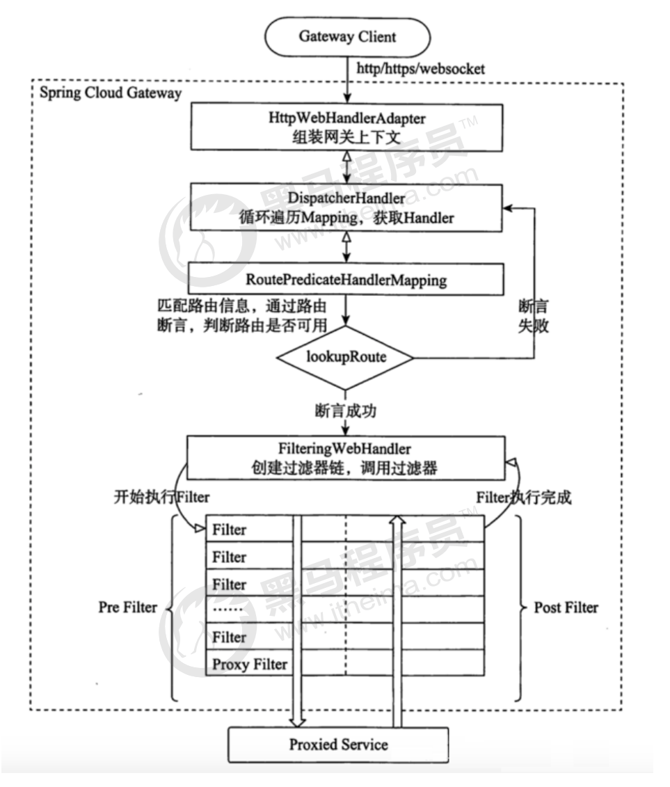

# 5.4 Gateway核心架构

## 5.4.1 基本概念

路由(Route) 是 gateway 中最基本的组件之一，表示一个具体的路由信息载体。主要定义了下面的几个

信息:

**id**，路由标识符，区别于其他 Route。 

**enabled**: trueuri，路由指向的目的地 uri，即客户端请求最终被转发到的微服务。

**order**，用于多个 Route 之间的排序，数值越小排序越靠前，匹配优先级越高。

**predicate**，断言的作用是进行条件判断，只有断言都返回真，才会真正的执行路由。

**filter**，过滤器用于修改请求和响应信息。

## 5.4.2 执行流程

执行流程大体如下：

1. Gateway Client向Gateway Server发送请求
2. 请求首先会被HttpWebHandlerAdapter进行提取组装成网关上下文
3. 然后网关的上下文会传递到DispatcherHandler，它负责将请求分发给RoutePredicateHandlerMapping

4. RoutePredicateHandlerMapping负责路由查找，并根据路由断言判断路由是否可用
5. 如果过断言成功，由FilteringWebHandler创建过滤器链并调用6. 请求会一次经过PreFilter--微服务--PostFilter的方法，最终返回响应

