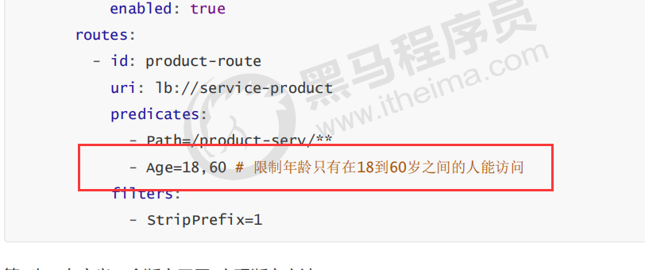

# 5.5 断言

Predicate(断言, 谓词) 用于进行条件判断，只有断言都返回真，才会真正的执行路由。

断言就是说: 在 **什么条件下** 才能进行路由转发

## 5.5.1 内置路由断言工厂

SpringCloud Gateway包括许多内置的断言工厂，所有这些断言都与HTTP请求的不同属性匹配。具体

如下：

- 基于Datetime类型的断言工厂

此类型的断言根据时间做判断，主要有三个：

AfterRoutePredicateFactory： 接收一个日期参数，判断请求日期是否晚于指定日期

BeforeRoutePredicateFactory： 接收一个日期参数，判断请求日期是否早于指定日期

BetweenRoutePredicateFactory： 接收两个日期参数，判断请求日期是否在指定时间段内

> -After=2019-12-31T23:59:59.789+08:00[Asia/Shanghai]

- 基于远程地址的断言工厂 RemoteAddrRoutePredicateFactory：接收一个IP地址段，判断请求主机地址是否在地址段中

> -RemoteAddr=192.168.1.1/24

- 基于Cookie的断言工厂

CookieRoutePredicateFactory：接收两个参数，cookie 名字和一个正则表达式。 判断请求cookie是否具有给定名称且值与正则表达式匹配。

> -Cookie=chocolate, ch.

- 基于Header的断言工厂

HeaderRoutePredicateFactory：接收两个参数，标题名称和正则表达式。 判断请求Header是否具有给定名称且值与正则表达式匹配。

> -Header=X-Request-Id, \d+

- 基于Host的断言工厂

HostRoutePredicateFactory：接收一个参数，主机名模式。判断请求的Host是否满足匹配规则。

> -Host=**.testhost.org

- 基于Method请求方法的断言工厂

MethodRoutePredicateFactory：接收一个参数，判断请求类型是否跟指定的类型匹配。

> -Method=GET

- 基于Path请求路径的断言工厂

PathRoutePredicateFactory：接收一个参数，判断请求的URI部分是否满足路径规则。

> -Path=/foo/{segment}

- 基于Query请求参数的断言工厂

QueryRoutePredicateFactory ：接收两个参数，请求param和正则表达式， 判断请求参数是否具

有给定名称且值与正则表达式匹配。

> -Query=baz, ba.

- 基于路由权重的断言工厂

WeightRoutePredicateFactory：接收一个[组名,权重], 然后对于同一个组内的路由按照权重转发

> routes:
>
> -id: weight_route1 uri: host1 predicates:
>
> -Path=/product/**
>
> -Weight=group3, 1
>
> -id: weight_route2 uri: host2 predicates:
>
> -Path=/product/**
>
> -Weight= group3, 9

## 5.5.2 自定义路由断言工厂

我们来设定一个场景: 假设我们的应用仅仅让age在(min,max)之间的人来访问。

第1步：在配置文件中,添加一个Age的断言配置




第2步：自定义一个断言工厂, 实现断言方法

```java
package com.itheima.predicates;

//这是一个自定义的路由断言工厂类,要求有两个
//1 名字必须是 配置+RoutePredicateFactory
//2 必须继承AbstractRoutePredicateFactory<配置类>
@Component
public class AgeRoutePredicateFactory extends AbstractRoutePredicateFactory<AgeRoutePredicateFactory.Config> {

    //构造函数
    public AgeRoutePredicateFactory() {
        super(AgeRoutePredicateFactory.Config.class);
    }

    //读取配置文件的中参数值 给他赋值到配置类中的属性上
    public List<String> shortcutFieldOrder() {
        //这个位置的顺序必须跟配置文件中的值的顺序对应
        return Arrays.asList("minAge", "maxAge");
    }

    //断言逻辑
    public Predicate<ServerWebExchange> apply(AgeRoutePredicateFactory.Config config) {
        return new Predicate<ServerWebExchange>() {
            @Override
            public boolean test(ServerWebExchange serverWebExchange) {
                //1 接收前台传入的age参数
                String ageStr = serverWebExchange.getRequest().getQueryParams().getFirst("age");

                //2 先判断是否为空
                if (StringUtils.isNotEmpty(ageStr)) {
                    //3 如果不为空,再进行路由逻辑判断
                    int age = Integer.parseInt(ageStr);
                    if (age < config.getMaxAge() && age > config.getMinAge()) {
                        return true;
                    } else {
                        return false;
                    }
                }
                return false;
            }
        };
    }

    //配置类,用于接收配置文件中的对应参数
    @Data
    @NoArgsConstructor
    public static class Config {
        private int minAge;//18
        private int maxAge;//60
    }
}
```

第4步：启动测试

```
#测试发现当age在(20,60)可以访问,其它范围不能访问 
http://localhost:7000/product-serv/product/1?age=30 
http://localhost:7000/product-serv/product/1?age=10
```


