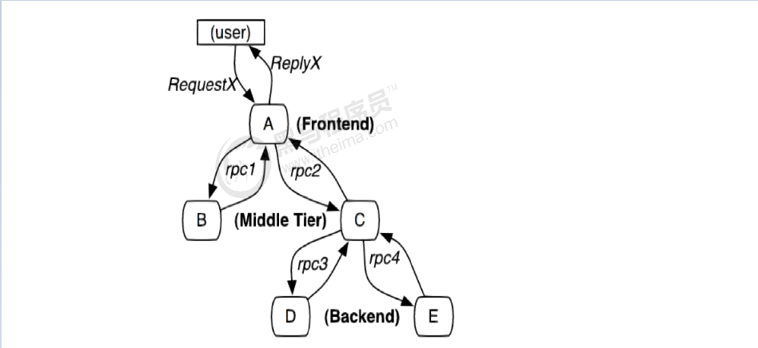

# 6.1 链路追踪介绍

​	在大型系统的微服务化构建中，一个系统被拆分成了许多模块。这些模块负责不同的功能，组合成系统，最终可以提供丰富的功能。在这种架构中，一次请求往往需要涉及到多个服务。互联网应用构建在不同的软件模块集上，这些软件模块，有可能是由不同的团队开发、可能使用不同的编程语言来实现、有可能布在了几千台服务器，横跨多个不同的数据中心，也就意味着这种架构形式也会存在一些问题：

- 如何快速发现问题？
- 如何判断故障影响范围？
- 如何梳理服务依赖以及依赖的合理性？
- 如何分析链路性能问题以及实时容量规划？

​	分布式链路追踪（Distributed Tracing），就是将一次分布式请求还原成调用链路，进行日志记录，性能监控并将一次分布式请求的调用情况集中展示。比如各个服务节点上的耗时、请求具体到达哪台机器上、每个服务节点的请求状态等等。

常见的链路追踪技术有下面这些：

- **cat** 由大众点评开源，基于Java开发的实时应用监控平台，包括实时应用监控，业务监控 。 集成方案是通过代码埋点的方式来实现监控，比如： 拦截器，过滤器等。 对代码的侵入性很大，集成成本较高。风险较大。

- **zipkin** 由Twitter公司开源，开放源代码分布式的跟踪系统，用于收集服务的定时数据，以解决微服务架构中的延迟问题，包括：数据的收集、存储、查找和展现。该产品结合spring-cloud-sleuth使用较为简单， 集成很方便， 但是功能较简单。

- **pinpoint** Pinpoint是韩国人开源的基于字节码注入的调用链分析，以及应用监控分析工具。特点是支持多种插件，UI功能强大，接入端无代码侵入。

- **skywalking**

SkyWalking是本土开源的基于字节码注入的调用链分析，以及应用监控分析工具。特点是支持多种插件，UI功能较强，接入端无代码侵入。目前已加入Apache孵化器。

- **Sleuth**

SpringCloud 提供的分布式系统中链路追踪解决方案。

**注意：SpringCloud alibaba技术栈中并没有提供自己的链路追踪技术的，我们可以采用Sleuth +Zinkin来做链路追踪解决方案**

