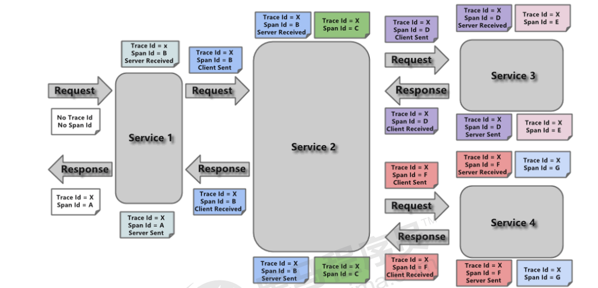
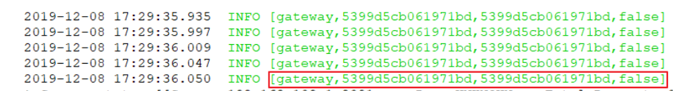

# 6.2 Sleuth入门

## 6.2.1 Sleuth介绍

​	SpringCloud Sleuth主要功能就是在分布式系统中提供追踪解决方案。它大量借用了Google Dapper的设计， 先来了解一下Sleuth中的术语和相关概念。

- Trace

  由一组Trace Id相同的Span串联形成一个树状结构。为了实现请求跟踪，当请求到达分布式系统的入口端点时，只需要服务跟踪框架为该请求创建一个唯一的标识（即TraceId），同时在分布式系统内部流转的时候，框架始终保持传递该唯一值，直到整个请求的返回。那么我们就可以使用该唯一标识将所有的请求串联起来，形成一条完整的请求链路。


- Span 代表了一组基本的工作单元。为了统计各处理单元的延迟，当请求到达各个服务组件的时候，也通过一个唯一标识（SpanId）来标记它的开始、具体过程和结束。通过SpanId的开始和结束时间戳，就能统计该span的调用时间，除此之外，我们还可以获取如事件的名称。请求信息等元数据。


- Annotation

用它记录一段时间内的事件，内部使用的重要注释：

cs（Client Send）客户端发出请求，开始一个请求的生命

sr（Server Received）服务端接受到请求开始进行处理， sr－cs = 网络延迟（服务调用的时间）

ss（Server Send）服务端处理完毕准备发送到客户端，ss - sr = 服务器上的请求处理时间

cr（Client Reveived）客户端接受到服务端的响应，请求结束。 cr - sr = 请求的总时间




## 6.2.2 Sleuth入门

微服务名称, traceId, spanid,是否将链路的追踪结果输出到第三方平台

[api-gateway,3977125f73391553,3977125f73391553,false]

[service-order,3977125f73391553,57547b5bf71f8242,false]

[service-product,3977125f73391553,449f5b3f3ef8d5c5,false]

接下来通过之前的项目案例整合Sleuth，完成入门案例的编写。

修改父工程引入Sleuth依赖

```xml
 		<dependency>
            <groupId>org.springframework.cloud</groupId>
            <artifactId>spring-cloud-starter-sleuth</artifactId>
        </dependency>
```

启动微服务，调用之后，我们可以在控制台观察到sleuth的日志输出



​	其中 5399d5cb061971bd 是TraceId， 5399d5cb061971bd 是SpanId，依次调用有一个全局的TraceId，将调用链路串起来。仔细分析每个微服务的日志，不难看出请求的具体过程。

​	查看日志文件并不是一个很好的方法，当微服务越来越多日志文件也会越来越多，通过Zipkin可以将日志聚合，并进行可视化展示和全文检索。