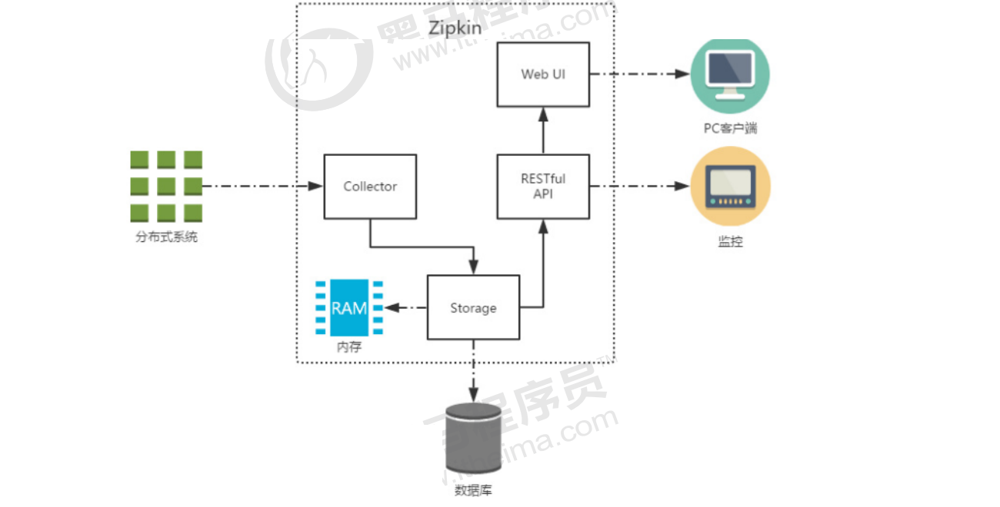
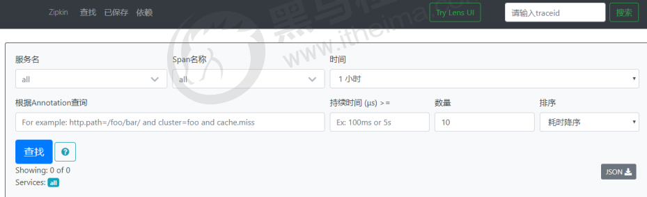
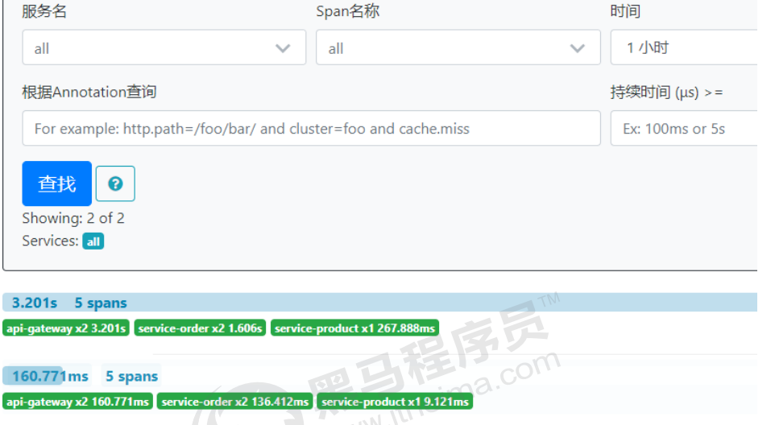
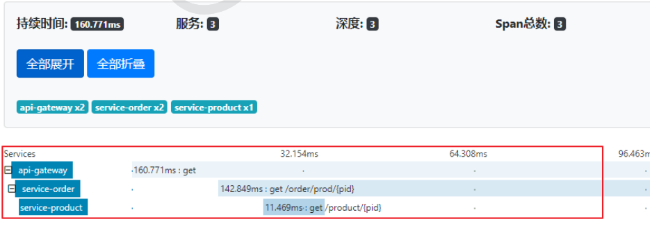

# 6.3 Zipkin的集成

## 6.3.1 ZipKin介绍

​	Zipkin 是 Twitter 的一个开源项目，它基于Google Dapper实现，它致力于收集服务的定时数据，以解决微服务架构中的延迟问题，包括数据的**收集、存储、查找和展现。**

​	我们可以使用它来收集各个服务器上请求链路的跟踪数据，并通过它提供的REST API接口来辅助我们查询跟踪数据以实现对分布式系统的监控程序，从而及时地发现系统中出现的延迟升高问题并找出系统性能瓶颈的根源。

​	除了面向开发的 API 接口之外，它也提供了方便的UI组件来帮助我们直观的搜索跟踪信息和分析请求链路明细，比如：可以查询某段时间内各用户请求的处理时间等。

​	Zipkin 提供了可插拔数据存储方式：In-Memory、MySql、Cassandra 以及 Elasticsearch。



上图展示了 Zipkin 的基础架构，它主要由 4 个核心组件构成：

- Collector：收集器组件，它主要用于处理从外部系统发送过来的跟踪信息，将这些信息转换为Zipkin内部处理的 Span 格式，以支持后续的存储、分析、展示等功能。


- Storage：存储组件，它主要对处理收集器接收到的跟踪信息，默认会将这些信息存储在内存中，我们也可以修改此存储策略，通过使用其他存储组件将跟踪信息存储到数据库中。


- RESTful API：API 组件，它主要用来提供外部访问接口。比如给客户端展示跟踪信息，或是外接系统访问以实现监控等。
- Web UI：UI 组件， 基于API组件实现的上层应用。通过UI组件用户可以方便而有直观地查询和分析跟踪信息。

Zipkin分为两端，一个是 Zipkin服务端，一个是 Zipkin客户端，客户端也就是微服务的应用。 客户端会

配置服务端的 URL 地址，一旦发生服务间的调用的时候，会被配置在微服务里面的 Sleuth 的监听器监

听，并生成相应的 Trace 和 Span 信息发送给服务端。


## 6.3.2 ZipKin服务端安装

第1步: 下载ZipKin的jar包

```
https://search.maven.org/remote_content?g=io.zipkin.java&a=zipkin-server&v=LATEST&c=exec
```

访问上面的网址，即可得到一个jar包，这就是ZipKin服务端的jar包 

第2步: 通过命令行，输入下面的命令启动ZipKin Server

```
java -jar zipkin-server-2.12.9-exec.jar
```

第3步：通过浏览器访问 http://localhost:9411访问



## 6.3.3 Zipkin客户端集成

ZipKin客户端和Sleuth的集成非常简单，只需要在微服务中添加其依赖和配置即可。

第1步：在每个微服务上添加依赖

```xml
       <dependency>
            <groupId>org.springframework.cloud</groupId>
            <artifactId>spring-cloud-starter-zipkin</artifactId>
        </dependency>
```

第2步：添加配置

```yaml
spring:
  zipkin:
    base-url: http://127.0.0.1:9411/  #zipkin server的请求地址
    discoveryClientEnabled: false #让nacos把它当成一个URL，而不要当做服务名
  sleuth:
    sampler:
      probability: 1.0  #采样的百分比
```

第3步: 访问微服务

```
http://localhost:7000/order-serv/order/prod/1
http://localhost:7000/service-order/order/prod/1
```

第4步: 访问zipkin的UI界面，观察效果

第5步：点击其中一条记录，可观察一次访问的详细线路

