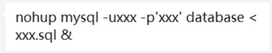
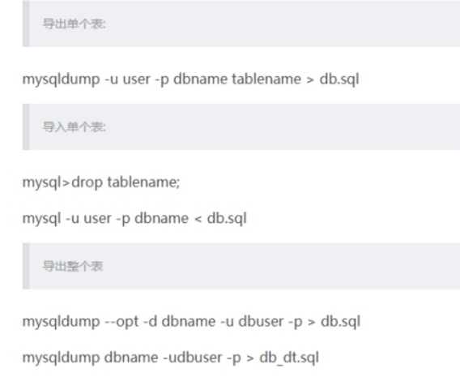

# 1 **导入sql文件**

## 1.1 **命令：source 执行sql 文件**

Linux下的Mysql用命令执行sql文件

<https://blog.csdn.net/qq_41186788/article/details/80462916>

 

 

## 1.2 **执行脚本：可后台运行**

 

# 2 **导出sql 文件**

## 2.1 **命令：mysqldump 导出sql 文件**

### 2.1.1 **导出单张表数据**

  

### 2.1.2 **mysqldump :command not found**

https://blog.csdn.net/weixin_30768661/article/details/99627510

 

 

 

 

 

 

 

 

 

 

 

 