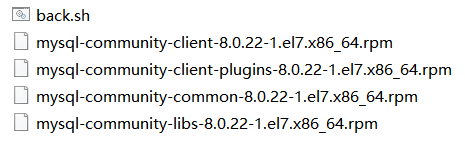

# mysql-client8.0.22安装

[Linux下只安装MySQL Client_chenliang-CSDN博客](https://blog.csdn.net/weixin_43733154/article/details/108571308)




# corntab定时任务

[解决crontab无法在普通用户执行问题_Rank92的博客-CSDN博客](https://blog.csdn.net/weixin_34273481/article/details/92920242?utm_medium=distribute.pc_relevant.none-task-blog-BlogCommendFromBaidu-2.control&depth_1-utm_source=distribute.pc_relevant.none-task-blog-BlogCommendFromBaidu-2.control)

```
crontab -e
0 4 * * * nuhup sh ~/data/back.sh > ~/data/logs/mysql_log_$(date "+\%Y-\%m-\%d \%H:\%M:\%S").log &2>&1
```

