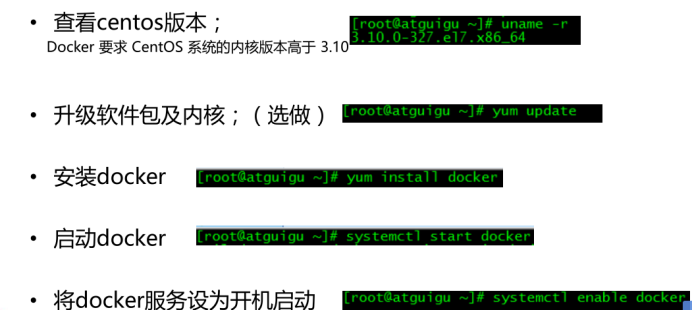

# 1 Cones7安装Docker

## 1.1 在线安装Docker



```shell
1、检查内核版本，必须是3.10及以上
[root@bmsoft01 ~]# uname -r
3.10.0-957.el7.x86_64
2、安装docker
[root@bmsoft01 ~]# yum install docker
3、输入y确认安装

4、启动docker
[root@localhost ~]# systemctl start docker
[root@localhost ~]# docker -v
Docker version 1.12.6, build 3e8e77d/1.12.6
5、开机启动docker
[root@localhost ~]# systemctl enable docker
Created symlink from /etc/systemd/system/multi‐user.target.wants/docker.service to /usr/lib/systemd/system/docker.service.
```

## 1.2 镜像加速

[Docker 镜像加速 | 菜鸟教程 (runoob.com)](https://www.runoob.com/docker/docker-mirror-acceleration.html)

```shell
vim /etc/docker/daemon.json
{"registry-mirrors":["https://ebzt3fx8.mirror.aliyuncs.com"]}

systemctl daemon-reload
systemctl restart docker
```


## 1.3 使用docker 用户

从此之后不再使用root 用户

```shell
groupadd docker
useradd -g docker docker   passwd docker
重启:
systemctl start docker
```

## 1.4 docker 启动问题汇总

[Cannot connect to the Docker daemon at unix:///var/run/docker.sock. Is the docker daemon running](https://blog.csdn.net/qq_42114918/article/details/81840335)

```shell
systemctl daemon-reload
systemctl restart docker.service
```


# 2 命令

## 2.1 镜像操作


## 2.2  容器操作


```
run 
	--restart=always  当 Docker 重启时，容器未能自动启动
	-d 后台启动
```


## 2.3 demo

软件镜像（QQ安装程序）----运行镜像----产生一个容器（正在运行的软件，运行的QQ）；

```
1、搜索镜像
[root@localhost ~]# docker search tomcat
2、拉取镜像
[root@localhost ~]# docker pull tomcat
3、根据镜像启动容器
docker run ‐‐name mytomcat ‐d tomcat:latest
4、docker ps 
查看运行中的容器
5、 停止运行中的容器
docker stop  容器的id
6、查看所有的容器
docker ps ‐a
7、启动容器
docker start 容器id
8、删除一个容器
 docker rm 容器id
9、启动一个做了端口映射的tomcat
[root@localhost ~]# docker run ‐d ‐p 8888:8080 tomcat
‐d：后台运行
‐p: 将主机的端口映射到容器的一个端口    主机端口:容器内部的端口
10、为了演示简单关闭了linux的防火墙
service firewalld status ；查看防火墙状态
service firewalld stop：关闭防火墙
11、查看容器的日志
docker logs container‐name/container‐id

更多命令参看
https://docs.docker.com/engine/reference/commandline/docker/
可以参考每一个镜像的文档
```

## 2.4 镜像容器迁移

[docker服务迁移(从一台服务器到另一台服务器)_我在北国不背锅的博客-CSDN博客](https://blog.csdn.net/weixin_44455388/article/details/107539559)

```
docker save [images] [images] > [name.tar]
docker load < xxx.tar 或 docker load -i xxx.tar
```

