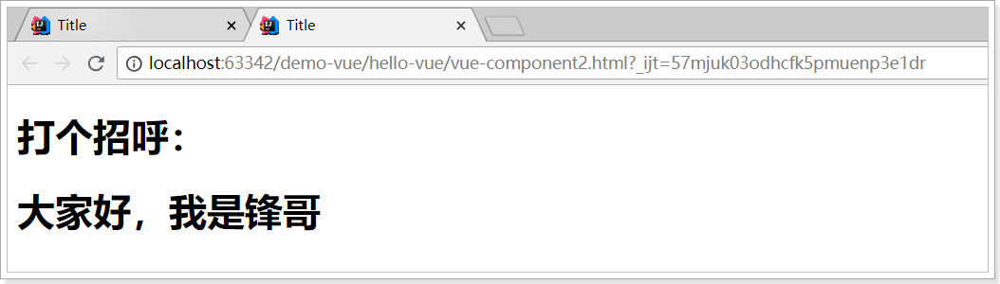
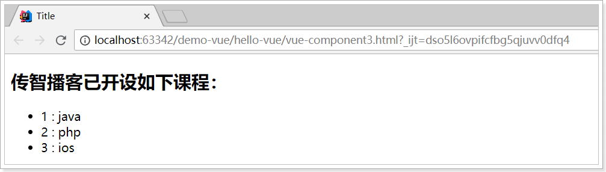
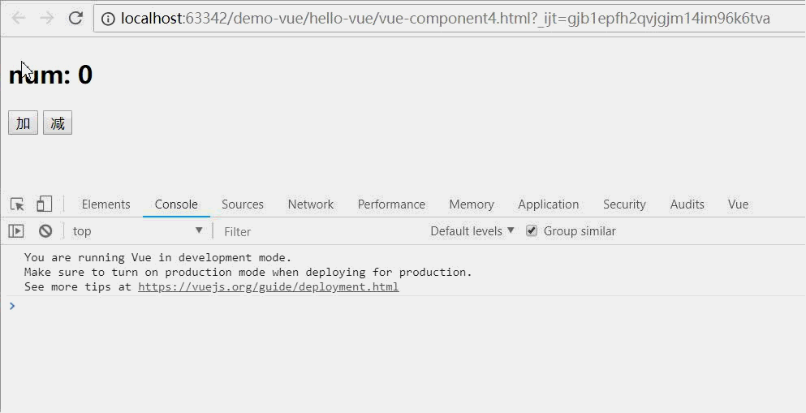

# 1.组件化

​	在vue里，所有的vue实例都是组件

## 1.1 概念

### **1.1.1 组件的data属性必须是函数**！

> **组件的data属性必须是函数**！

当我们定义这个 `<counter>` 组件时，它的data 并不是像之前直接提供一个对象：

```js
data: {
  count: 0
}
```

取而代之的是，一个组件的 data 选项必须是一个函数，因此每个实例可以维护一份被返回对象的独立的拷贝：

```js
data: function () {
  return {
    count: 0
  }
}
```

如果 Vue 没有这条规则，点击一个按钮就会影响到其它所有实例！

### 1.1.2 组件的复用

定义好的组件，可以任意复用多次：

```html
<div id="app">
    <!--使用定义好的全局组件-->
    <counter></counter>
    <counter></counter>
    <counter></counter>
</div>
```

效果：


你会发现每个组件互不干扰，都有自己的count值。怎么实现的？

### 1.1.3 基本使用

1) 引入组件 

2) 映射成标签 

3) 使用组件标签

```vue
<template> 
	<HelloWorld></HelloWorld> 
	<hello-world></hello-world> 
</template> 

<script> 
	import HelloWorld from './components/HelloWorld' 
    export default { 
        components: { HelloWorld } 
    } 
</script>
```

​	关于标签名与标签属性名书写问题 : **写法一: 一模一样  写法二: 大写变小写, 并用-连接** 

## 1.2 组件分类

### 1.2.1 全局组件

我们通过Vue的component方法来定义一个全局组件。

```html
<div id="app">
    <!--使用定义好的全局组件-->
    <counter></counter>
</div>
<script src="./node_modules/vue/dist/vue.js"></script>
<script type="text/javascript">
    // 定义全局组件，两个参数：1，组件名称。2，组件参数
    Vue.component("counter",{
        template:'<button v-on:click="count++">你点了我 {{ count }} 次，我记住了.</button>',
        data(){
            return {
                count:0
            }
        }
    })
    var app = new Vue({
        el:"#app"
    })
</script>
```

- 组件其实也是一个Vue实例，因此它在定义时也会接收：data、methods、生命周期函数等
- 不同的是组件不会与页面的元素绑定，否则就无法复用了，因此没有el属性。
- 但是组件渲染需要html模板，所以增加了template属性，值就是HTML模板
- 全局组件定义完毕，任何vue实例都可以直接在HTML中通过组件名称来使用组件了。
- data必须是一个函数，不再是一个对象。

效果：


### 1.2.3 局部组件

一旦全局注册，就意味着即便以后你不再使用这个组件，它依然会随着Vue的加载而加载。

因此，对于一些并不频繁使用的组件，我们会采用局部注册。

我们先在外部定义一个对象，结构与创建组件时传递的第二个参数一致：

```js
const counter = {
    template:'<button v-on:click="count++">你点了我 {{ count }} 次，我记住了.</button>',
    data(){
        return {
            count:0
        }
    }
};
```

然后在Vue中使用它：

```js
var app = new Vue({
    el:"#app",
    components:{
        counter:counter // 将定义的对象注册为组件
    }
})
```

- components就是当前vue对象子组件集合。
  - 其key就是子组件名称
  - 其值就是组件对象名
- 效果与刚才的全局注册是类似的，不同的是，这个counter组件只能在当前的Vue实例中使用


# 2 组件通信

## 2.1 概述

### 2.1.1 概念

通常一个单页应用会以一棵嵌套的组件树的形式来组织：


- 页面首先分成了顶部导航、左侧内容区、右侧边栏三部分
- 左侧内容区又分为上下两个组件
- 右侧边栏中又包含了3个子组件

各个组件之间以嵌套的关系组合在一起，那么这个时候不可避免的会有组件间通信的需求。

### 2.1.2 组件间通信基本原则 

1) 不要在子组件中直接修改父组件的状态数据 

2) 数据在哪, 更新数据的行为(函数)就应该定义在哪 

### 2.1.3  vue 组件间通信方式 

1) props 

2) vue 的自定义事件 

3) 消息订阅与发布(如: pubsub 库) 

4) slot 

5) vuex(后面单独讲) 


## 2.2 父向子传递

### 2.2.1 props

#### props

1. 父组件使用子组件时，自定义属性（属性名任意，属性值为要传递的数据）
2. 子组件通过props接收父组件数据，通过自定义属性的属性名

父组件使用子组件，并自定义了title属性：

```html
<div id="app">
    <h1>打个招呼：</h1>
    <!--使用子组件，同时传递title属性-->
    <introduce title="大家好，我是锋哥"/>
</div>
<script src="./node_modules/vue/dist/vue.js"></script>
<script type="text/javascript">
    Vue.component("introduce",{
        // 直接使用props接收到的属性来渲染页面
        template:'<h1>{{title}}</h1>',
        props:['title'] // 通过props来接收一个父组件传递的属性
    })
    var app = new Vue({
        el:"#app"
    })
</script>
```

效果：




#### props验证

我们定义一个子组件，并接收复杂数据：

```js
    const myList = {
        template: '\
        <ul>\
        	<li v-for="item in items" :key="item.id">{{item.id}} : {{item.name}}</li>\
        </ul>\
        ',
        props: {
            items: {
                type: Array,
                default: [],
                required: true
            }
        }
    };
```

- 这个子组件可以对 items 进行迭代，并输出到页面。
- props：定义需要从父组件中接收的属性
  - items：是要接收的属性名称
    - type：限定父组件传递来的必须是数组
    - default：默认值
    - required：是否必须

**当 prop 验证失败的时候，(开发环境构建版本的) Vue 将会产生一个控制台的警告。** 

我们在父组件中使用它：

```html
<div id="app">
    <h2>传智播客已开设如下课程：</h2>
    <!-- 使用子组件的同时，传递属性，这里使用了v-bind，指向了父组件自己的属性lessons -->
    <my-list :items="lessons"/>
</div>
```

```js
var app = new Vue({
    el:"#app",
    components:{
        myList // 当key和value一样时，可以只写一个
    },
    data:{
        lessons:[
            {id:1, name: 'java'},
            {id:2, name: 'php'},
            {id:3, name: 'ios'},
        ]
    }
})
```

效果：




type类型，可以有：


**注意：子组件模板有且只有一个根标签**


#### 动态静态传递

给 prop 传入一个静态的值： 

```html
<introduce title="大家好，我是锋哥"/>
```

给 prop 传入一个动态的值： （通过v-bind从数据模型中，获取title的值）

```html
<introduce :title="title"/>
```

静态传递时，我们传入的值都是字符串类型的，但实际上**任何类型**的值都可以传给一个 props。 

```html
<!-- 即便 `42` 是静态的，我们仍然需要 `v-bind` 来告诉 Vue -->
<!-- 这是一个JavaScript表达式而不是一个字符串。-->
<blog-post v-bind:likes="42"></blog-post>

<!-- 用一个变量进行动态赋值。-->
<blog-post v-bind:likes="post.likes"></blog-post>
```

#### 注意与问题

**注意**

- 此方式用于父组件向子组件传递数据 
- 所有标签属性都会成为组件对象的属性, 模板页面可以直接引用 

**问题:** 

- 如果需要向非子后代传递数据必须多层逐层传递 
- 兄弟组件间也不能直接 props 通信, 必须借助父组件才可以


### 2.2.2 slot

#### 2.9.1. 理解 

此方式用于父组件向子组件传递`标签数据` 

#### 2.9.2. 子组件: Child.vue

```html
<template> 
	<div>
		<slot name="xxx">不确定的标签结构 1</slot>
    	<div>组件确定的标签结构</div> 
    	<slot name="yyy">不确定的标签结构 2</slot> 
    </div> 
</template>
```

父组件: Parent.vue 

```html
<child>
	<div slot="xxx">xxx 对应的标签结构</div> 
	<div slot="yyy">yyyy 对应的标签结构</div> 
</child>
```


## 2.3 子向父的通信

### 2.3.1 $emit

来看这样的一个案例：

```html
<div id="app">
    <h2>num: {{num}}</h2>
    <!--使用子组件的时候，传递num到子组件中-->
    <counter :num="num"></counter>
</div>
<script src="./node_modules/vue/dist/vue.js"></script>
<script type="text/javascript">
    Vue.component("counter", {// 子组件，定义了两个按钮，点击数字num会加或减
        template:'\
            <div>\
                <button @click="num++">加</button>  \
                <button @click="num--">减</button>  \
            </div>',
        props:['num']// count是从父组件获取的。
    })
    var app = new Vue({
        el:"#app",
        data:{
            num:0
        }
    })
</script>
```

- 子组件接收父组件的num属性
- 子组件定义点击按钮，点击后对num进行加或减操作

我们尝试运行，好像没问题，点击按钮试试：


子组件接收到父组件属性后，默认是不允许修改的。怎么办？

既然只有父组件能修改，那么加和减的操作一定是放在父组件：

```js
var app = new Vue({
    el:"#app",
    data:{
        num:0
    },
    methods:{ // 父组件中定义操作num的方法
        increment(){
            this.num++;
        },
        decrement(){
            this.num--;
        }
    }
})
```

但是，点击按钮是在子组件中，那就是说需要子组件来调用父组件的函数，怎么做？

我们可以**通过v-on指令将父组件的函数绑定到子组件**上：

```html
<div id="app">
    <h2>num: {{num}}</h2>
    <counter :count="num" @inc="increment" @dec="decrement"></counter>
</div>
```

在子组件中定义函数，函数的具体实现调用父组件的实现，并在子组件中调用这些函数。当子组件中按钮被点击时，调用绑定的函数：

```js
        Vue.component("counter", {
            template:'\
                <div>\
                    <button @click="plus">加</button>  \
                    <button @click="reduce">减</button>  \
                </div>',
            props:['count'],
            methods:{
                plus(){
                    this.$emit("inc");
                },
                reduce(){
                    this.$emit("dec");
                }
            }
        })
```

- vue提供了一个内置的this.$emit()函数，用来调用父组件绑定的函数

效果：



#### 绑定事件监听

```javascript
// 方式一: 通过 v-on 绑定 
@delete_todo="deleteTodo" 
// 方式二: 通过$on() 
this.$refs.xxx.$on('delete_todo', function (todo) { 
    this.deleteTodo(todo) 
})
```

#### **触发事件**

```java
// 触发事件(只能在父组件中接收)
this.$emit(eventName, data)
```

#### 注意: 

1) 此方式只用于子组件向父组件发送消息(数据) 

2) 问题: 隔代组件或兄弟组件间通信此种方式不合适

## 2.4 都通信


```
2.8. 组件间通信 3: 消息订阅与发布(PubSubJS 库)
2.8.1. 订阅消息 PubSub.subscribe('msg', function(msg, data){})
2.8.2. 发布消息 PubSub.publish('msg', data) 
2.8.3. 注意 
1) 优点: 此方式可实现任意关系组件间通信(数据) 
2.8.4. 事件的 2 个重要操作(总结) 
1) 绑定事件监听 (订阅消息) 目标: 标签元素 <button> 事件名(类型): click/focus 回调函数: function(event){} 
2) 触发事件 (发布消息) DOM 事件: 用户在浏览器上对应的界面上做对应的操作 自定义: 编码手动触发
```

