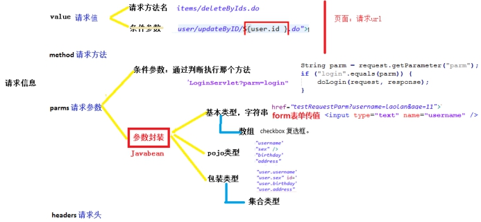
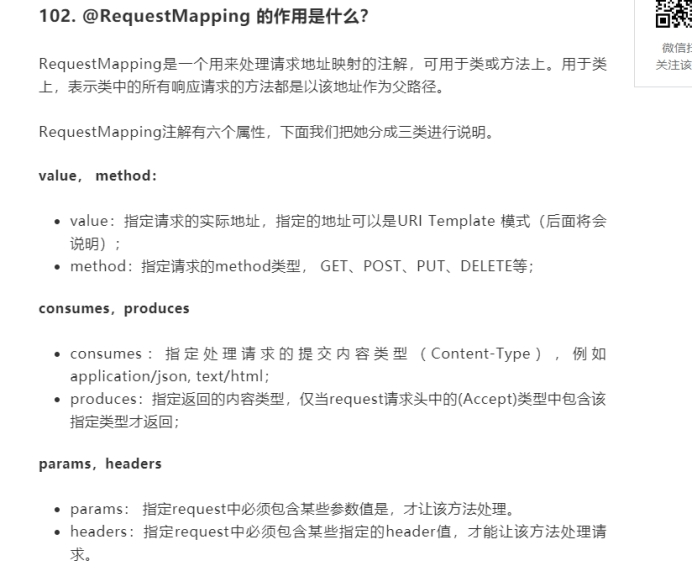
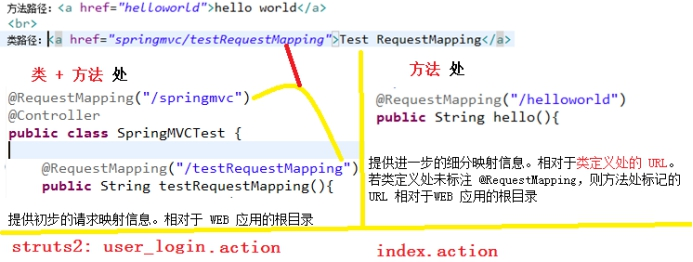
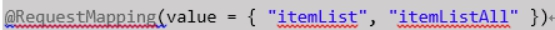
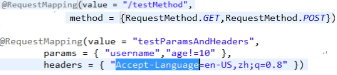
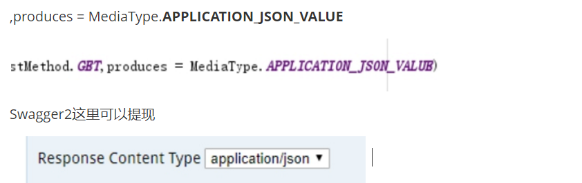

# 1  **RequestMapping映射请求信息**

## 1.1 **请求信息**概述

 

 

## 1.2 **请求值—value**

### 1.2.1 **概述**

 

 

 

 

### 1.2.2  **地址传参@PathVariable**

 

 

 

 

###  1.2.3 **请求url通配符**

​	Ant 风格资源地址支持 3 种匹配符：

### 1.2.4 请求ur多个地址

 

 

## 1.3 扩展属性

### 1.3.1 **请求方法method、请求参数parms或请求头headers**

 

 

 

 

### 1.3.2 **响应类型produces** 

 

## 1.4 @RequestMapping适应restful的注解方法

 Spring4.3中引进了｛@GetMapping、@PostMapping、@PutMapping、@DeleteMapping、@PatchMapping｝，来帮助简化常用的HTTP方法的映射，并更好地表达被注解方法的语义。

  以@GetMapping为例，Spring官方文档说：

  @GetMapping是一个组合注解，是@RequestMapping(method = RequestMethod.GET)的缩写。该注解将HTTP Get 映射到 特定的处理方法上。

 

 

 

# 2 **@Controller**

## 2.1 **@RestController**

Spring 4.2新增

@RestController

@RestController注解相当于@ResponseBody ＋ @Controller合在一起的作用。

如果只是使用@RestController注解Controller，则Controller中的方法无法返回jsp页面，配置的视图解析器InternalResourceViewResolver不起作用，返回的内容就是Return 里的内容。例如：本来应该到success.jsp页面的，则其显示success.

@Controller：

1.如果需要返回到指定页面，则需要用 @Controller配合视图解析器InternalResourceViewResolver才行。
    2.如果需要返回JSON，XML或自定义mediaType内容到页面，则需要在对应的方法上加上@ResponseBody注解。

 