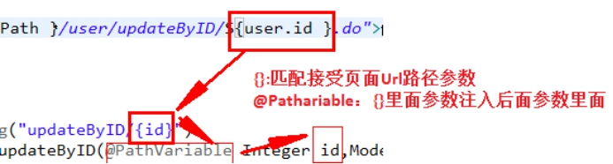
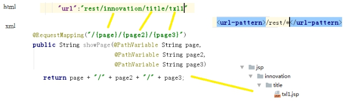
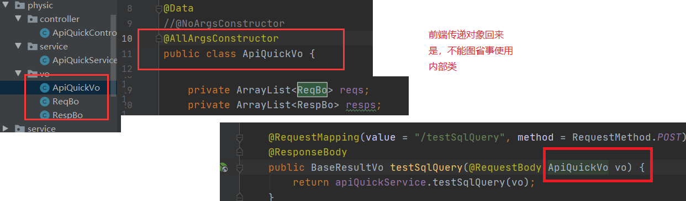
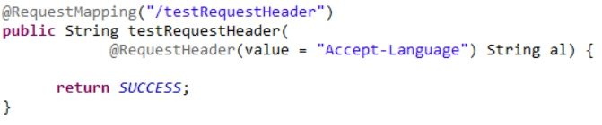
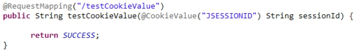
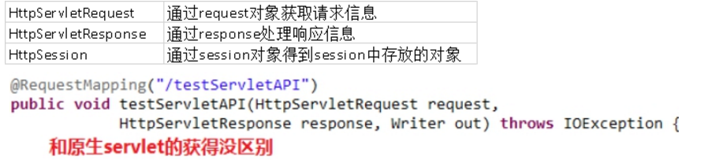

参看文献：<https://blog.csdn.net/eson_15/article/details/51718633>

https://blog.csdn.net/kobejayandy/article/details/12690161

 

# 1 **参数绑定**

## 1.1 **Value--@PathVariable**

参数映射

​	映射请求URL传封装参数@PathVariable

  

 

参数多级传递

只能一级一级的接受

 

 

 

## 1.2 **Parm--@RequestParam**

### 1.2.1 **绑定简单类型原理**

当请求的参数名称和处理器形参名称一致时会将请求参数与形参进行绑定。

这样，从Request取参数的方法就可以进一步简化。

 

### 1.2.2 **支持的数据类型**

参数类型推荐使用包装数据类型，因为基础数据类型不可以为null

```
整形：Integer、int
字符串：String
单精度：Float、float
双精度：Double、double
布尔型：Boolean、boolean
说明：对于布尔类型的参数，请求的参数值为true或false。或者1或0
```

```
请求url：http://localhost:8080/xxx.action?id=2&status=false
处理器方法：public String editItem(Model model,Integer id,Boolean status) 
```


### 1.2.3 **@RequestParam**

使用@RequestParam常用于处理简单类型的绑定。

- **value：**参数名字，即入参的请求参数名字，如value=“[itemId]()”表示请求的参数;区中的名字为itemId的参数的值将传入
- **required：**是否必须，默认是true，表示请求中一定要有相应的参数，否则将报错;TTP Status 400 - Required Integer parameter 'XXXX' is not present
- **defaultValue：**默认值，表示如果请求中没有同名参数时的默认值

 

### 1.2.4 **注意与@PathVariable区别**

```
@PathVariable是获取url上数据的。

@RequestParam获取请求参数的（包括post表单提交）
```

 

## 1.3  **Param（JSON）--@RequestBody**

### 1.3.1 概述

​	@RequestBody接受前台json数据，把json数据自动封装javaBean。用于读取http请求的内容(字符串)，通过springmvc提供的HttpMessageConverter接口将读到的内容（json数据）转换为java对象并绑定到Controller方法的参数上。形参只能有一个

[spring接收json格式的多个对象参数](https://www.cnblogs.com/mahuan2/p/6008832.html)：https://www.cnblogs.com/mahuan2/p/6008832.html

 

### 1.3.2 问题：接受对象为内部类

接受list<obj>时。不能使用内部类



 

## 1.4 **扩展属性**

### 1.4.1 **Headers--@RequestHeader**

​	使用 @RequestHeader 绑定 请求头 的属性值

​	

 

### 1.4.2 **Cookie--@CookieValue**

​	使用 @CookieValue 绑定请求中的 Cookie 值

 

 

# 2 **结果响应**

## 2.1 **返回json** **@ResponseBody**

 

​	@ResponseBody把后台pojo转换json对象，返回到页面。用于将Controller的方法返回的对象，通过springmvc提供的HttpMessageConverter接口转换为指定格式的数据如：json,xml等，通过Response响应给客户端

​	如果加上@ResponseBody注解，就不会走视图解析器，不会返回页面，目前返回的json数据。如果不加，就走视图解析器，返回页面


# 3 **servlet原生api（内置对象）**

处理器形参中添加如下类型的参数处理适配器会默认识别并进行赋值。



 

 

 

 