# 第2章 HTTP初相识--了解HTTP协议

## 2-1_浏览器背后的故事

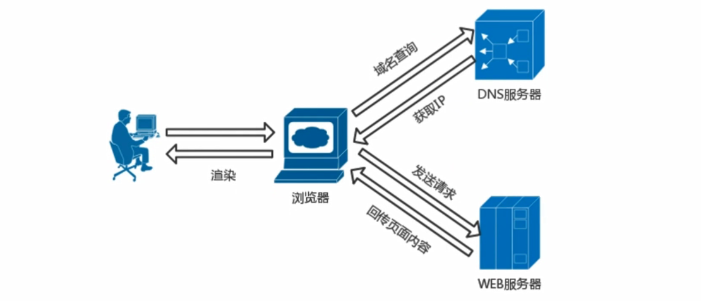

### HTTP

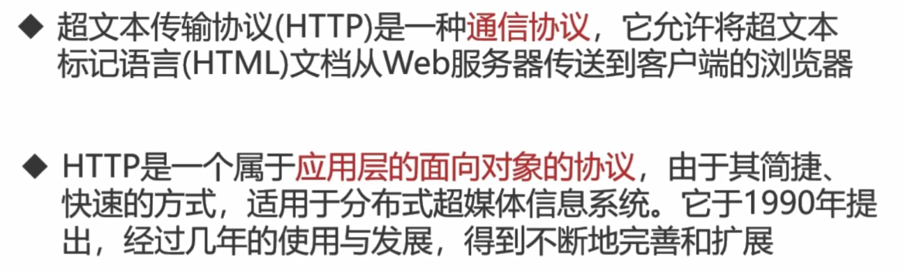


### Web和HTTP

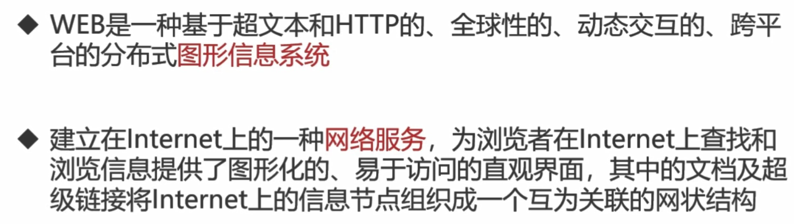


## 2-2_HTTP协议的前世今生

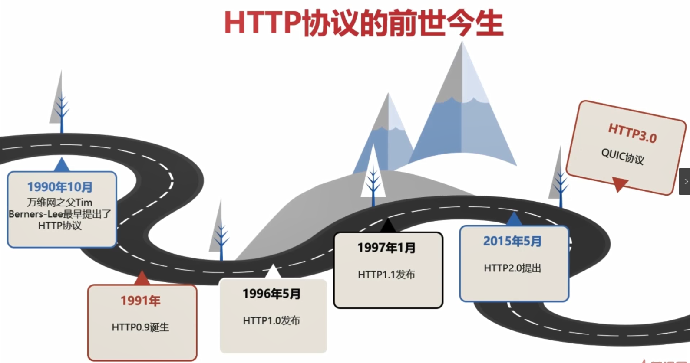


## 2-3_透过TCPIP看HTTP

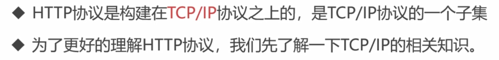

### TCP/IP协议族

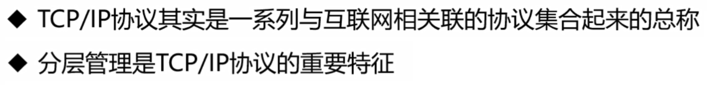

### TCP/IP协议族分层

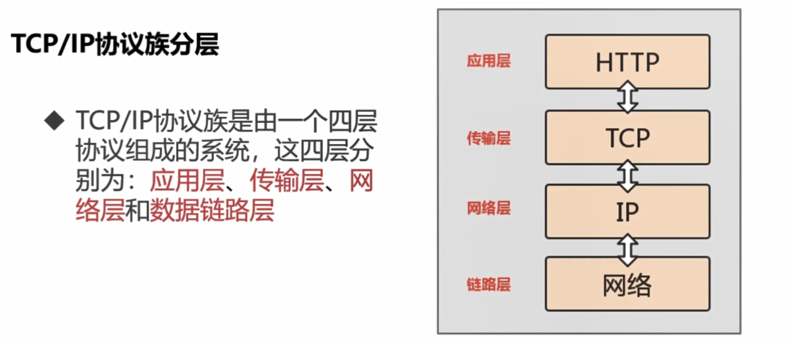

#### 应用层

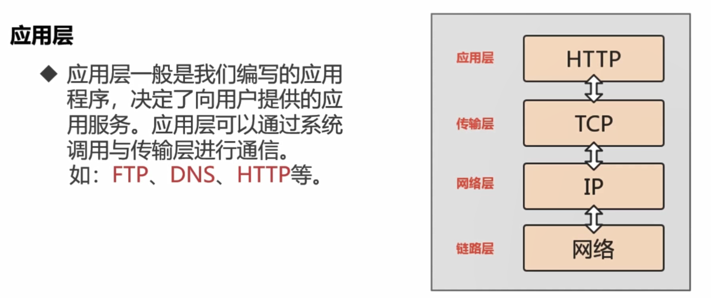

#### 传输层

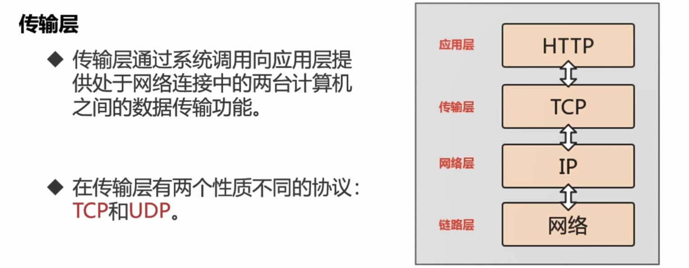

#### 链路层

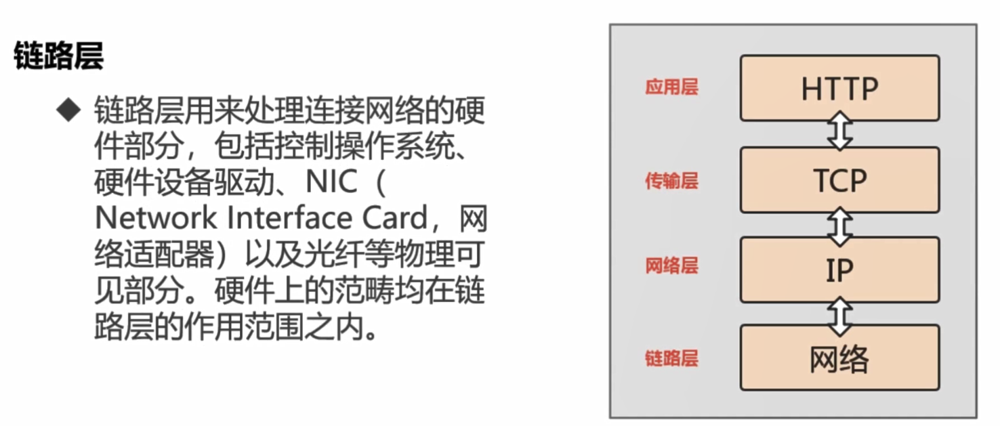

### 数据包的封装过程

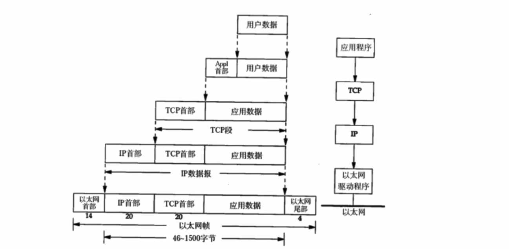

### HTTP数据传输过程

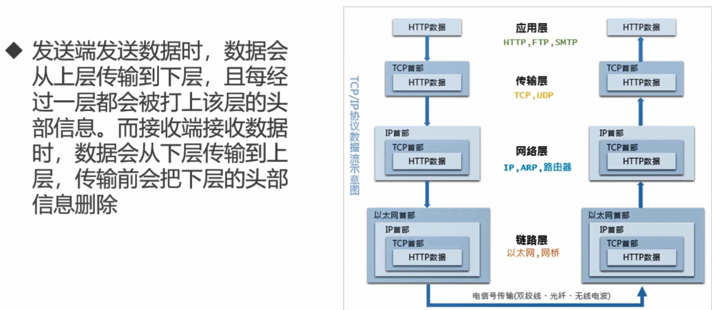


### 传输层-TCP三次握手

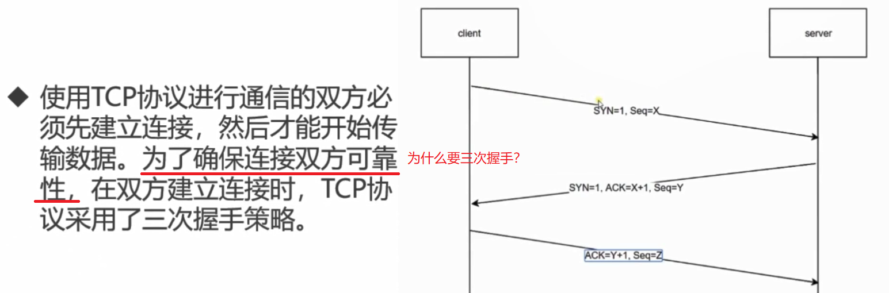


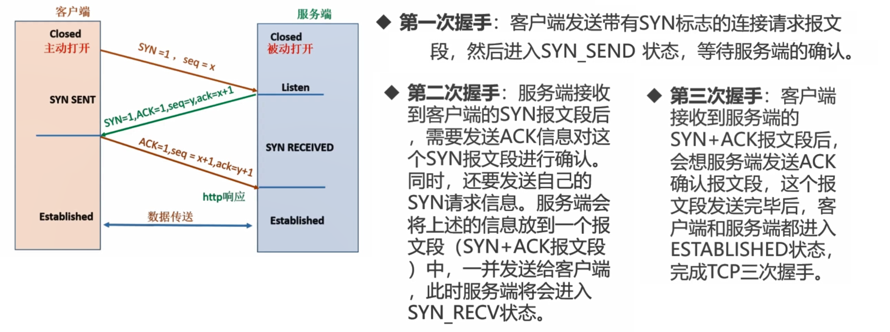

## 2-4_“你是如何访问慕课的”--DNS域名解析

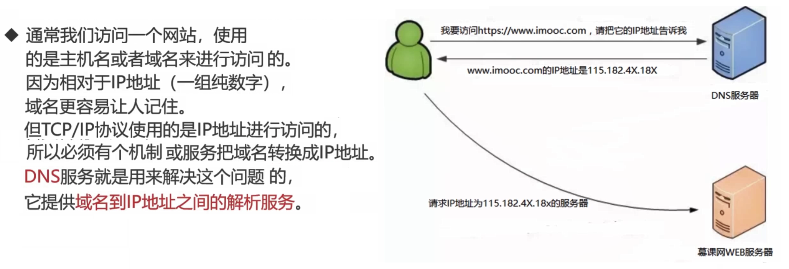

```
CDN: 了解
```

## 2-5_回溯HTTP事务处理过程

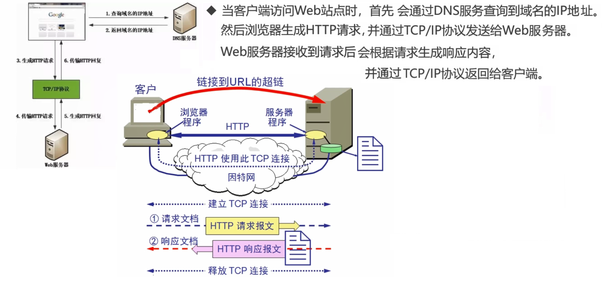

## 2-6_实验：与HTTP请求的第一次亲密接触

