# 第4章 HTTP渐相知--深入认识HTTP协议不为人知的特性和使用方法

# 4-1_4_2 聊聊HTTP协议中的编码和解码

### 字符集与编码

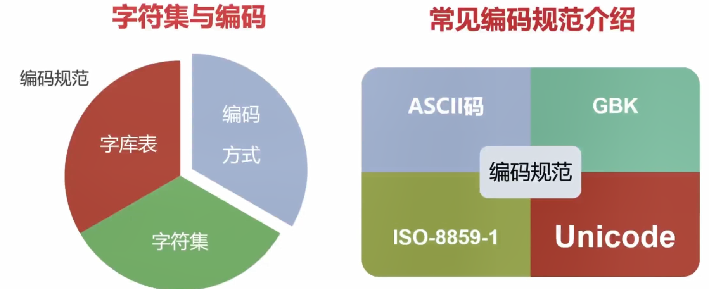

### 乱码的由来

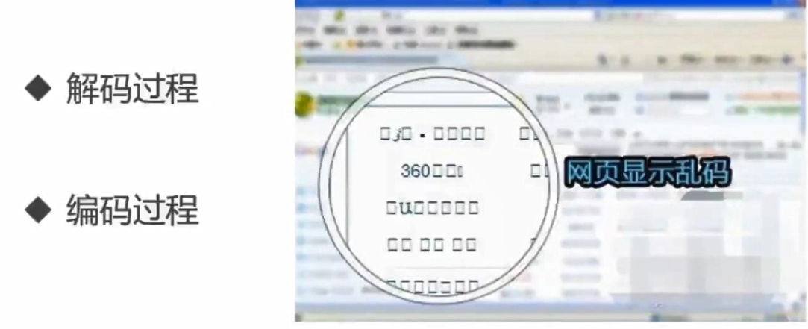

### URL中的编码与解码

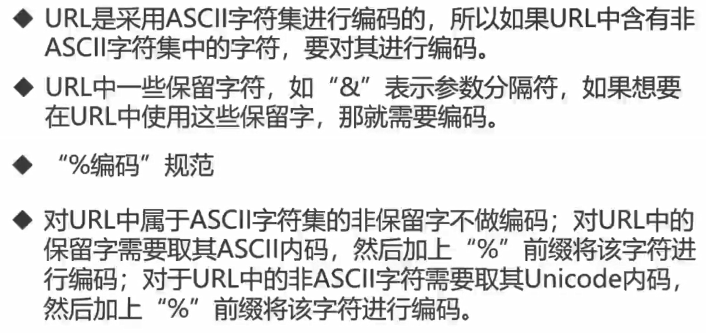

## 4-3_HTTP协议之基本认证

### 常见认证方式

- BASIC认证（基本认证）
- DIGEST认证（摘要认证）
- SSL客户端认证
- FormBase认证（基于表单的认证）

### BASIC认证（基本认证）

 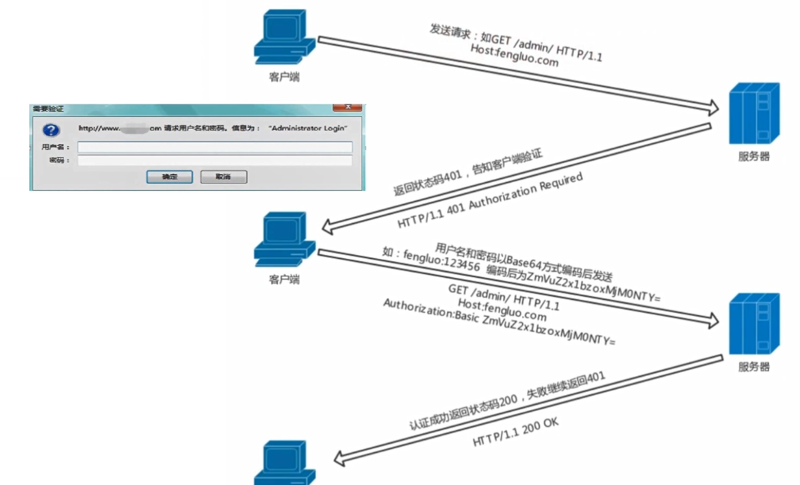

### DIGEST认证（摘要认证）

为了弥补BASIC认证存在的缺点，从HTTP/1.1就有了DIGEST认证

DIGEST认证同样使用了质询/和响应的方式，但不会像BASIC认证那样直接发送明文密码

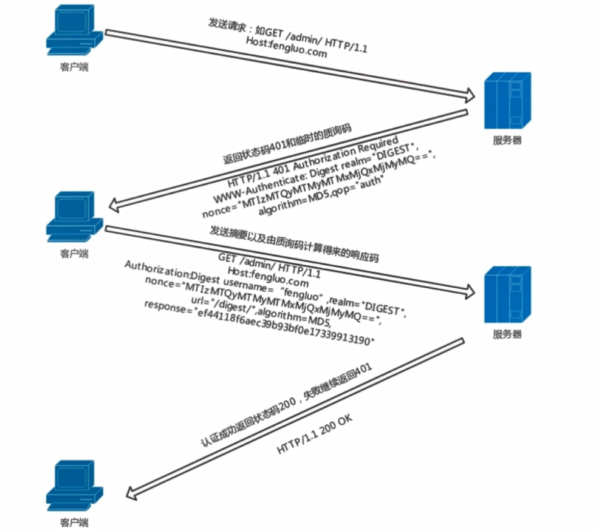

### SSL客户端认证

SSL客户端认证是借由HTTPS的客户端证书完成认证的方式。凭借客户端证书认证，服务器可确认访问是否自己登录的客户端

### FormBase认证（基于表单的认证）

基于表单的认证方法并不是在HTTP协议里定义的

使用由Web应用程序各自实现基于表单的认证方式

通过Cookie和Session的方式来保持用户的状态

## 4-4_HTTP中长连接与短连接

HTTP协议是基于请求/响应模式的，因此只要服务服务器端给了响应，本次HTTP请求就结束，**本质是TCP长连接和短连接**

HTTP/1.0中，默认使用短连接。也就是说，浏览器和服务器没进行一次HTTP操作，就建立一次连接，结束就中断。**HTTP/1.1起，默认使用长连接，用以保持连接特性**。

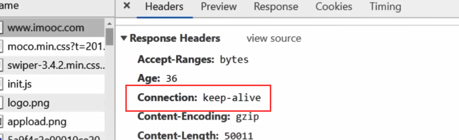

短连接：建立连接-数据传输-关闭连接...建立连接-数据传输-关闭连接

长连接：建立连接-数据传输...（保持连接）...数据传输-关闭连接

## 4-5_HTTP中介之代理

### 代理

### 代理的作用

- 抓包
- FQ翻墙
- 匿名访问
- 过滤器

## 4-6_HTTP中介之网关

网关可以作为某种翻译器的使用，它抽象出了一中能到达资源的方法。网关是资源和应用程序之间的粘合剂。

网关扮演的是“协议转换器”的角色

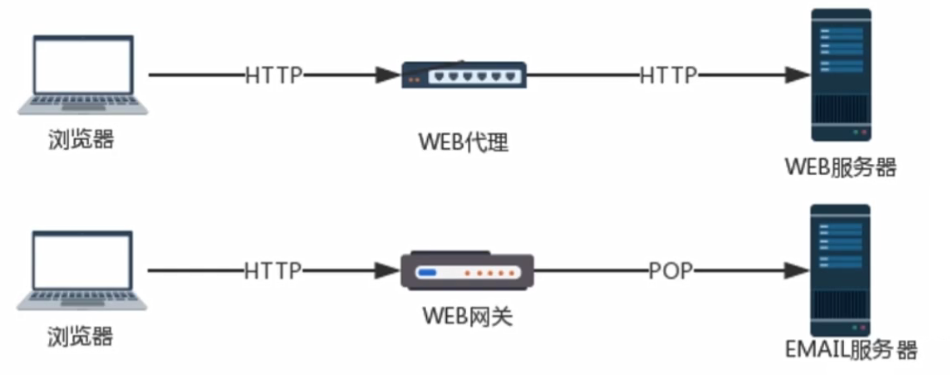

### WEB网关	

Web网关在一侧使用HTTP协议，在一方面使用另一种协议。<客户端协议>/<服务器端协议>

1. （HTTP/）服务器端网关：通过HTTP协议与客户端对话，通过其他协议与服务器通信
2. （/HTTP）客户端网关：通过其他协议与客户端对话，通过HTTP协议与服务器通信

### 常见网关类型

- (HTTP/*)服务器端Web网关
- (HTTP/HTTPS)服务器端安全网关
- (HTTPS/HTTP)客户端安全加速网关
- 资源网关

## 4-7_HTTP缓存

### HTTP缓存头部字段

- Cache-Control：请求/响应头，缓存控制字段

  no-store:所有都不缓存

  no-cahce:缓存，但是浏览器使用缓存前，都会请求服务器判断缓存资源是否为最新

  max-age=x(单位秒)请求缓存后X秒后不再发起请求

  s-maxage=x(单位秒)代理服务器请求源站缓存后的X秒后不再发起请求，只对CDN缓存有效

  public 客户端和代理服务器 （CDN）都可以缓存

  private 只有客户端可以缓存

- Expries 响应头，代表资源过期时间，由服务器返回提供，是http1.0的属性，在与max-age共存的情况下，优先级要低

- Last-Modified 响应头，资源最新修改时间，由服务器告诉浏览器

- if-Modified-Since 请求头，资源最新修改时间，由浏览器告诉服务器，和Last-Modified是一对，他两会进行对比

- Etag 响应头，缓存资源标识，由浏览器告诉服务器（其实就是上次浏览器的给的Etag），和Etag是一对，他两会进行对比

### HTTP缓存工作方式

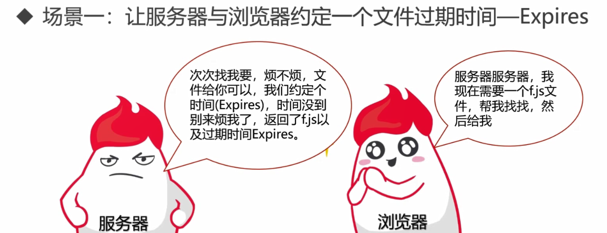

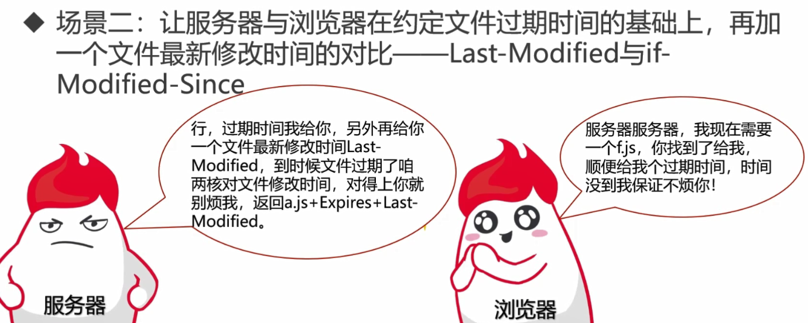

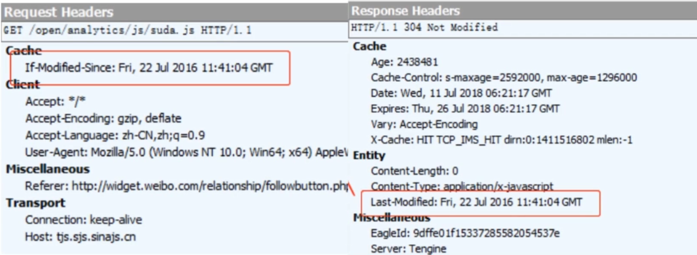

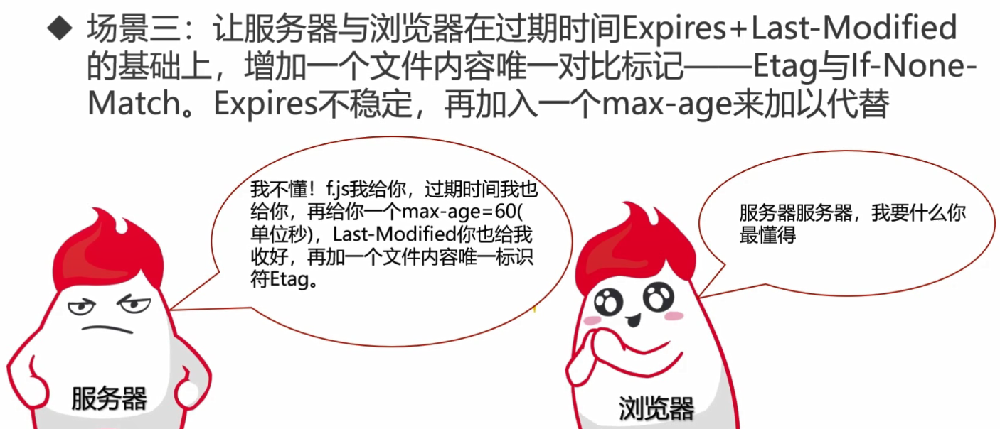

### 缓存改进方案

- md5/hash缓存：通过不缓存html, 为静态资源添加MD5和Hash标识，解决浏览器无法跳过缓存过期时间主动感知文件变化问题
- cdn缓存： CDN是构建在网络之上的内容分发网络，依靠部署在各地边缘服务器，通过中心平台的负载均衡、内容分发、调度等功能模块，使用户就近获取所需内容，降低网络拥塞，提高用户访问响应速度和命中率

### CDN缓存工作方式

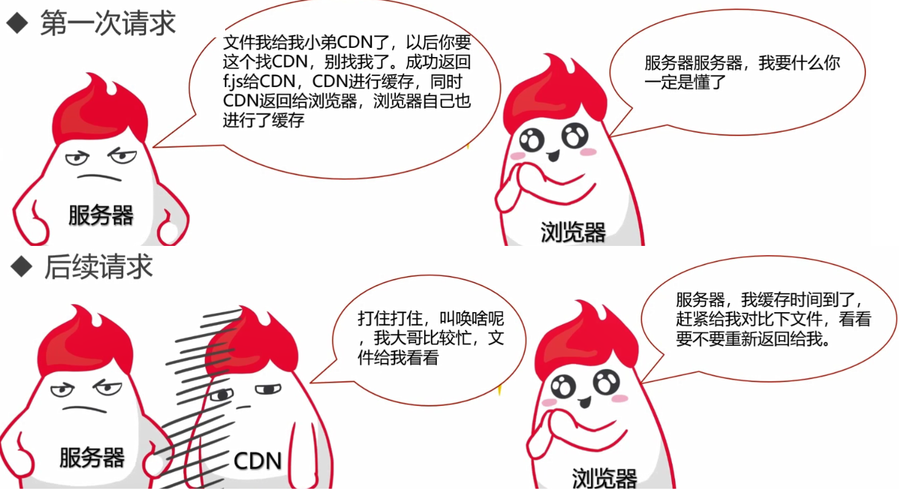

### 浏览器操作对HTTP缓存的影响

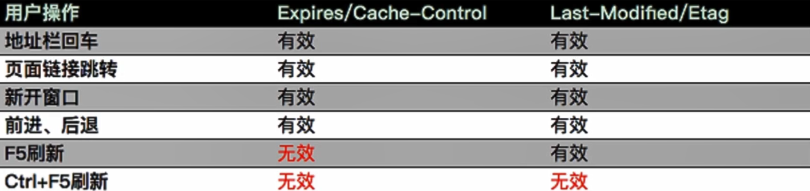

## 4-8_HTTP内容协商机制

### 内容协商机制

- 指客户端和服务器端就响应的资源内容进行交涉，然后提供给客户端最为适合的资源。内容协商会以响应资源的语言，字符集，编码等作为判断的基准
- 客户端驱动：客户端发起请求，服务器发送可选项列表，客户端作出选择后再发送第二次请求
- 服务端驱动： 服务器检查客户端的请求头部集并决定提供哪个版本的页面
- 透明协商： 摸个中间设备（通常是缓存代理）代表客户端进行协商

### 服务器驱动内容协商-请求首部集

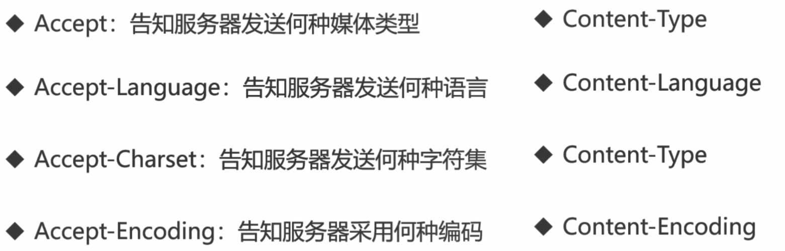

### 服务器驱动内容协商-近似匹配

## 4-9_HTTP的断点续传与多线程下载

### 断点续传与多线程下载

​	HTTP是通过在Header里的两个参数实现的，客户端发请求时对应的是Range,服务器端响应时对应的是Centent-Range

- Range

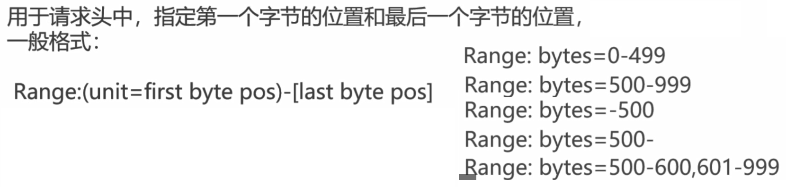

- Content-Range

### 断点续传过程

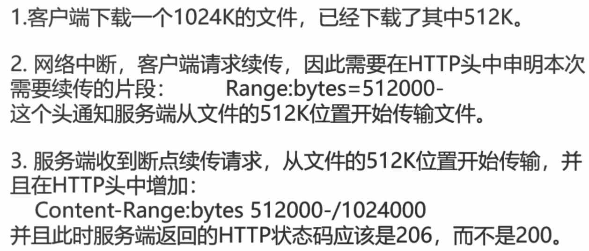