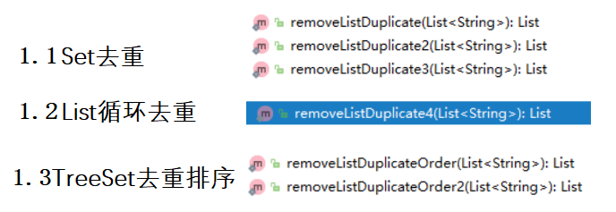
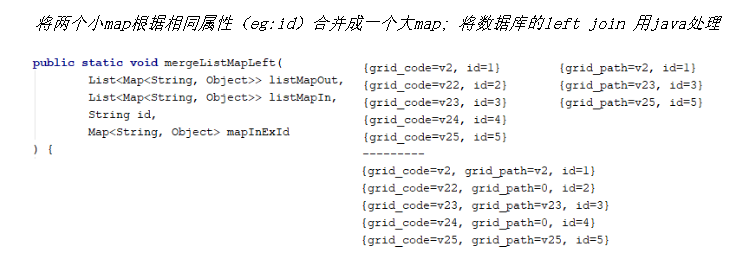
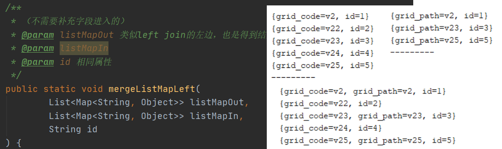
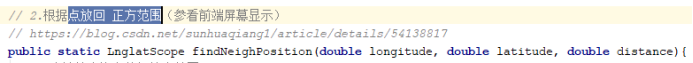
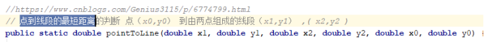
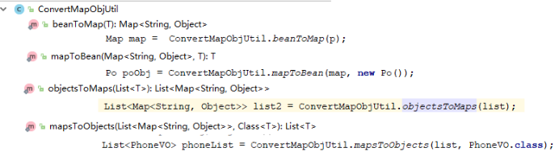
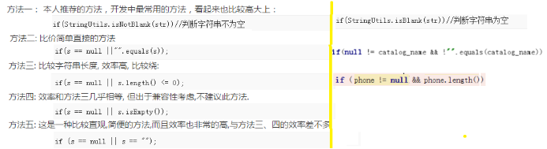
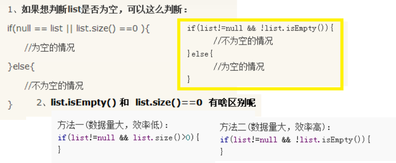

[TOC]


# 工具类

## 返回字符串

### **转换成oracle的in所需要的形式**

 返回结果都是字符串的 "'1', '2', '3'"

```java
 // 数组 [1,2,3]  --> "'1','2','3'"
public static String arrToOrclInStr(Object [] arr);
// 1.2.集合
public static String listToOrclInStr(List<String> list);
// 1.3 字符串 "1,2,3"  --> "'1','2','3'"
 public static String strToOrclInStr(String str) ;
// 1.4.集合listMap
public static String listMapToOrclInStr(List<Map<String, Object>> mapList, String key)
// 1.5.listObj没必要封装 ， 使用jdk 1.8 加上listToOrclInStr	
// 1.6 json数据格式 JSON.stringify(self.searchForm.qkId)
public static String jsonArrToOrclInStr(String str) {
```

### 返回uuid

```java
public static String getUUID()
```

### 返回md5

```java
// md5加密
public static String getMD5(String str)
```

## 对象Map集合

### 返回List

#### **去重排序**

去除List集合中的重复值（四种好用的方法）

参考：<https://blog.csdn.net/cs6704/article/details/50158373>      



#### 生成填报月份

```java
/**
 * 更据时间生成中间的数据， 生成fill_date
 * @param minDate  2019-01
 * @param maxDate  2019-06
 * @param type  1(全部) 2 含头不含尾 3 含尾不含头
 */
public static List<String> createMonthBetween(String minDate, String maxDate, String type)  {
```


#### 生成数据服务cdrTotal日期

```java
/**
 * 生成 kun_api_cdr_total(time_id)
 * @param minDateTime  2019-01-01 00:00:00
 * @param maxDateTime  2019-01-03 00:00:00
 * @param type  1(全部) 2 含头不含尾 3 含尾不含头
 * @return
 */
public static List<String> createDateTimeBetween(String minDateTime, String maxDateTime, String type)  {
```


### 返回ListMap

#### 合并-合并多个Map





#### 合并-模拟jpa映射

```java
/**
 * 用于一对多（推荐）
 * @param listMapOut
 * @param listMapIn
 * @param keys  { "id", "key_id", "inPos"}; 外层id, 内层外键id， 实体命名
 */
public static void mergeOfO2mMapping(List<Map<String, Object>> listMapOut, List<Map<String, Object>> listMapIn, String [] keys) ;
// 用于一对多（推荐） 驼峰式
public static void mergeOfO2mMappingUpper(List<Map<String, Object>> listMapOut, List<Map<String, Object>> listMapIn, String [] keys) ;
/**
   * 多对一，一对一
   * @param listMapOut
   * @param listMapIn
   * @param keys  { "id", "key_id", "inPo"}; 外层id, 内层外键id， 实体命名
   */
public static void mergeOfM2oO2oMapping(List<Map<String, Object>> listMapOut, List<Map<String, Object>> listMapIn, String [] keys) ;
// 多对一，一对一 （驼峰式）
public static void mergeOfM2oO2oMappingUpper(List<Map<String, Object>> listMapOut, List<Map<String, Object>> listMapIn, String [] keys) ;
```

#### 生成


#### 转换

```java
/**
 * 返回element需要生成的树(生成自带id),湘潭
 */
public static List<Map<String, Object>> tranXiangtanTree(List<Map<String, Object>> ls, String [] keys) ;
/**
     * 父子节点转换为 Tree
     *  参看：https://www.cnblogs.com/1955/p/9844694.html
     * @param datas 源数据
     * @param res   结果数据
     * @param keys 判断的 ["id", "parent_id" ]
     */
    public static void tranTree(List<Map<String, Object>> datas, List<Map<String, Object>> res, String [] keys) {
    
```

#### 获得


## 日期字符串

```java
// 获得当前时间
public static Date getNowDate();
public static String getNowDateStr();
// 日期 转换
public static Date getParseDate(String str) 

// 计算两个日期之间相差的天数
public static int daysBetween(Date smdate, Date bdate);
public static int daysBetween(String smdate, String bdate);
//根据类型获取到，返回当前时间，到 当小时，当天，当周，当月，当季度，当年 集合的秒数
public static Long getNumByType(String dateType)；
//功能描述: 根据日期获取周几
public static String getWeekOfDate(String date);
public static String getWeekOfDate(Date date);
```


## 地图

 **获得两点距离**

 

 

返回点正方范围



 

**点到线段的最短距离**



 

##  Socket

### 测试服务器端口是否开通-URIUtil

```java
//测试服务器端口是否开通
public static String serverPortTest(String ip,int port,int timeout);
public static String serverPortTest(URI uri,int timeout);
public static String serverPortTest(String url,int timeout);
```

##  转换

### 对象和Map互转



### json和对象转换


### Json的key转换


# Model

```
BaseResultVo：结合异常
PageBo: 分页
```

#  编码

## 技巧


## 非空判断

### 字符串



### 数组

```
做项目时想要根据判断 fujian 这个数组是否为空，执行不同的方法。
fujian==null || (fujian!=null && fujian.length==0)   ==》表示数组为空。
fujian!=null || (fujian==null && fujian.length!=0)    ==》表示数组不为空。
```

### 集合

#### list




## String&int转换


## 表单数据纠正


## 表单校验


# 调试

```
测试时间效率
```

