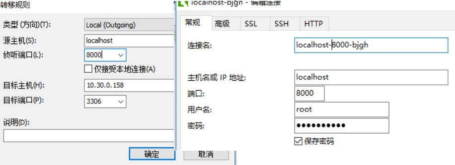

# 1 服务器

## 1.1 MySQL5.7安装

### 1.1.1 安装

参考：http://www.jb51.net/article/99626.htm

### **1.1.2 开启远程访问权限**

https://www.cnblogs.com/vathena/p/4012399.html

## 1.2 MySQL8安装

### 1.2.1 安装

<https://www.cnblogs.com/mysqlanzhuang/p/13336212.html>

### 1.2.2 问题

#### 由于找不到vcruntime140_1.dll

<https://blog.csdn.net/littlehaes/article/details/104127787>

#### Can''t connect to MySQL server on localhost (10061)解决方法

<https://www.jb51.net/article/26505.htm>

看截图

# 2 客户端

## 2.1 **sqlyog**

### 2.1.1 **激活**

用户名：随意填写

秘钥：

ccbfc13e-c31d-42ce-8939-3c7e63ed5417
a56ea5da-f30b-4fb1-8a05-95f346a9b20b
a0fe8645-3916-45d4-9976-cb6b88fecc6c

b70d7f66-dac2-4462-bf51-c4e9347da763

## 2.2 Navicat

### 2.2.1 安装破解

**安装破解**12： https://blog.csdn.net/qq_21205435/article/details/78902052

 **安装破解15**： https://www.cnblogs.com/poloyy/p/12231357.html

### 2.2.2 应用：隧道

隧道：https://blog.csdn.net/duval_yang/article/details/50953282

